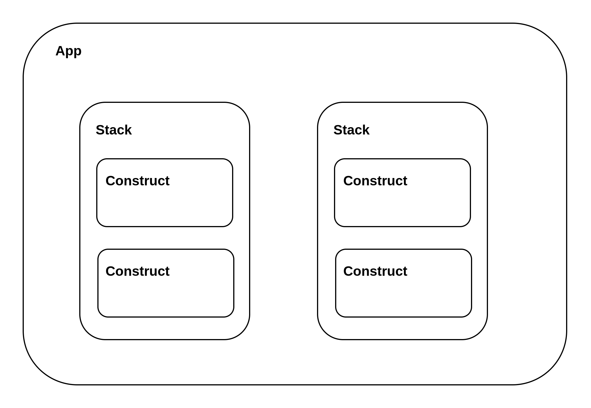

# AWS CDK

AWS CDK は 2 つのコンポーネントから構成される。

- AWS CDK Construct Library
  - TypeScript/Go などの各言語毎に例供される CDK のライブラリー
- AWS CDK CLI
  - TypeScript で記述したリソースを AWS 上にデプロイするためのコマンド

## CDK の概念

- App
  - cdk deploy コマンドは App 単位でリソースをデプロイする
  - App は複数のスタックを持つことができる
- Stack
  - cdk deploy コマンドは App 単位でデプロイするので 1 度に複数のスタックを作成/更新できる
  - CloudFormation のスタック
- Construct
  - cfn のリソース



## 環境

環境はスタックをデプロイする AWS アカウントとリージョンで構成される。環境を指定しない場合は`~/.aws/config`の default プロファイルが使用される。

## ブートストラップ

CDK スタックをデプロイする前に、環境をブートストラップする必要がある。`cdk bootstrap`コマンドを使用してスタックを作成するための IAM ロールやアセットに使用する S3、ECR を作成する。これらのリソースも CloudFormation のスタックを使用してデプロイされる。

## アセット

アセットとは lambda 関数のファイルや ECS に使用する Docker イメージのこと。CDK はアセットを自動で S3 や ECR にデプロイしてくれる。

以下に lambda 関数のファイルをアセットとして S3 に自動でアップロードしてくれる CDK のコードを示す。

```TypeScript
import * as cdk from 'aws-cdk-lib'
import { Constructs } from 'constructs'
import * as lambda from 'aws-cdk-lib/aws-lambda'
import * as path from 'path'

export class HelloAssetStack extends cdk.Stack {
  constructor(scope: Construct, id: string, props?: cdk.StackProps) {
    super(scope, id, props)

    new lambda.Function(this, 'myLambdaFunction', {
      // アセットを定義する
      code: lambda.Code.fromAsset(path.join(__dirname, 'handler')),
      runtime: lambda.Runtime.PYTHON_3_6,
      handler: 'index.lambda_handler'
    })
  }
}
```

## コンテキスト値

コンテキスト値は`cdk.json`ファイルやコマンドラインから CDK に提供できる key-value の変数。

### コンテキスト値のソース

- cdk コマンドの--context オプション
- cdk.json ファイル
- `construct.node.setContext()`メソッド

### コンテキスト値の使用例

```TypeScript
import * as cdk from 'aws-cdk-lib'
import { Construct } from 'constructs'

export class ExistsVpcStack extends cdk.Stack {

  constructor(scope: Construct, id: string, props?: cdk.StackProps) {

    super(scope, id, props)

    // コンテキスト値を取得する
    const env = this.node.tryGetContext('env')
  }
}
```

## CDK 記述例

```TypeScript
import 'source-map-support/register'
import * as cdk from 'aws-cdk-lib'
import { Construct } from 'constructs'
import * as lambda from 'aws-cdk-lib/aws-lambda'

// 1. App作成
const app = new cdk.App()

// 2. スタック定義
class HelloCdkStack extends cdk.Stack {
  constructor(scope: Construct, id: string, props?: cdk.StackProps) {
    super(scope, id, props)

    // Define the Lambda function resource
    const myFunction = new lambda.Function(this, "HelloWorldFunction", {
      runtime: lambda.Runtime.NODEJS_20_X, // Provide any supported Node.js runtime
      handler: "index.handler",
      code: lambda.Code.fromInline(`
        exports.handler = async function(event) {
          return {
            statusCode: 200,
            body: JSON.stringify('Hello World!'),
          }
        }
      `),
    })
  }
}

// 3. スタック作成
new HelloCdkStack(app, 'HelloCdkStack')
```
