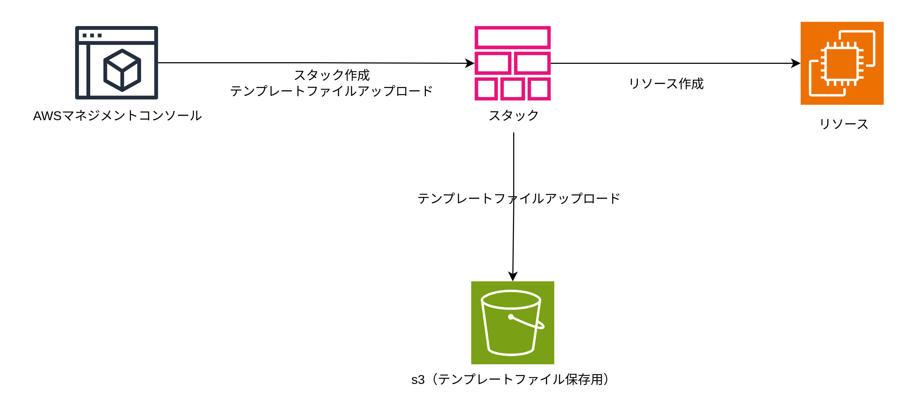
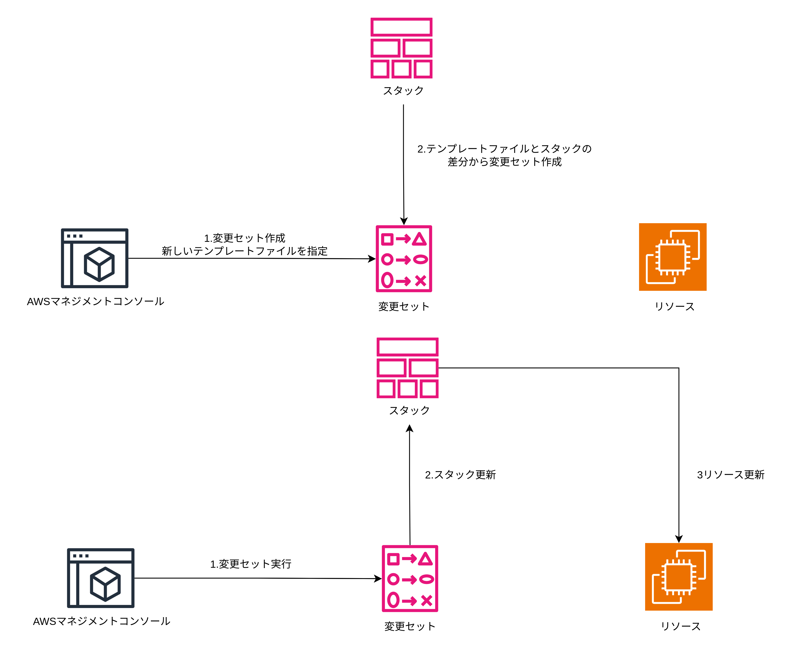
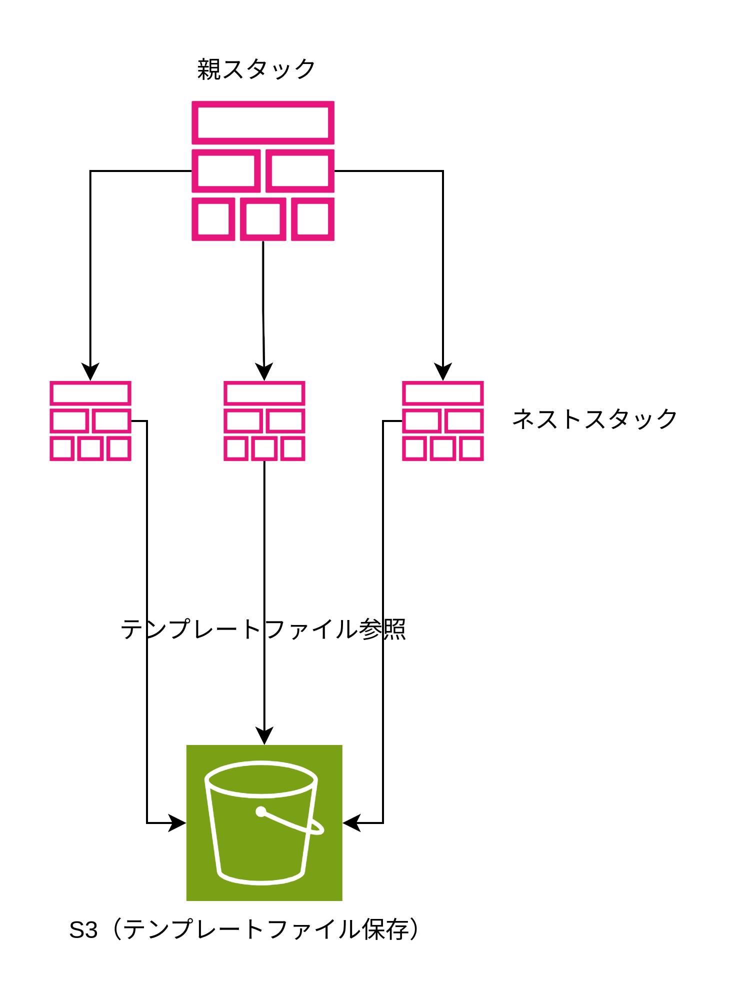
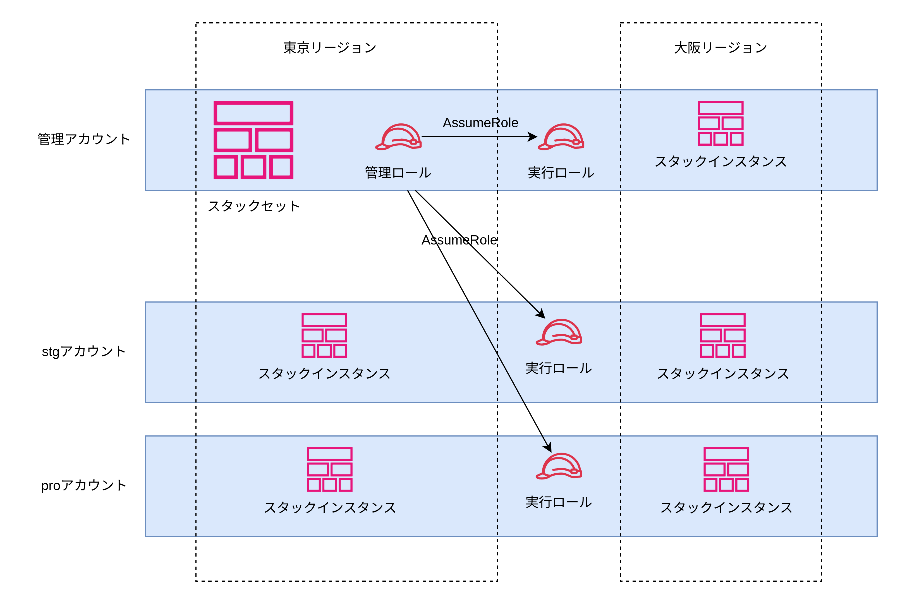

# CloudFormation

## 基本要素

- テンプレートファイル
  - YAML/JSON ファイル
  - CloudFormation で作成したいリソースを記述する
- スタック
  - AWS リソース
  - テンプレートファイルを基に AWS 上にスタックを作成する。スタックを作成するとリソースを作成する。テンプレートファイルを更新してスタックを更新するとリソースを更新する。スタックを削除するとリソースを削除する
- 変更セット
  - AWS リソース
  - テンプレートファイルの情報とスタックが保持するリソースの情報を比較できる
  - 変更セットを実行することでスタックの作成/更新ができる
  - 新規スタック/既存スタック/インポート用の変更セットがある
- ドリフト
  - 用語
  - スタックが保持するリソース情報と実際のリソースの状態との差分
  - CloudFormation で作成したリソースは差分を発生させないように CloudFormation でのみ更新する
- スタックセット
  - AWS リソース
  - 複数アカウント/複数リージョンに子スタックを作成できる
  - 各子スタックのパラメーターをオーバーライドできる
  - AWS Organizations と連携したサービスとしてスタックセットを利用することも可能
- ネストスタック
  - AWS リソース
  - CloudFormation で作成されたスタックのことをネストスタックと呼ぶ
  - テンプレートファイルに AWS::CloudFormation::Stack リソースを記述することでスタックを作成する

## テンプレートファイルを AWS にアップロードする方法

- スタック作成時にテンプレートファイルをアップロード（cfn 用の s3 バケットが作成されハッシュ値をつけてテンプレートファイルが保存される）
- 事前に s3 にアップロードする
- Git リポジトリと同期する

## スタック操作

- スタックの作成/更新/削除
- 新規スタック作成のために変更セット作成/実行
- 既存スタックの変更セット作成/実行
- 既存リソースのインポート（既存方式/IaC ジェネレーター）
- スタックセットの作成/更新/削除
- ドリフト検知

## スタック



スタックのオプション項目

- テンプレートファイル
  - s3 オブジェクト URL
  - テンプレートファイルのアップロード
  - Git リポジトリ
- パラメーター
- タグ（指定したタグを全てのリソースに付与する）
- CAPABILITIES（複数選択可能）
  - CAPABILITY_IAM: IAM リソースを作成する権限を CloudFormation に与えるために必要
  - CAPABILITY_NAMED_IAM: 名前付きの IAM リソースを作成する権限を CloudFormation に与えるために必要
  - CAPABILITY_AUTO_EXPAND: ネストされたスタック/Transform を使用する権限を CloudFormation に与えるために必要
- IAM ロール（CloudFormation がリソースを作成する際に使用する/デフォルトはスタック作成者の権限）
- プロビジョニング失敗時のオプション
  - 全リソースのロールバック
  - 正常にプロビジョニングされたリソースはロールバックせず保持し、プロビジョニングに失敗したリソースはロールバックする
- ロールバック時に新しく作成されたリソースを削除する
  - 削除ポリシーを適用する（DeletionPolicy）
  - 新しく作成されたリソースを全て削除してロールバックを完了する
- プロビジョニング完了後のロールバック設定（アラームを監視しがアラームが鳴るとロールバックする）
  - CloudWatchAlarm の ARN
  - モニタリング時間
- 通知オプション
  - SNS トピックの ARN
- タイムアウト時間
- 削除保護

## リソース置換

リソースを更新する際にリソースを置換する場合がある。以下に流れを示す。

1. スタック更新開始（UPDATE_IN_PROGRESS）
2. 新リソース作成（UPDATE_IN_PROGRESS）
3. 新リソース作成完了（UPDATE_COMPLETE）
4. クリーンナップ開始（UPDATE_COMPLETE_CLEANUP_IN_PROGRESS）
5. 旧リソース削除（DELETE_IN_PROGRESS）
6. 旧リソース削除完了（DELETE_COMPLETE）
7. スタック更新完了（UPDATE_COMPLETE）

新しいリソースを作成してから古いリソースを削除する。

## ロールバック

スタックの作成/更新時にエラーが発生すると、1 つ前のスタックの状態に戻すためにロールバックする。

| リソースの操作 | ロールバック時の挙動                                                                                                                 |
| :------------- | :----------------------------------------------------------------------------------------------------------------------------------- |
| 作成           | 削除                                                                                                                                 |
| 更新           | 更新前の設定に戻す                                                                                                                   |
| 削除           | 何もしない（リソースの削除はスタック更新成功後に実行されるため）                                                                     |
| 置換           | 再作成するまたは、再作成できないリソースの場合はロールバックに失敗する（既に古いリソースは削除されているため再作成する必要あがある） |

## Git リポジトリと同期

Git リポジトリと同期することでスタックの更新を自動化できる。特定のリポジトリ/ブランチにコミットされると自動的にスタックが更新される。以下に AWS が実際に行うスタックの更新の流れを示す。

1. CodeConnectors が Git リポジトリのコミット情報を webhook で受け取る
2. CodeConnectors が EventBridge に対してイベントを生成する
3. EventBridge が受け取ったイベントを基にターゲットをトリガーする
4. イベントターゲットである Lambda 関数を実行する
5. Lambda 関数が Git リポジトリからテンプレートファイルとデプロイファイル を取得する
6. 変更セットを作成する
7. 変更セットを実行する
8. CloudFormation がスタックを更新する

以下に GitSync を使用する手順を示す

1. Git リポジトリにテンプレートファイルをデプロイファイルを作成する
2. AWS コンソール上でデベロッパー用ツールの接続を作成し AWS に Git リポジトリに対してアクセスする許可をする(OAuth2)
3. AWS コンソール上でスタックを作成する。テンプレートファイル選択時に Git と同期を選択する
4. CodeConnectors が EventBridge にルールとターゲットの登録/CloudFormation に対するアクション権限を与える IAM ロールを作成する
5. デプロイファイルパス/リポジトリ/ブランチを選択する

CodeConnectors の IAM ロール

```JSON
{
    "Version": "2012-10-17",
    "Statement": [
        {
            "Sid": "SyncToCloudFormation",
            "Effect": "Allow",
            "Action": [
                "cloudformation:CreateChangeSet",
                "cloudformation:DeleteChangeSet",
                "cloudformation:DescribeChangeSet",
                "cloudformation:DescribeStackEvents",
                "cloudformation:DescribeStacks",
                "cloudformation:ExecuteChangeSet",
                "cloudformation:GetTemplate",
                "cloudformation:ListChangeSets",
                "cloudformation:ListStacks",
                "cloudformation:ValidateTemplate"
            ],
            "Resource": "*"
        },
        {
            "Sid": "PolicyForManagedRules",
            "Effect": "Allow",
            "Action": [
                "events:PutRule",
                "events:PutTargets"
            ],
            "Resource": "*",
            "Condition": {
                "StringEquals": {
                "events:ManagedBy": ["cloudformation.sync.codeconnections.amazonaws.com"]
                }
            }
        },
        {
            "Sid": "PolicyForDescribingRule",
            "Effect": "Allow",
            "Action": "events:DescribeRule",
            "Resource": "*"
        }
    ]
}
```

信頼ポリシー

```JSON
{
  "Version": "2012-10-17",
  "Statement": [
    {
      "Sid": "CfnGitSyncTrustPolicy",
      "Effect": "Allow",
      "Principal": {
        "Service": "cloudformation.sync.codeconnections.amazonaws.com"
      },
      "Action": "sts:AssumeRole"
    }
  ]
}
```

デプロイファイル

テンプレートファイルパス/パラメーター/タグを指定する。3 つとも必須。

```YAML
template-file-path: ./template.yaml
parameters: {}
tags: {}
```

## 変更セット

主にスタックを更新する際の差分確認のために作成される。



既存リソースをスタックにインポートする際にも利用される

## ネストスタック

テンプレートファイル内に CloudFormation リソースを記述することでネストスタックを作成できる。事前に s3 にテンプレートファイルをアップロードして親スタックのテンプレートファイルに URL を指定する必要がある。パラメーターも指定可能。ネストスタックの Output 値を親スタックから参照可能。Terraform のモジュールに近い。



```YAML
Resources:
  nestStack:
    Type: AWS::CloudFormation::Stack
    Properties:
      TemplateURL: s3://<s3-bucket-name>-ap-northeast-1/object-name
      Parameters:
        instanceType: t2.micro
        keyName: id_rsa.pub
```

## スタックセット

スタックセットを 1 つだけ作成することで複数のアカウント/複数のリージョンにスタックインスタンスを作成することができる。



スタックセットのアクセス許可

- セルフマネージドなアクセス許可
  - アカウント/リージョンに指定することができる
  - 事前に管理ロール/実行ロールを作成する必要がある
- サービスマネージドなアクセス許可
  - 組織全体または OU/リージョンを指定することができる
  - CloudFormation が自動的にロールを作成する

管理ロール

- CloudFormation スタックインスタンスを作成する各アカウントの実行ロールを AssumeRole するためのロール
- 組織のルートアカウントに作成するロール

```YAML
AWSTemplateFormatVersion: '2010-09-09'
Description: admin role for stackSet

Resources:
  adminRole:
    Type: AWS::IAM::Role
    Properties:
      RoleName: AdminRoleForStackSet
      AssumeRolePolicyDocument:
        Version: '2012-10-17'
        Statement:
          - Effect: Allow
            Action:
              - sts:AssumeRole
            Principal:
              Service:
                - cloudformation.amazonaws.com
      Policies:
        - PolicyName: AssumeTargetAccountRole
          PolicyDocument:
            Version: '2012-10-17'
            Statement:
              - Sid: AllowAssumeTargetAccountRole
                Effect: Allow
                Action: sts:AssumeRole
                Resource: arn:aws:iam::*:role/TargetRoleForStackSet
```

実行ロール

- CloudFormation がスタック作成/リソース作成に使用するロール
- 信頼ポリシーの Principal として管理アカウントの管理ロールを指定する必要がある
- スタックインスタンスを作成する各アカウントに作成する必要がある（管理アカウントにもスタックインスタンスを作成する場合は管理アカウントにも実行ロールを作成する）

```YAML
AWSTemplateFormatVersion: '2010-09-09'
Description: target role for stackSet

Resources:
  targetRole:
    Type: AWS::IAM::Role
    Properties:
      RoleName: TargetRoleForStackSet
      AssumeRolePolicyDocument:
        Version: '2012-10-17'
        Statement:
          - Effect: Allow
            Action:
              - 'sts:AssumeRole'
            Principal:
              AWS: arn:aws:iam::838135940574:role/AdminRoleForStackSet
      Policies:
        - PolicyName: AllowAllAction
          PolicyDocument:
            Version: '2012-10-17'
            Statement:
              - Effect: Allow
                Action: '*'
                Resource: '*'
```

### スタックセットの使用方法

1. 事前に管理ロール/実行ロールを作成する
2. テンプレートファイル/パラメーター/管理ロール Arn/実行ロール名/アカウント/リージョンを指定してスタックセットを作成する
3. アカウントごとに異なるパラメーターでオーバーライドする
4. デフォルトのパラメーターを指定しているアカウント/リージョンのみ指定して新しいテンプレートファイルでスタックセットを更新する
5. アカウントごとに異なるパラメーターでオーバーライドしてスタックセットを更新する

## IaC ジェネレーター

アカウント内のリソースをスキャンして CloudFormation で管理されていないリソースを CloudFormation のスタックにインポートできる
