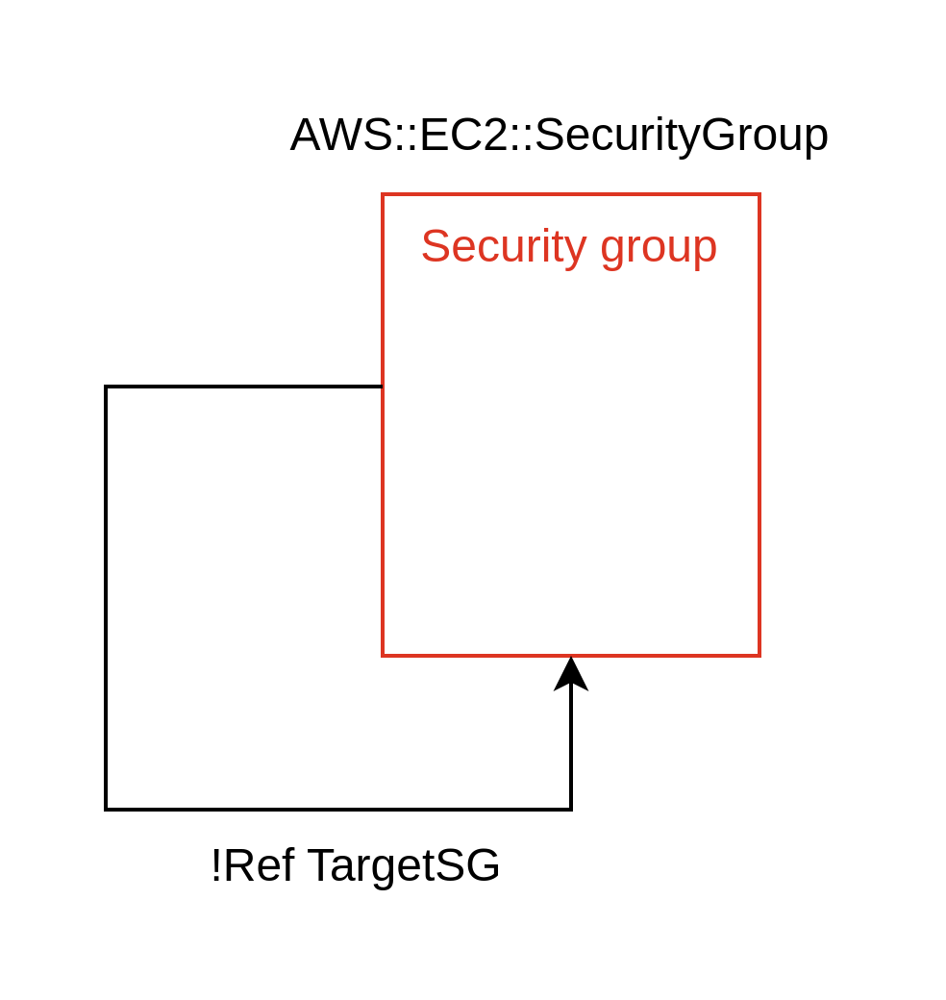
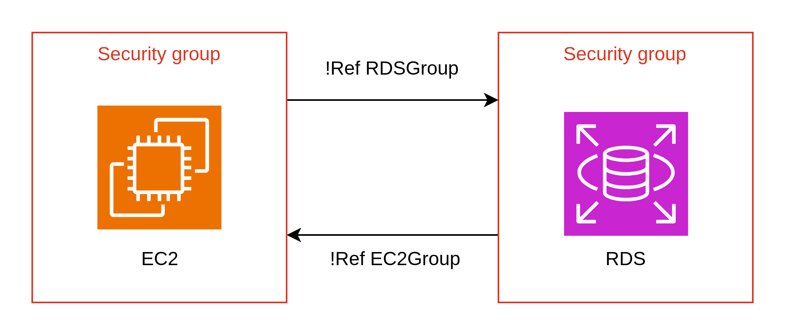

# テンプレートファイル

## セクション

| セクション名             | 値の型               | 備考                                                                                                                 |
| :----------------------- | :------------------- | :------------------------------------------------------------------------------------------------------------------- |
| AWSTemplateFormatVersion | String               | 固定値 2010-09-09                                                                                                    |
| Description              | String               | テンプレートの説明を記載                                                                                             |
| Transform                | String/List\<String> | マクロや変換を指定する（AWS::LanguageExtensions/AWS::Serverless-2016-10-31）                                         |
| Metadata                 | String               | コメントを記載/AWS::CloudFormation::Interface を設定してマネジメントコンソールのパラメータの並びを設定できる         |
| Parameters               | YAML                 | スタック作成時に指定できる値（引数）                                                                                 |
| Outputs                  | YAML                 | スタック実行後に表示する値を記載する（返り値）Fn::ImportValue で他のスタックから Export の値を参照可能               |
| Mappings                 | YAML                 | キーと名前付きの値の組み合わせを登録する（ローカル変数）                                                             |
| Conditions               | YAML                 | リソースの有無や設定条件で使用する条件を登録（条件式）疑似パラメーターとパラメーターを利用して true/false を決定する |
| Resources                | YAML                 | リソースを記載する。必須                                                                                             |
| Rules                    | YAML                 | パラメーターの値や組み合わせを検証                                                                                   |

### Metadata セクション

コメント等を記載可能

```YAML
Metadata:
  comment1: sample comment
  comment2:
    date: '2020-01-01'
    todo:
      - VPCStack
```

#### AWS::CloudFormation::Interface メタデータキー

マネジメントコンソールのパラメータのグループ/並び順/ラベルを指定可能

```YAML
Metadata:
  AWS::CloudFormation::Interface:
    ParameterGroups:
      - Label:
          default: Amazon EC2 Configuration
        Parameters:
          - EC2ImageId
          - EC2InstanceType
          - EC2KeyName
```

### Parameters セクション

スタックの引数を設定可能

#### パラメータの型一覧

| Type                                                                       | Type の値                           | 説明                                                                                        |
| :------------------------------------------------------------------------- | :---------------------------------- | :------------------------------------------------------------------------------------------ |
| String                                                                     | 文字列                              |                                                                                             |
| Number                                                                     | 数値                                | 整数または浮動小数点                                                                        |
| List\<String>/List\<Number>/List\<AWS::EC2::Subnet::Id>/CommaDelimitedList | 配列                                | マネジメントコンソール/Default プロパティーには A,B,C のようにコンマ区切りで記述する        |
| AWS::EC2::VPC::Id/AWS::EC2::Subnet::Id                                     | AWS 固有のタイプ                    |                                                                                             |
| SSM パラメータータイプ                                                     | AWS::SSM::Parameter::Value\<String> | SSM パラメーターストアを参照する。パラメーターの値を取得可能。SecureString は利用できない。 |

```YAML
Parameters:
  Subnets:
    Type: List<String>
    Default: 192.168.10.0/24,192.168.11.0/24,192.168.12.0/24
    AllowedValues:
      - 192.168.10.0/24
      - 192.168.11.0/24
      - 192.168.12.0/24
  DBUser:
    type: AWS::SSM::Parameter::Value<String>
    Default: /cfn/db/user
```

### Outputs セクション

スタック実行後に表示する値を設定できる（返り値）

```YAML
Outputs:
  S3BucketName:
    Value: !Ref s3Bucket
    Description: Bucket Name
  S3BucketArn:
    Value: !GetAtt s3Bucket.Arn
    Description: Bucket Arn
```

#### Export

他のスタックに値をエクスポートできる

値をエクスポートするテンプレートファイル

```YAML
Outputs:
  S3BucketName:
    Value: !Ref s3Bucket
    Export:
      Name: s3BucketName
```

値をインポートするテンプレートファイル

```YAML
Resources:
  S3Bucket2:
    Type: AWS::S3::Bucket
    Properties:
      LoggingConfiguration:
        DestinationBucketName:
          Fn::ImportValue: s3BucketName
        LogFilePrefix: test-log/
```

エクスポートの注意点

- 利用中のエクスポートの値の更新は不可。スタックの削除も不可。
- Export 名はアカウント/リージョンで一意にする必要がある。
- Export 名には Ref や GetAtt で取得したリソース参照値は指定不可。

### Resources セクション

リソースには以下の属性を設定可能

| 属性名              | 説明                                                                         |
| :------------------ | :--------------------------------------------------------------------------- |
| 論理 ID（必須）     | cfn での論理 ID を指定する/テンプレートファイル内で一意である必要がある      |
| Type（必須）        | AWS::EC2::Instance などのリソースの種類                                      |
| Properties          | 作成するリソースの設定値                                                     |
| DeletionPolicy      | リソース削除時の挙動を設定                                                   |
| UpdateReplacePolicy | リソース置換時の挙動を設定                                                   |
| DependsOn           | リソースを作成する順番を指定すために依存しているリソースの論理 ID を指定する |
| Metadata            | コメント                                                                     |
| Condition           | 指定した Conditions セクションの値が true の場合のみリソースを作成する       |

```YAML
Resources:
  s3Bucket:
    Type: AWS::S3::Bucket
    DeletionPolicy: RetainExceptOnCreate
    UpdateReplacePolicy: Delete
    DependsOn: otherResourceId
    Metadata:
      comment1: sample-comment
    Properties:
      BucketName: test-bucket
```

#### DeletionPolicy

スタック削除時とスタックの更新でリソースが削除される際にリソースを削除するか保持するかを設定できる。

| ポリシーの値         | 動作                                                    |
| :------------------- | :------------------------------------------------------ |
| Delete               | 削除する                                                |
| Retain               | 削除せず保持する                                        |
| RetainExceptOnCreate | 削除しない/最初のリソース作成時に失敗した場合は削除する |
| Snapshot             | 削除する/削除する前に snapshot を取得する               |

Snapshot には以下のリソースが対応している

- AWS::EC2::Volume
- AWS::ElastiCache::CacheCluster
- AWS::ElastiCache::ReplicationGroup
- AWS::RDS::DBCluster
- AWS::RDS::DBInstance
- AWS::Redshift::Cluster

#### UpdateReplacePolicy

スタック更新時に置換が発生する場合にリソースを削除するか保持するかを設定できる。

| ポリシーの値 | 動作                                      |
| :----------- | :---------------------------------------- |
| Delete       | 削除する                                  |
| Retain       | 削除せず保持する                          |
| Snapshot     | 削除する/削除する前に snapshot を取得する |

DeletionPolicy と UpdateReplacePolicy の適用タイミングを以下に示す。

| タイミング                   | 適用されるポリシー  |
| :--------------------------- | :------------------ |
| リソース新規作成失敗         | DeletePolicy        |
| スタック更新で論理 ID 削除   | DeletePolicy        |
| スタック更新でリソースの置換 | UpdateReplacePolicy |
| スタック削除                 | DeletePolicy        |

#### DependsOn

明示的に依存関係を設定することで依存リソースを先に作成することができる。**論理 ID を指定する。**

```YAML
Resources:
  routeTable:
    Type: AWS::EC2::RouteTable
    DependsOn: subnet
    Properties:
      VpcId: !Ref vpc
  subnet:
    Type: ASW::EC2::Subnet
    Properties:
      VpcId: !Ref vpc
      CidrBlock: 10.0.0.0/24
```

先にサブネットが作成されてからルートテーブルが作成される。

#### 動的参照

動的参照を使用することで SSM パラメターストアや SecretManager から値を取得できる。

- ssm パラメータの値（文字列）
- 一部の ssm パラメータの値（暗号化された文字列）
- SecretManager のシークレット

##### ssm パラメータの文字列

Resources セクション/Parameters セクション/Outputs セクションで利用できる。

```YAML
Resources:
  instance:
    Type: AWS::EC2::Instance
    Properties:
      ImageId: '{{resolve:ssm:/imageId/ubuntu}}' # バージョン指定なし
  instance2:
    Type: AWS::EC2::Instance
    Properties:
      ImageId: '{{resolve:ssm:/imageId/ubuntu:1}}' # バージョン指定あり
```

##### ssm パラメータの暗号化された文字列

ほとんどの暗号化された文字列は使用できない。RDS/ElastiCache などの一部のパラメーターのみ使用可能

##### SecretManager シークレット

SecretManager のシークレットは任意のリソースプロパティーで使用できる。

```YAML
'{{resolve:secretmanager:シークレット名::JSONキー:staging}}' # ステージングラベル指定
'{{resolve:secretmanager:シークレット名::JSONキー::version-id}}' # バージョンID指定
'{{resolve:secretmanager:シークレット名::JSONキー}}' # バージョンIDを指定しない場合、AWSCurrentを取得する
'{{resolve:secretmanager:シークレット名}}' # JSON自体を取得する
```

##### ssm パラメータによるスタック間の値の授受

エクスポートする側のスタックで AWS::SSM::Params リソースを作成し、インポートする側のリソースで ssm パラメータを参照する。

値をエクスポートするスタック

```YAML
Resources:
  ssmParam:
    Type: AWS::SSM::Parameter
    Properties:
      Name: /cfn/vpcId
      Type: String
      Tier: Standard
      Value: !Ref vpc
      Description: vpc id
  vpc:
    Type: AWS::EC2::VPC
    Properties:
      CidrBlock: 10.0.0.0/16
```

値をインポートするスタック

```YAML
Resources:
  subnet:
    Type: AWS::EC2::Subnet
    Properties:
      VpcId: '{{resolve:ssm:/cfn/vpcId}}'
      CidrBlock: 10.0.0.0/24
```

### Mappings セクション

- Mappings セクションでは 3 つのキーと値の組み合わせを登録する
- Resources セクションで Fn::FindInMap を使い Mappings セクションの値を利用する

```YAML
Parameters:
  env:
    Type: String
    AllowedValues: dev,stg,pro
Mappings:
  EnvToValues:
    dev:
      taskCount: 1
      cpu: '256'
      memory: '512'
    stg:
      taskCount: 1
      cpu: '512'
      memory: '1024'
    dev:
      taskCount: 4
      cpu: '1024'
      memory: '2048'
```

### Conditions セクション

Conditions セクションに条件式を記述し、各リソースの Condition セクションでリソースの作成をする/しない等の条件を設定する

```YAML
Parameters:
  env:
    Type: String
    AllowedValues: dev,stg,pro
Conditions:
  isProd: !Equals
    - !Ref env
    - pro
Resources:
  s3Bucket4Prod:
    Type: AWS::S3::Bucket
    Condition: isProd
  s3Bucket4All:
    Type: AWS::S3::Bucket
    Properties:
      LifecycleConfiguration:
        Fn::If:
          - IsProd
          - Ref: AWS::NoValue
          - Rules:
              - Id: DeleteAfter1Month
                Status: Enabled
                ExpirationInDays: '30'
```

## スタック間の連携

スタック間で連携する方法は以下の 3 種類がある

- ネストスタック
- 値をエクスポートすることによるクロススタック
- ssm パラメータを使用した値の授受によるクロススタック

| 種類           | 向いている状況                                     |
| :------------- | :------------------------------------------------- |
| ネストスタック | リソースを個別に更新する必要がなく一括更新する場合 |
| クロススタック | リソースの独立性が高く、個別に更新する場合         |

## 組み込み関数

| 組み込み関数    | 説明                                                                                                            |
| :-------------- | :-------------------------------------------------------------------------------------------------------------- |
| Ref             | パラメータ/リソースの物理 ID/組み込み関数の値                                                                   |
| Fn::GetAtt      | 指定したリソースの属性                                                                                          |
| Fn::Sub         | 入力文字列の変数${}を置換                                                                                       |
| Fn::Base64      | 入力文字列を base64 エンコードする                                                                              |
| Fn::Cidr        | CIDR アドレスブロックの配列                                                                                     |
| Fn::FindInMap   | Mappings セクションのマッピングの値                                                                             |
| Fn::GetAZs      | 指定した AZ の配列（デフォルト サブネット が存在する AZ 配列/デフォルトサブネット が存在しない場合は全ての AZ） |
| Fn::ImportValue | 他のスタックの Outputs セクションの Export を参照                                                               |
| Fn::Join        | 配列を指定文字で連結した値                                                                                      |
| Fn::Select      | 配列からインデックス番号取得した値                                                                              |
| Fn::Split       | 文字列を指定の文字で分割した配列                                                                                |

以下は AWS::LanguageExtensions で使用可能な関数

| 関数             | 説明                                       |
| :--------------- | :----------------------------------------- |
| Fn::Length       | 配列の要素数                               |
| Fn::ForEach      | 指定した配列の値で繰り返し                 |
| Fn::ToJsonString | オブジェクトまたは配列を JSON 文字列に変換 |

以下は Conditions セクション/Resources セクションの Condition で使用できる関数

| 関数       | 例                                                     |
| :--------- | :----------------------------------------------------- |
| Fn::And    | Fn::And: [{条件}, {条件}]                              |
| Fn::Or     | Fn::Or: [{条件}, {条件}]                               |
| Fn::Not    | Fn::Not: {条件}                                        |
| Fn::Equals | Fn::Equals: ['値 1', '値 2']                           |
| Fn::If     | Fn::If: [conditionName, true の時の値, false の時の値] |

### Ref

- パラメーターを指定した場合パラメーターの値を返す
- AWS::AccountId 等の疑似パラメーターを指定した場合その値を返す
- リソース（論理 ID）を指定した場合は作成した物理 ID を返す

```YAML
Ref: logicalName # 正式形
!Ref: logicalName # 短縮形
```

### Fn::GetAtt

リソースの属性情報を返す。

```YAML
# 正式形
Fn::GetAtt:
  - logicalName
  - attribute

# 短縮形
!GetAtt
  - logicalName
  - attribute

Fn::GetAtt: logicalName.attribute # 正式形
!GetAtt: logicalName.attribute # 短縮形
```

### Fn::Sub

文字列中の`${xx}`を変数 xx として置換する。

```YAML
Fn::Sub: '${AWS::StackId}-bucket' # 正式形
!Sub '${AWS::StackId}-bucket' # 短縮形
```

マッピングのある Fn::Sub を使用すると他の組み込み関数と組み合わせることができる。

```YAML
Name:
  Fn::Sub:
    - 'www.${Domain}/${Path}'
    - Domain: !ImportValue ExportDomainName
      Path: !If [isDev, 'test', 'app']
```

### Fn::Cidr

IP アドレスブロックの配列を返す。

```YAML
# 正式形
Fn::Cidr:
  - ipBlock(ipの範囲を指定する)
  - count(何個のIPアドレスブロックを作成するか指定する)
  - cidrBits(1つのIPアドレスブロックのbit数。例えば256個のIPアドレスをIPアドレスに含めたい場合は8bitなので8を指定する)

# 短縮形
!Cidr [ipBlock, count, cidrBits]
```

下記は配列['192.168.0.0/27', '192.168.0.32/27', '192.168.0.64/27']を返す。

```YAML
Fn::Cidr:
  - 192.168.0.0/16
  - '3' # 3個のIPアドレスブロックがほしい
  - '5' # IPアドレスブロックの範囲は5bit
```

### Fn::FindInMap

3 つのキーを指定して Mappings の値を取得する。

```YAML
# 正式形
Fn::FindInMap:
  - MapName
  - TopLevelKey
  - SecondLevelKey

# 短縮形
!FindInMap [MapName, TopLevelKey, SecondLevelKey]
```

### Fn::GetAZs

AZ 配列を返却する。デフォルトサブネットがある場合はデフォルトのサブネットを持つ AZ のみ返す。デフォルトサブネットが存在しない場合は全ての AZ を返す。

```YAML
# 正式形
Fn::GetAZs:
  Ref: AWS::Region

# 短縮形
!GetAZs:
  Ref: AWS::Region
```

### Fn::ImportValue

他のスタックからエクスポートされた値を返す。

```YAML
# 正式形
Fn::ImportValue: s3BucketName

# 短縮形
!ImportValue s3BucketName
```

### Fn::Join

指定した文字列で複数の文字列を結合する。

```YAML
# 正式形
Fn::Join:
  - ','
  - [a, b, c, d]

# 短縮形
!Join
  - ','
  - [a, b, c, d]
```

### Fn::Select

配列から指定したインデックス番号の要素を返す。

```YAML
# 正式形
Fn::Select:
  - '0'
  - [apples, grapes, oranges]

# 短縮形
!Select
  - '0'
  - [apples, grapes, oranges]
```

### Fn::Split

テキストを配列に変換する

```YAML
# 正式形
Fn::Split:
  - ','
  - 'a,b,c,d'

# 短縮形
!Split
  - ','
  - 'a,b,c,d'
```

### Fn::Length

配列の長さを返す。  
AWS::LanguageExtensions を Transform セクションに指定する必要がある。

```YAML
Fn::Length: [1, 2, 3]
```

## 疑似パラメーター

AWS アカウント ID など AWS 環境の除法を提供するパラメーター。パラメーターと同様に Ref や Fn::Sub で参照できる。

| 疑似パラメーター      | 説明                                                                              |
| :-------------------- | :-------------------------------------------------------------------------------- |
| AWS::AccountId        | AWS アカウント ID                                                                 |
| AWS::NotificationARNs | スタックの通知 SNS の ARN リスト                                                  |
| AWS::NoValue          | リソースプロパティーに使用するとそのプロパティーを削除する。Fn::If と一緒に用いる |
| AWS::Region           | リージョン                                                                        |
| AWS::StackId          | スタック ID                                                                       |
| AWS::StackName        | スタック名                                                                        |

## 循環参照

Ref/Fn::Sub/Fn::GetAtt を使い参照する際、循環参照になってしまうことがある。循環参照が作成される場合はどのリソースを先に作成するかを cfn が判断できないのでエラーになりテンプレートを登録できない。cfn-lint を使用するとどのリソース間で循環参照が発生しているかエラーメッセージ/グラフで表示できる。

### セキュリティーグループで発生する循環参照（自己参照）

VPC のセキュリティーグループではセキュリティーグループ自体を通信元/通信先に指定できる。自身を参照するルールを別リソースとして切り出すことで自己参照を解除できる。



```YAML
Resources:
  TargetSG:
    Type: AWS::EC2::SecurityGroup
    Properties:
      VpcId: !Ref vpc
      GroupDescription: allow ingress from icmp
      Tags:
        - Key: Name
          Value: TargetSG
  IngressRule:
    Type: AWS::EC2::SecurityGroupIngress
    Properties:
      GroupId: !Ref TargetSg
      IpProtocol: icmp
      fromPort: -1
      toPort: -1
      SourceSecurityGroupId: !Ref TargetSG
```

### セキュリティーグループ間で派生する循環参照

2 つのグループ間で通信を許可する場合にも循環参照する。ルールを別リソースとして登録することで循環参照を回避できる。



```YAML
Resources:
  RdsSG:
    Type: AWS::EC2::SecurityGroup
    Properties:
      VpcId: !Ref vpc
      GroupDescription: allow rds from ec2
      Tags:
        - Key: Name
          Value: RdsSG
  RdsIngressRule:
    Type: AWS::EC2:SecurityGroupIngress
    Properties:
      GroupId: !Ref RdsSG
      IpProtocol: tcp
      fromPort: 3306
      toPort: 3306
      SourceSecurityGroupId: !Ref EC2SG

  EC2SG:
    Type: AWS::EC2::SecurityGroup
    Properties:
      VpcId: !Ref vpc
      GroupDescription: ec2 sg
      SecurityGroupIngress:
        - IpProtocol: tcp
          fromPort: 80
          toPort: 80
          CidrBlock: 0.0.0.0/0
      Tags:
        - Key: Name
          Value: EC2SG
  EC2EgressRule:
    Type: AWS::EC2:SecurityGroupEgress
    Properties:
      GroupId: !Ref EC2SG
      IpProtocol: tcp
      fromPort: 3306
      toPort: 3306
      SourceSecurityGroupId: !Ref RdsSG
```

### ポリシーで発生する循環参照

IAM ポリシーやリソースポリシーが関係して循環参照になる場合がある。


#### 解決方法 1 IAM ポリシーを別リソースに切り出し


```YAML
Resources:
  myCMK:
    Type: AWS::KMS::Key
    Properties:
      EnableKeyRotation: true
      KeyPolicy:
        Version: '2012-10-17'
        Id: Policy1
        Statement:
          - Sid: Enable IAM User Permission
            Effect: Allow
            Action: kms:*
            Principal:
              AWS: !Sub 'arn:aws:iam::${AWS::AccountId}:root'
            Resource: '*'
          - Sid: Enable lambda-role Permission
            Effect: Allow
            Action: kms:*
            Resource: '*'
            Principal:
              AWS: !GetAtt myLambdaRole.Arn
  myCMKAlias:
    Type: AWS::KMS::Alias
    Properties:
      TargetKeyId: !Ref myCMK
      AliasName: !Sub 'alias/${AWS::StackName}'

  myEncryptedS3:
    Type: AWS::S3::Bucket
    Properties:
      BucketName: !Sub '${AWS::AccountId}-${AWS::Region}-${AWS::StackName}'
      BucketEncryption:
        ServerSideEncryptionConfiguration:
          - ServerSideEncryptionByDefault:
              SSEAlgorithm: aws:kms
              KMSMasterKeyID: !Ref myCMKAlias
            BucketKeyEnabled: true

  myLambdaRole:
    Type: AWS::IAM::Role
    Properties:
      AssumeRolePolicyDocument:
        Version: '2012-10-17'
        Statement:
          - Effect: Allow
            Action: sts:AssumeRole
            Principal:
              Service: lambda.amazonaws.com
      ManagedPolicyArns:
        - arn:aws:iam::aws:policy/service-role/AWSLambdaBasicExecutionRole
  myLambdaRolePolicy:
    Type: AWS::IAM::Policy
    Properties:
      Roles:
        - Ref: myLambdaRole
      PolicyName: lambda-write-2-s3
      PolicyDocument:
        Version: '2012-10-17'
        Statement:
          - Effect: Allow
            Action: s3:PutObject
            Resource: !Sub 'arn:aws:s3:::${myEncryptedS3}/*'

  myLambda:
    Type: AWS::Lambda::Function
    Properties:
      FunctionName: SaveEvent2S3
      Runtime: python3.9
      Handler: index.lambda_handler
      Role: !GetAtt myLambdaRole.Arn
      Code:
        ZipFile: !Sub |
          import json
          import boto3
          from datetime import datetime
          s3 = boto3.client('s3')
          def lambda_handler(event, context):
              file_contents = json.dumps(event)
              bucket = "${myEncryptedS3}"
              key = 'event-' + datetime.now().strftime('%Y-%m-%d-%H-%M-%S') + '.json'
              response = s3.put_object(Body=file_contents, Bucket=bucket, Key=key)
              print("Lambda function end. function name:", context.function_name)
              return response
```

#### 解決方法 2 リソースポリシーを使用せず IAM ポリシーへ記載変更


```YAML
Resources:
  myCMK:
    Type: AWS::KMS::Key
    Properties:
      EnableKeyRotation: true
      KeyPolicy:
        Version: '2012-10-17'
        Id: Policy1
        Statement:
          - Sid: Enable IAM User Permission
            Effect: Allow
            Action: kms:*
            Principal:
              AWS: !Sub 'arn:aws:iam::${AWS::AccountId}:root'
            Resource: '*'
  myCMKAlias:
    Type: AWS::KMS::Alias
    Properties:
      TargetKeyId: !Ref myCMK
      AliasName: !Sub 'alias/${AWS::StackName}'

  myEncryptedS3:
    Type: AWS::S3::Bucket
    Properties:
      BucketName: !Sub '${AWS::AccountId}-${AWS::Region}-${AWS::StackName}'
      BucketEncryption:
        ServerSideEncryptionConfiguration:
          - ServerSideEncryptionByDefault:
              SSEAlgorithm: aws:kms
              KMSMasterKeyID: !Ref myCMKAlias
            BucketKeyEnabled: true

  myLambdaRole:
    Type: AWS::IAM::Role
    Properties:
      AssumeRolePolicyDocument:
        Version: '2012-10-17'
        Statement:
          - Effect: Allow
            Action: sts:AssumeRole
            Principal:
              Service: lambda.amazonaws.com
      ManagedPolicyArns:
        - arn:aws:iam::aws:policy/service-role/AWSLambdaBasicExecutionRole
      Policies:
        - PolicyName: lambda-write-2-s3-use-cmk
          PolicyDocument:
            Version: '2012-10-17'
            Statement:
              - Sid: EnablePutObject3Bucket
                Effect: Allow
                Action: s3:PutObject
                Resource: !Sub 'arn:aws:s3:::${myEncryptedS3}/*'
              - Sid: EnableUseCMK
                Effect: Allow
                Action: kms:*
                Resource: !GetAtt myCMK.Arn

  myLambda:
    Type: AWS::Lambda::Function
    Properties:
      FunctionName: SaveEvent2S3
      Runtime: python3.9
      Handler: index.lambda_handler
      Role: !GetAtt myLambdaRole.Arn
      Code:
        ZipFile: !Sub |
          import json
          import boto3
          from datetime import datetime
          s3 = boto3.client('s3')
          def lambda_handler(event, context):
              file_contents = json.dumps(event)
              bucket = "${myEncryptedS3}"
              key = 'event-' + datetime.now().strftime('%Y-%m-%d-%H-%M-%S') + '.json'
              response = s3.put_object(Body=file_contents, Bucket=bucket, Key=key)
              print("Lambda function end. function name:", context.function_name)
              return response
```

### DependsOn で発生する循環参照

s3 バケットのイベント通知設定は、設定の前に SNS 通知先に権限が付与されている必要がある。また cfn では SNS トピック(AWS::SNS::Topic)と SNS トピックを Publish する権限付与用のポリシー(AWS::SNS::TopicPolicy)は別リソースで作成する必要がある。s3 は DependsOn で SNS トピックポリシーに依存関係を設定して SNS トピックポリシーが確実に先に作成されるようにする必要がある。


#### パラメータを作成する


```YAML
Parameters:
  bucketName:
    Type: String

Resources:
  snsTopic:
    Type: AWS::SNS::Topic
    Properties:
      TopicName: test-topic
  snsTopicPolicy:
    Type: AWS::SNS::TopicPolicy
    Properties:
      PolicyDocument:
        Version: '2012-10-17'
        Statement:
          - Sid: allow-s3
            Effect: Allow
            Action: sns:Publish
            Resource: !Ref snsTopic
            Principal:
              Service: s3.amazonaws.com
            Condition:
              ArnLike:
                'aws:SourceArn': !Sub 'arn:aws:s3:*:*:${bucketName}'
              StringEquals:
                'aws:SourceAccount': !Ref AWS::AccountId
      Topics:
        - !Ref snsTopic
  myBucket:
    Type: AWS::S3::Bucket
    DependsOn:
      - snsTopicPolicy
    Properties:
      BucketName: !Ref bucketName
      NotificationConfiguration:
        TopicConfigurations:
          - Event: 's3:ObjectCreated:*'
            Topic: !Ref snsTopic
```
