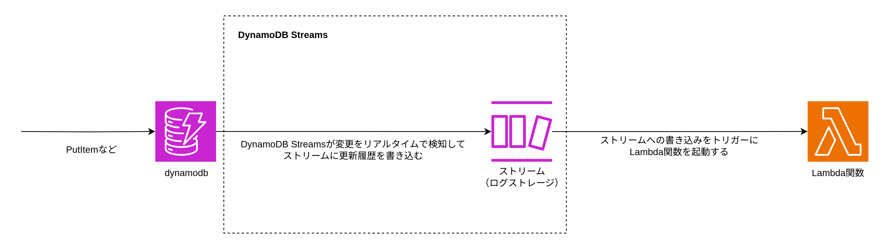

# DynamoDB

## コンポーネント

- コントロールプレーン
- クエリフロントエンド
- パーティションマネージャー（パーティションサーバーへのルーティング）
- パーティションサーバー

## データの格納先

- パーティションキーのハッシュ値により格納するパーティションサーバーが決定される
- 同じパーティションサーバーが 3 つの AZ にそれぞれ存在するため、1 つのデータは 3 つのサーバーに格納される

## ビリングモード

- オンデマンドキャパシティー
- プロビジョンドキャパシティー
  - 読み取りキャパシティーユニットと書き込みキャパシティーユニットを設定する必要がある
  - ApplicationAutoScaling を使用してキャパシティーユニットをスケールできる

## テーブルクラス

- DynamoDB Standard（標準）
  - 頻繁にアクセスされるデータに最適
  - ストレージコスト: 高い
  - データアクセスコスト: 低い
- DynamoDB Standard-Infrequent Access (DynamoDB Standard-IA)
  - 滅多にアクセスされないデータに最適
  - ストレージコスト: 低い
  - データアクセスコスト: 高い

## プライマリーキー

- パーティションキー（必須）
- ソートキー（任意）

## データ型

- スカラ型
  - S: 文字列
  - N: 数値
  - B: バイナリー
  - NULL: null
  - BOOL: boolean
- ドキュメント型
  - Map: マップ
  - List: 配列
- セット型
  - SS: 文字列セット
  - NS: 数値セット
  - BS: バイナリーセット

## TTL

- テーブルに TTL を設定できる（Unix エポック秒を格納する属性を指定する必要がある）
- TTL は PutItem や UpdateItem で属性に TTL を指定する必要がある
- DynamoDB が期限になると自動的に数日以内に削除する
- 期限になってすぐ削除されるわけではないため、TTL を過ぎた項目をフィルターしたクエリを作成して実行する必要がある

## グローバルセカンダリーインデックス

任意の属性を指定してテーブルに対するコピーを作成可能。テーブルに対してはパーティションキーとソートキー以外での検索は Scan という非効率な検索方法しか存在しないため、別の属性をパーティションキーとソートキー（任意）にしてテーブルのコピーを作成することで効率的な検索を実現可能。

- テーブルのコピー
- 新しい属性をプライマリーキーとする（ただしプライマリーキーの値が重複しても良い）
- 強力な整合性読み取り使用不可
- 属性の射影オプション
  - KYES_ONLY: テーブルソースのパーティションキーとソートキーの値、およびインデックスキーの値のみ
  - INCLUDE: KEYS_ONLY の属性に加えて、セカンダリインデックスにその他の非キー属性が含まれるように指定できる
  - ALL: テーブルソースの全ての属性

## ローカルセカンダリーインデックス

テーブルソースと同一のパーティションキーと任意の属性のソートキーを指定してテーブルソースのコピーを作成可能。例えばテーブルソースのソートキーは登録日時だが更新日時順に検索したい場合はソートキーを更新日時にしてローカルセカンダリーインデックスを作成することで更新日時順のクエリを実行できる。

- テーブルのコピー
- テーブルソースとパーティションキーは同一
- ソートキーは必須
- 属性の射影オプション
  - KYES_ONLY: テーブルソースのパーティションキーとソートキーの値、およびインデックスキーの値のみ
  - INCLUDE: KEYS_ONLY の属性に加えて、セカンダリインデックスにその他の非キー属性が含まれるように指定できる
  - ALL: テーブルソースの全ての属性

## 読み取りクエリ

基本的にパーティションキーとソートキーに対してしか条件を付与できない（だからこそグローバルセカンダリーインデックスが必要）

- GetItem
  - プライマリーキーを指定して単一の項目を取得する
  - グローバルセカンダリーインデックスに対しては使用不可（プライマリーキーが重複して複数の項目を取得する可能性があるから）
- BatchGetItem
  - 1 度の API 呼び出しで複数の GetItem を実行する
- Query
  - パーティションキーを指定して異なるソートキーの複数の項目を取得する
  - パーティションキー: 必須/等価条件(=)での比較のみ
  - ソートキー: 任意/範囲比較なども可能
  - グローバルセカンダリーインデックス/ローカルセカンダリーインデックスに対しても使用可能
  - パーティションキーとソートキーを指定して項目取得後にフィルター式にパーティションキーとソートキー以外の属性を指定して項目を絞り込むこともできる（ただしパフォーマンスが劣化する可能性あり）
- Scan
  - テーブルの全ての項目をスキャンする（非効率）

## 読み込み整合性

DynamoDB は各データを 3 つのパーティションに書き込むため必ずしも取得したデータが最新のコミットされたデータとは限らない。

- 結果整合性のある読み取り
  - 1 つのレプリカから読み取りを行い即座に結果を返す
  - 最新のデータでない可能性がある
- 強力な整合性のある読み取り
  - 3 つのパーティションサーバーから返却された最新のタイムスタンプの値を採用する
  - 結果整合性のある読み取りの倍の読み取りキャパシティーユニットを消費する

## 書き込み整合性

DynamoDB は書き込み API を呼び出してから少なくとも 2 つの AZ のパーティションに書き込みが完了した時点で書き込みを成功とみなしクライアントにレスポンスを返す。

## 書き込みクエリ

- PutItem
  - Upsert を実行する
  - プライマリーキーの指定は必須
- UpdateItem
  - Upsert を実行する
  - プライマリーキーの指定は必須
  - 特定の項目のみ更新可能
- DeleteItem
  - Delete を実行する
  - プライマリーキーの指定は必須
- BatchWriteItem
  - 1 度の API 呼び出しで複数の PutItem/UpdateItem/DeleteItem を実行する

## 条件式

条件式に一致しない場合は書き込みクエリを失敗させることができる（RDB の排他制御の代わりに使用する）  
`condition-expression`を使用して条件式を作成する。

- 条件付きPutItem
- 条件付きDeleteItem
- 条件付きUpdateItem

条件付きPutItem（同じプライマリーキーが存在しない場合のみ項目を作成する）

```bash
aws dynamodb put-item \
    --table-name ProductCatalog \
    --item file://item.json \
    --condition-expression "attribute_not_exists(PK) AND attribute_not_exists(SK)"
```

## トランザクション

DynamoDB のトランザクションの分離レベルは Serializable。よって複数のトランザクションが同一の項目に対して書き込みまたは読み込みをする場合は 1 つのトランザクション以外は楽観ロックエラーになる。

以下にクライアント A が先にトランザクションを開始しクライアント B が後から同じ項目に書き込みまたは読み込みを実行した場合の挙動パターンを示す。

| クライアント A           | クライアント B           | 結果                                                                                |
| :----------------------- | :----------------------- | :---------------------------------------------------------------------------------- |
| トランザクション書き込み | トランザクション書き込み | トランザクション B が失敗する                                                       |
| トランザクション書き込み | トランザクション読み込み | トランザクション B が失敗する                                                       |
| トランザクション書き込み | 書き込み                 | クライアント B は即座に書き込むが、トランザクションの結果次第で最終的な状態が決まる |
| トランザクション書き込み | 読み込み                 | クライアント B は即座に読み込むが、トランザクション完了前の状態を読む可能性がある   |
| トランザクション読み込み | トランザクション書き込み | クライアント B の書き込みトランザクションが失敗する                                 |
| トランザクション読み込み | トランザクション読み込み | 両方の読み込みが成功する                                                            |
| トランザクション読み込み | 書き込み                 | クライアント B は即座に書き込む                                                     |
| トランザクション読み込み | 読み込み                 | クライアント B は即座に読み込む。両操作とも成功する                                 |

- DynamoDB のトランザションは内部的に楽観ロックを使用しているためロックの開放を待つことなく失敗する
- DynamoDB のロックは排他ロックではなく共有ロックなので同じ項目を複数のトランザクションが読み取ろうとする場合は成功する
- 非トランザクション処理は即座に実行される
- トランザクション同士の読み書きを同時に行うと楽観ロックによりエラーになる
- トランザクションと非トランザクションの読み書きを同時に行っても楽観ロックエラーにならない

## 競合が発生するパターン

1. 通常の書き込みが、別のトランザクション書き込みと競合する場合、TransactionConflictExceptionで失敗する。
2. トランザクション書き込みが、別のトランザクション書き込みと競合する場合、TransactionCanceledExceptionで失敗する。
3. トランザクション読み込みが、別のトランザクション書き込みまたは通常の書き込みと競合する場合、TransactionCanceledExceptionで失敗する。

※通常の読み込みは失敗しない。

通常の書き込み: PutItem,UpdateItem,DeleteItem  
トランザクション書き込み: TransactWriteItems  
通常の読み込み: Query,Get  
トランザクション読み込み: TransactGetItems  

## トランザクションの API

- TransactionWriteItems
  - 複数の PutItem/UpdateItem/DeleteItem をトランザクションで実行可能
  - 1 回の API 呼び出しで全ての操作が実行される
- TransactionGetItems
  - 複数の GetItem をトランザクションで実行可能
  - 1 回の API 呼び出しで全ての操作が実行される

## トランザクションの分離レベル

| オペレーション | 分離レベル                        |
| :------------- | :-------------------------------- |
| DeleteItem     | SERIALIZABLE/通常書き込み         |
| PutItem        | SERIALIZABLE/通常書き込み         |
| UpdateItem     | SERIALIZABLE/通常書き込み         |
| BatchWriteItem | 通常書き込み                      |
| GetItem        | SERIALIZABLE/コミット済み読み取り |
| BatchGetItem   | コミット済み読み取り              |
| Query          | コミット済み読み取り              |
| Scan           | コミット済み読み取り              |

## DynamoDB のデータモデリング

- シングルテーブル設計: 1 つのテーブルに複数のエンティティーを含める
  - SK にエンティティー名を指定して各エンティティーを区別する
  - 複合ソートキーを使用してクエリの柔軟性を上げることができる
- マルチテーブル設計: 1 つのテーブルに 1 つのエンティティー

### 1. 複合ソートキー

クエリとして複数の属性を指定してフィルタリングできるようにソートキーに複数の属性を指定する

<table>
  <thead>
    <th>PK</th>
    <th>SK</th>
    <th>name</th>
  </thead>
  <tbody>
    <tr>
      <td rowspan="4">UserId</td>
      <td>Cart#Active</td>
      <td>Apple</td>
    </tr>
    <tr>
      <td>Cart#Active</td>
      <td>Banana</td>
    </tr>
    <tr>
      <td>Cart#Saved</td>
      <td>Oranges</td>
    </tr>
    <tr>
      <td>Wish</td>
      <td>Carrots</td>
    </tr>
  </tbody>
</table>

### 2. 項目コレクション

1 つのテナントに対して 1 つのエンティティーの項目を複数保持する。例）ユーザー ID に対して複数の写真項目を保持する

<table>
  <thead>
    <th>PK</th>
    <th>SK</th>
    <th>ImageURL</th>
  </thead>
  <tbody>
    <tr>
      <td rowspan="2">UserOne</td>
      <td>PhotoId0001</td>
      <td>http://s3.amazonaws.com/bucket/example01.png</td>
    </tr>
    <tr>
      <td>PhotoId0002</td>
      <td>http://s3.amazonaws.com/bucket/example02.png</td>
    </tr>
    <tr>
      <td rowspan="2">UserTwo</td>
      <td>PhotoId0003</td>
      <td>http://s3.amazonaws.com/bucket/example03.png</td>
    </tr>
    <tr>
      <td>PhotoId0004</td>
      <td>http://s3.amazonaws.com/bucket/example04.png</td>
    </tr>
  </tbody>
</table>

### 3. グローバルセカンダリーインデックス

テーブルの PK とは異なる PK を指定して読み取りクエリを実行したい場合はグローバルセカンダリーインデックスを使用する。

ポストテーブル

<table>
  <thead>
    <th>PK</th>
    <th>UserId</th>
  </thead>
  <tbody>
    <tr>
      <td >Post01</td>
      <td rowspan="3">User01</td>
    </tr>
    <tr>
      <td>Post02</td>
    </tr>
    <tr>
      <td>Post03</td>
    </tr>
    <tr>
      <td>Post04</td>
      <td>User02</td>
    </tr>
  </tbody>
</table>

グローバルセカンダリーインデックス

<table>
  <thead>
    <th>PK(UserId)</th>
    <th>PostId</th>
  </thead>
  <tbody>
    <tr>
      <td rowspan="3">User01</td>
      <td>Post01</td>
    </tr>
    <tr>
      <td>Post02</td>
    </tr>
    <tr>
      <td>Post03</td>
    </tr>
    <tr>
      <td>User02</td>
      <td>Post04</td>
    </tr>
  </tbody>
</table>

ポストテーブルでは`getPostsByUser`のようなクエリは実行できないためユーザー ID を PK としたグローバルセカンダリーインデックスを作成する

### 4. ローカルセカンダリーインデックス

ローカルセカンダリーインデックスでは項目コレクションをソートする属性を変更したい場合に使用する。

カラムテーブル

<table>
  <thead>
    <th>PK(MetadataId)</th>
    <th>SK(Name)</th>
    <th>Type</th>
  </thead>
  <tbody>
    <tr>
      <td rowspan="3">Meta01</td>
      <td>name01</td>
      <td>VARCHAR</td>
    </tr>
    <tr>
      <td>name02</td>
      <td>INT</td>
    </tr>
    <tr>
      <td>name03</td>
      <td>CHAR</td>
    </tr>
    <tr>
      <td>Meta02</td>
      <td>name01</td>
      <td>VARCHAR</td>
    </tr>
  </tbody>
</table>

ローカルセカンダリーインデックス

<table>
  <thead>
    <th>PK(MetaId)</th>
    <th>SK(Type)</th>
    <th>Name</th>
  </thead>
  <tbody>
    <tr>
      <td rowspan="3">Meta01</td>
      <td>CHAR</td>
      <td>name03</td>
    </tr>
    <tr>
      <td>INT</td>
      <td>name02</td>
    </tr>
    <tr>
      <td>VARCHAR</td>
      <td>name01</td>
    </tr>
    <tr>
      <td>Meta02</td>
      <td>VARCHAR</td>
      <td>name01</td>
    </tr>
  </tbody>
</table>

メタデータテーブルのみだと各メタデータに属するカラムを名前でのソートしかできないが、ローカルセカンダリーインデックスを定義することでデータ型でのソートもできる。

### 5. TTL

TTL を使用することで有効期限をすぎると数日以内にデータを削除できる。期限切れの項目削除は非同期で行われるため期限きっかりに削除したい場合は使用不可。

タイムラインテーブル

<table>
  <thead>
    <th>PK(UserId)</th>
    <th>SK(MessageTimestamp)</th>
    <th>ttl</th>
    <td>Message</th>
  </thead>
  <tbody>
    <tr>
      <td rowspan="3">UserId01</td>
      <td>2024-01-01 00:00:00</td>
      <td>170000000</td>
      <td>Hello</td>
    </tr>
    <tr>
      <td>2024-01-02 00:00:00</td>
      <td>170000000</td>
      <td>Message</td>
    </tr>
    <tr>
      <td>2024-01-03 00:00:00</td>
      <td>170000000</td>
      <td>World</td>
    </tr>
  </tbody>
</table>

TTL を過ぎても削除されていない項目を読み取りクエリから除外したい場合はフィルターを使用する

### 6.多対多

多対多の場合片方のエンティティーの ID を PK,もう一方のエンティティーの ID を SK としてもつ。グローバルセカンダリーインデックスを SK を PK に PK を SK にすることで多対多を表現できる。グラフのノードをエンティティー、エッジを関係とみなせば、両方のエンティティーに対して PK になるテーブルを作成すれば良いことがわかる。

ユーザー/講座の多対多のテーブル

<table>
  <thead>
    <th>PK(UserId)</th>
    <th>SK(CourseId)</th>
  </thead>
  <tbody>
    <tr>
      <td rowspan="3">UserId01</td>
      <td>Course01</td>
    </tr>
    <tr>
      <td>Course02</td>
    </tr>
    <tr>
      <td>Course03</td>
    </tr>
    <tr>
      <td>UserId02</td>
      <td>Course02</td>
    </tr>
  </tbody>
</table>

グローバルセカンダリーインデックス

<table>
  <thead>
    <th>PK(CourseId)</th>
    <th>SK(UserId)</th>
  </thead>
  <tbody>
    <tr>
      <td rowspan="2">Course01</td>
      <td>UserId01</td>
    </tr>
    <tr>
      <td>UserId02</td>
    </tr>
    <tr>
      <td>Course02</td>
      <td>UserId01</td>
    </tr>
   <tr>
      <td>Course03</td>
      <td>UserId01</td>
    </tr>
  </tbody>
</table>

`getCoursesByUser`はベーステーブルで`getUsersByCourse`はグローバルセカンダリーインデックスで対応できる。

### 7.大きな項目（垂直パーティショニング）

DynamoDB の項目の最大サイズは 400KB なので項目を小さなチャンクデータに分割して関連する全ての項目をパーティションキー値で関連付けて項目コレクションを作成する。

分割前のテーブル

| PK(UserId) | sessionId | Currency | Locale | AddressDelivery                     | AddressHome                        | first  | last | email            |
| :--------- | :-------- | :------- | :----- | :---------------------------------- | :--------------------------------- | :----- | :--- | :--------------- |
| 00001      | 2fbo70w   | JPY      | ja-jp  | {prefecture: Tokyo, city: Shinjuku} | {prefecture: Tokyo, city: Shibuya} | Ichiro | Sato | sato@example.com |

分割後のテーブル

<table>
  <thead>
    <th>PK(UserId)</th>
    <th>SK</th>
    <th colspan="3">Attributes</th>
  </thead>
  <tbody>
    <tr>
      <td rowspan="12">00001</td>
      <td rowspan="2">M#Session#id</td>
      <td>sessionId</td>
      <td></td><td></td>
    </tr>
    <tr>
      <td>2fbo70w</td>
      <td></td><td></td>
    </tr>
    <tr>
      <td rowspan="2">P#Currency</td>
      <td>Value</td><td></td><td></td>
    </tr>
    <tr>
      <td>JPY</td><td></td><td></td>
    </tr>
    <tr>
      <td rowspan="2">P#Locale/td>
      <td>Value</td><td></td><td></td>
    </tr>
    <tr>
      <td>ja-jp</td><td></td><td></td>
    </tr>
    <tr>
      <td rowspan="2">U#Address#Delivery</td>
      <td>Prefecture</td>
      <td>City</td><td></td>
    </tr>
    <tr>
      <td>Tokyo</td>
      <td>Shinjuku</td><td></td>
    </tr>
    <tr>
      <td rowspan="2">U#Address#Home</td>
      <td>Prefecture</td>
      <td>City</td><td></td>
    </tr>
    <tr>
      <td>Tokyo</td>
      <td>Shibuya</td><td></td>
    </tr>
    <tr>
      <td rowspan="2">U#Address#Information</td>
      <td>first</td>
      <td>last</td>
      <td>email</td>
    </tr>
    <tr>
      <td>Ichiro</td>
      <td>Sato</td>
      <td>sato@example.com</td>
    </tr>
  </tbody>
</table>

## 読み込み操作（DynamoDB API）

### プロジェクション式(projection-expression)

取得する属性を指定する

```bash
aws dynamodb get-item \
    --table-name ProductCatalog \
    --key '{"PK": {S: "001"}}' \
    --projection-expression "Description, RelatedItems[0], ProductReviews.FiveStar"
```

### 属性値式(expression-attribute-values)

SQL でいうとプレースホルダーの実際の値を定義する。プレフィックスとして`:`を付与する必要がある。

```bash
aws dynamodb scan \
  --table-name ProductCatalog \
  --filter-expression '{contains(Color, :c) and price <= :p}' \
  --expression-attribute-values '{ ":c": {"S": "Black"}, ":p": {"N": 500} }'
```

### クエリの条件式（key-condition-expression）

`a = b`/`a < b`/`a > b`/`a <= b`/`a >= b`/`a BETWEEN b and c`/`begins_with(a, string)`がサポートされている

```bash
aws dynamodb query \
  --table-name Reply \
  --key-condition-expression "Id = :id and begins_with(ReplyDateTime, :dt)" \
  --expression-attribute-values '{ ":id": {"S": "0001"}, ":dt": {"S": "2024-01"} }'
```

### クエリのフィルター式

PK と SK を指定して Query を実行後にフィルター式で指定したフィルターを実行する。フィルター式はパーテイションサーバーから Query によって項目を取得した後にクエリフロントエンドで実行される。

```bash
aws dynamodb query \
  --table-name Thread \
  --key-condition-expression 'ForumName = :fn and Subject = :sub' \
  --filter-expression 'Views >= :num' \
  --expression-attribute-values '{ ":fn": {"S": "DynamoDB"}, ":sub": {"S": "Thread1"}, ":num": {"N": 3} }'
```

### ソート

`scan-index-forward`に Bool 値を指定することで SK でソートできる。

- true: 昇順
- false: 降順

```bash
aws dynamodb query \
  --table-name Thread \
  --key-condition-expression 'ForumName = :fn' \
  --expression-attribute-values '{ ":fn": {"S": "DynamoDB"} }'
  --scan-index-forward false
```

### 項目数指定

`limit`に項目数を指定することで返却される結果の項目数を指定できる。Limit とフィルター式を併用した場合指定した Limit の数以下の項目数が返却される可能性がある。Limit は Query 実行時の項目数をしており、Query 実行後にフィルター式を実行すると項目数が減る可能性がある。

```bash
aws dynamodb query \
  --table-name Thread \
  --key-condition-expression 'ForumName = :fn' \
  --expression-attribute-values '{ ":fn": {"S": "DynamoDB"} }'
  --limit 10
```

### クエリ結果セットの最大サイズ

クエリ結果セットの最大サイズは 1MB であるためクエリ結果を全ての取得するためには`lastEvaluatedKey`が Null になるまで繰り返し DynamoDB の API を呼び出す必要がある。

以下のような処理を繰り返し処理する

1. クエリを実行する
2. 結果に LastEvaluatedKey 要素が含まれており、それが Null 以外の場合、ステップ 2 に進む。結果に LastEvaluatedKey がない場合、これ以上取得する項目はない。
3. 以前のものと同じパラメータを使用して新しい Query リクエストを作成する。ただし、今回は、ステップ 1 から LastEvaluatedKey 値を取得して、新しい Query リクエストの ExclusiveStartKey パラメータとして使用する。

### 条件式（演算子+関数）

- `=` `<>` `<` `<=` `>` `>=`
- IN
- BETWEEN
- `attribute_exists`/`attribute_not_exists`/`begins_with`/`contains`
- NOT
- AND
- OR

## 書き込み操作（DynamoDB API）

### 更新式（updateItem）

#### SET（属性の更新/追加）

属性が存在しない場合は追加し、属性がすでに存在する場合は上書きする

```bash
aws dynamodb update-item \
  --table-name ProductCatalog \
  --key '{"id": {"N": 789}}' \
  --update-expression 'SET ProductCategory = :c, Price = :p' \
  --expression-attribute-values '{":c": {"S": "Hardware"}, ":p": {"N": "60"}}' \
  --return-values ALL_NEW
```

## DynamoDBStreams



DynamoDB Streams を有効化すると DynamoDB テーブル内の項目を変更するたびに DynamoDB Streams が項目を最大 24 時間ストリームに保存する。ストリームとはテーブル変更履歴を保存するためのログストレージのこと。また DynamoDBStreams のストリームへの書き込みをトリガーとして Lambda 関数を実行できる（DynamoDB テーブルへの書き込みをトリガーとして Lambda 関数を実行することが現在できない）。

### オプション

StreamSpecification（ストリームに保存する内容）

- KEYS_ONLY: キー属性のみストリームに書き込む
- NEW_IMAGE: 変更後の項目のみストリームに書き込む
- OLD_IMAGE: 変更前の項目のみストリームに書き込む
- NEW_AND_OLD_IMAGE: 変更前の項目/変更後の項目をストリームに書き込む

cfn では DynamoDB テーブルの StreamSpecification を指定すると DynamoDBStreams が有効化される。他のオプションはないので新しく項目が作成された場合のみ Stream がストリームに書き込むなどはできない。そのような要件を実現したい場合は Lambda 関数のフィルターオプションを使用する。

### TTL

TTLを設定しているテーブルにDynamoDB Streamsを設定してストリームへの書き込みをトリガーとしてLambda関数を実行すると、有効期限切れの項目をバックアップ可能

### SDK

DynamoDB API と DynamoDB Streams API は異なるため 2 つのクライアントをインスタンス化する必要がある。

[DynamoDB Streams と Lambda の例](https://docs.aws.amazon.com/ja_jp/amazondynamodb/latest/developerguide/Streams.Lambda.Tutorial.html)
