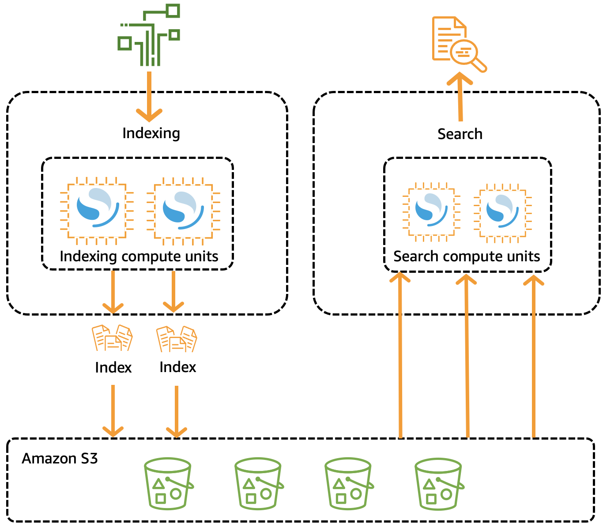
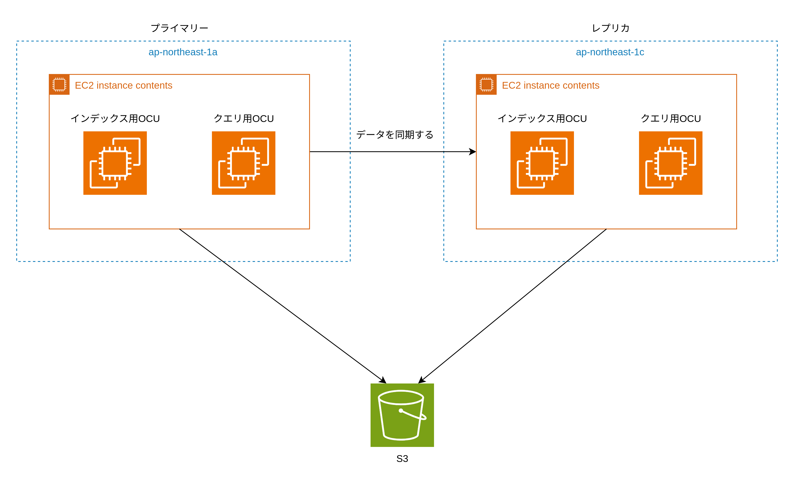
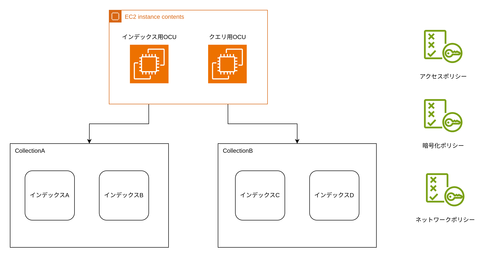

# OpenSearchServerless

## 仕組み

OpenSearchServerless は以下の 3 つのコンポーネントから構成される。

- インデックス作成コンポーネント（OCU）
- 検索（クエリ）コンポーネント（OCU）
- インデックス格納コンポーネント（S3）

OCU（OpenSearchComputeUnit）は 6GB のメモリ、仮想 CPU、120GB のエフェメラルストレージを持つ仮想サーバーである。検索コンポーネントのメモリやエフェメラルストレージにはインデックスのキャッシュが保管されている。検索時に OCU 内にキャッシュが存在しない場合には S3 からデータを直接ダウンロードして検索オペレーションを実行する。



## レプリカ

`StandbyReplica=Enabled`を指定すると OCU を 2 つの AZ にまたがって冗長構成にすることができる。



## CloudFormation のリソース一覧

OpenSearchServerless はコレクションというリソースを作成して、その中にインデックスを作成する。AWS アカウント、リージョン毎にコレクション/インデックスへのアクセスポリシー、暗号化ポリシー、ネットワークポリシーを作成する。

OpenSearchServerless の cfn のリソース一覧を以下に示す。

- Collection
  - インデックスを格納することができる概念的な箱
- AccessPolicy
  - IAM ユーザーや IAM ロールに対して、コレクション/インデックスに対する操作の許可ポリシーを設定する
  - AWS アカウント/リージョン毎に作成する
- SecurityPolicy
  - ネットワークポリシーとセキュリティーポリシーを作成するために使用する
  - コレクション/インデックスに対する許可ポリシーを設定する
  - ネットワークポリシー
    - パブリックアクセス/プライベートアクセスを選択できる
    - プライベートアクセスの場合は VPC エンドポイントが必要
    - OpenSearchDashboard へのアクセス許可設定
  - 暗号化ポリシー
    - コレクション/インデックスに対する暗号化ポリシーを設定する
    - KMS の暗号化キーを使用してデータを暗号化する
- VpcEndpoint
  - Route53 プライベートホストゾーンを作成して VPC にアタッチし、VPC からコレクションへのアクセスを可能にする

```YAML
AWSTemplateFormatVersion: 2010-09-09
Description: 'Amazon OpenSearch Serverless template to create an IAM user, encryption policy, data access policy and collection'
Resources:
  IAMUSer:
    Type: 'AWS::IAM::User'
    Properties:
      UserName:  aossadmin
  DataAccessPolicy:
    Type: 'AWS::OpenSearchServerless::AccessPolicy'
    Properties:
      Name: quickstart-access-policy
      Type: data
      Description: Access policy for quickstart collection
      Policy: !Sub >-
        [{"Description":"Access for cfn user","Rules":[{"ResourceType":"index","Resource":["index/*/*"],"Permission":["aoss:*"]},
        {"ResourceType":"collection","Resource":["collection/quickstart"],"Permission":["aoss:*"]}],
        "Principal":["arn:aws:iam::${AWS::AccountId}:user/aossadmin"]}]
  NetworkPolicy:
    Type: 'AWS::OpenSearchServerless::SecurityPolicy'
    Properties:
      Name: quickstart-network-policy
      Type: network
      Description: Network policy for quickstart collection
      Policy: >-
        [{"Rules":[{"ResourceType":"collection","Resource":["collection/quickstart"]}, {"ResourceType":"dashboard","Resource":["collection/quickstart"]}],"AllowFromPublic":true}]
  EncryptionPolicy:
    Type: 'AWS::OpenSearchServerless::SecurityPolicy'
    Properties:
      Name: quickstart-security-policy
      Type: encryption
      Description: Encryption policy for quickstart collection
      Policy: >-
        {"Rules":[{"ResourceType":"collection","Resource":["collection/quickstart"]}],"AWSOwnedKey":true}
  Collection:
    Type: 'AWS::OpenSearchServerless::Collection'
    Properties:
      Name: quickstart
      Type: TIMESERIES
      Description: Collection to holds timeseries data
    DependsOn: EncryptionPolicy
Outputs:
  IAMUser:
    Value: !Ref IAMUSer
  DashboardURL:
    Value: !GetAtt Collection.DashboardEndpoint
  CollectionARN:
    Value: !GetAtt Collection.Arn
```

AWS アカウント、リージョン毎の全てのコレクションに対して同じ OCU を使用する。下図のように CollectionA と CollectionB に対する検索やインデクシングは同じ OCU を使用する。



## モニタリング/ログ

OpenSearchServerless は 2024/09 時点でログ出力する機能がない。またモニタリングに関しても OCU の CPU/メモリ/ディスクの使用率を閲覧できない。ただし、OCU の使用率が 75%以上になった場合に EventBridge を用いて通知をすることはできる。
