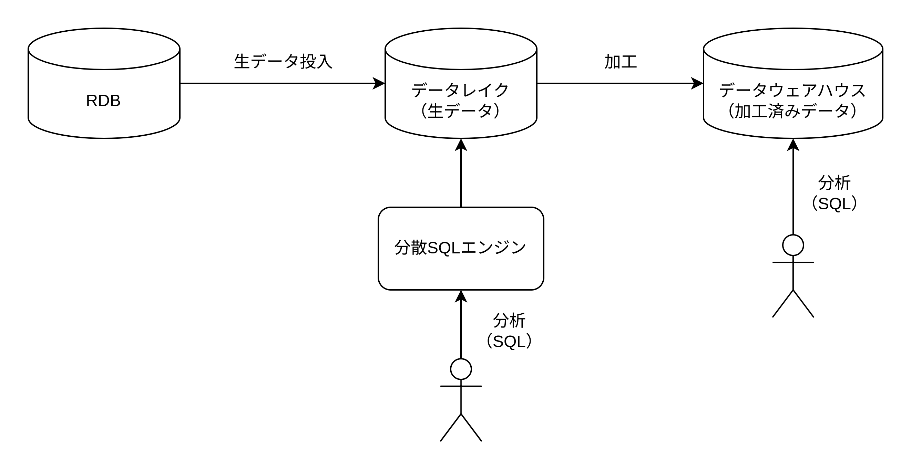

# データレイク

## データレイクとは

データレイクはあらゆる形式の生データ（構造化・半構造化・非構造化）をそのままの状態で保存するストレージ。

1. 収集  
   データソースからバッチ処理/ストリーム処理によって収集する
2. 保存  
   データソースの生データを保存する
3. 変換  
   データレイクの生データを加工して、分析用データレイク/データウェアハウスに保存する
4. 分析  
   データレイクやデータウェアハウスにクエリをリクエストして分析する

## データレイクの目的

1. コンピューティングとストレージの分離
   - コンピューティングとストレージを同一 PC 上に密結合しないことで、それぞれにスケールさせることができる。例えばストレージは 24 時間 365 日使用し続けるが、コンピューティングは使用したいときだけ起動することができるので、コンピューティングにかかる費用を抑えることが可能。（ストレージは S3、コンピューティングは Athena など）
   - コンピューティングとストレージが密結合していないので、コンピューティングのソフトやバージョンを容易に変更可能。Athena/Redshift/QuickSight など様々の処理系で分析可能。ただしストレージが API を公開し、ファイルの取得/作成/更新/削除などを行える必要がある。
   - ストレージのサイズを気にする必要がない。（Hadoop の場合は、コンピューティングとストレージが密結合しているためストレージのサイズを増やすとノード数を増やすしかないため SSD だけでなく CPU/メモリ等も購入する必要がある）
2. 真のデータ置き場
   - データレイクに常に正しいデータがあることが保証される
3. 大容量かつ多様なデータを蓄積する

## データレイクとデータウェアハウスの違い

| データレイク                                                   | データウェアハウス                                                                       |
| :------------------------------------------------------------- | :--------------------------------------------------------------------------------------- |
| 構造化データ・半構造化データ・非構造化データを保存可能         | 構造化データのみ保存可能                                                                 |
| スキーマがないので生データを保存可能                           | スキーマを定義する必要があるので生データを保存しづらく加工したデータを保存する必要がある |
| ストレージのサイズが実質無限なのでデータ量を気にする必要がない | ストレージのサイズが有限なのでデータ量を気にする必要がある                               |

