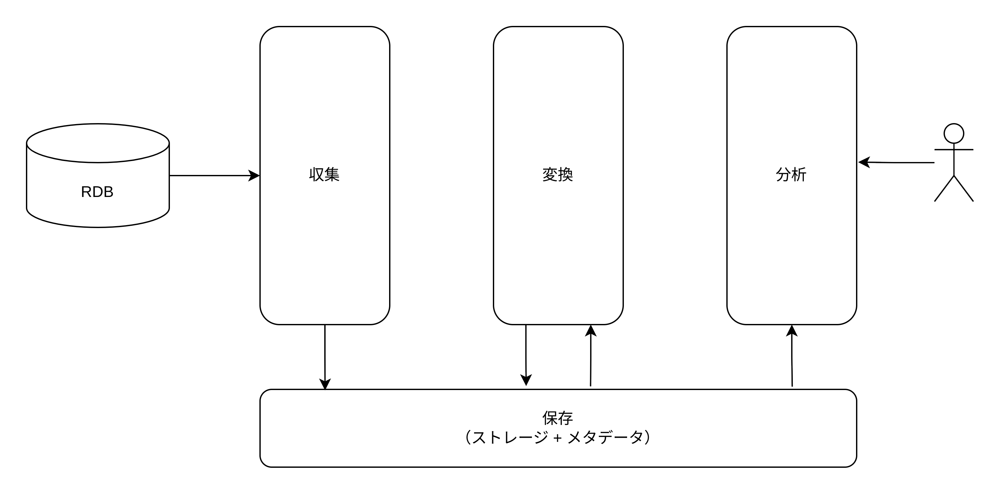
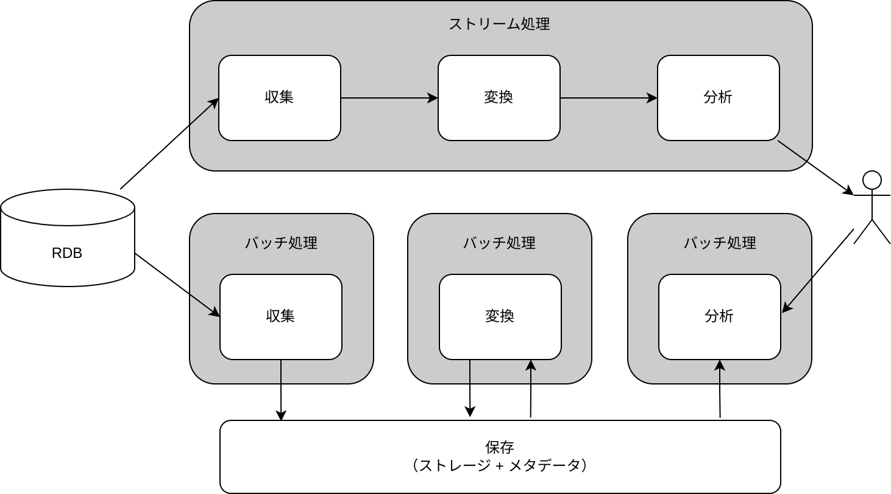

# デーレイクのコンポーネント

## データレイクのアーキテクチャー

データレイクのアーキテクチャーは以下の図のようになる。

## ラムダアーキテクチャー

バッチ処理とストリーム処理の両方を組み合わせたラムダアーキテクチャーがある。  
バッチ処理は大量データを並列で高速に処理できるが最新のデータを処理できない。  
ストリーム処理は最新のデータを処理できるが、複雑になる。よって再集計する場合手間がかかる。  
最新のデータはストリーム処理から取得し、バッチ処理側のデータとマージすることで最新の集計が可能。

## データレイクを構築する際の考え方

1. どのようなアウトプットがほしいかを考える
   - 経営者が KPI を確認するためのダッシュボード（BI ツール）
   - 不正な決済処理のリアルタイム検知（ストリーム分析）
   - ログ分析（分散 SQL）
2. 必要なデータソースのリストアップ
3. データの収集方法
   - リアルタイム性が欲しい場合はストリーム処理、そうでない場合はバッチ処理
   - RDB でストリーム処理をする場合は変更データキャプチャーを使い、バッチ処理する場合はレプリケーションログを使用するなど
4. アウトプットを導出するための変換を決める
   - Glue Job や Spark を用いて変換する

まず「分析」（分析から得られるアウトプット）を考え、それを得るためのデータを「収集」「保存」し、最後にデータをアウトプットするための「変換」「分析」について考える。

## 各コンポーネントの AWS サービス

## 収集コンポーネント

S3 には API があるので子の API を用いて、オンプレミスのサーバーやファイルシステムなどにあるデータを転送する。

### ファイル

業務システムなどから日時で出力される CSV ファイルを、cron などを用いてデータレイクに保存する。  
AWS のサービスでは AWS DataSync がある。データ転送用のエージェントを用いてオンプレミスにあるデータを S3 に対して自動的に転送できる。

### ストリームデータ

ストリームデータとは、継続的にデータが発生して順に流れてくるものを指す。Web サービスのイベント履歴、IoT センサーから定期的に送られてくるメトリクス、Web サーバーにアクセスした際に生成されるアクセスログなどが典型的なストリームデータ。ストリームデータは小さめ（数百 KB 未満）かつ大量に生成される。  
AWS のサービスでは、Amazon KDS（Kinesis Data Streams）がある。Kinesis Data Streams は log-structured な形式で書き込まれるため順序整合性があり、パーティショニングされるためスケーリングでき、レプリケーションされるため耐久性があるストリーミングサービス。  
Amazon KDF（Kinesis Data Firehose）は、S3/Redshift/ElasticSearchService などに圧縮形式やデータフォーマットを指定し簡単な変換をしてデータを出力できるサービス。  
Amazon MSK（Managed Streaming for Kafka）は、Kafka のマネージドサービス。

### データベース

RDB からデータを収集する場合は、ストリーミングによる収集とバッチによる収集の 2 種類がある。ストリーミングによる収集はレプリケーションログを使用した変更データキャプチャーによって収集する。バッチによる収集はレプリケーションログを利用した差分抽出がある。  
AWS のサービスの場合は、ストリーミング/バッチともに AWS DMS（Database Migration Service）を利用できる。

## 保存コンポーネント

### ストレージ

AWS S3 を使用する。

ストレージに求められる要件

1. 耐久性
   - 3 つ以上の AZ にレプリケーションする
2. 可用性
3. スケーラビリティー
4. 多様な形式のデータを保存可能
5. コスト
   - 参照頻度が低いまたは古いデータをアーカイブしてコスト削減できる
6. セキュリティー/権限管理
   - HTTPS で通信経路の暗号化・KMS でストレージの暗号化が可能
   - BucketPolicy/IAM/アクセスコントロールリストで権限管理可能

### メタデータ

## 変換コンポーネント

## 分析コンポーネント
