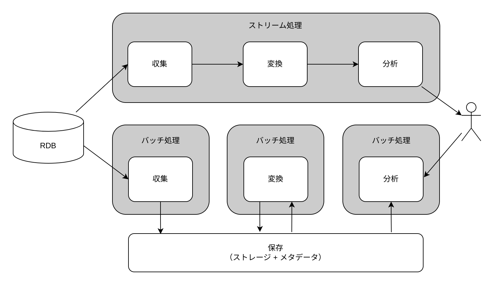

# デーレイクのコンポーネント

## データレイクのアーキテクチャー

データレイクのアーキテクチャーは以下の図のようになる。

## ラムダアーキテクチャー

バッチ処理とストリーム処理の両方を組み合わせたラムダアーキテクチャーがある。  
バッチ処理は大量データを並列で高速に処理できるが最新のデータを処理できない。  
ストリーム処理は最新のデータを処理できるが、複雑になる。よって再集計する場合手間がかかる。  
最新のデータはストリーム処理から取得し、バッチ処理側のデータとマージすることで最新の集計が可能。

## データレイクを構築する際の考え方

1. どのようなアウトプットがほしいかを考える
   - 経営者が KPI を確認するためのダッシュボード（BI ツール）
   - 不正な決済処理のリアルタイム検知（ストリーム分析）
   - ログ分析（分散 SQL）
2. 必要なデータソースのリストアップ
3. データの収集方法
   - リアルタイム性が欲しい場合はストリーム処理、そうでない場合はバッチ処理
   - RDB でストリーム処理をする場合は変更データキャプチャーを使い、バッチ処理する場合はレプリケーションログを使用するなど
4. アウトプットを導出するための変換を決める
   - Glue Job や Spark を用いて変換する

まず「分析」（分析から得られるアウトプット）を考え、それを得るためのデータを「収集」「保存」し、最後にデータをアウトプットするための「変換」「分析」について考える。

## 各コンポーネントの AWS サービス

## 収集コンポーネント

S3 には API があるので子の API を用いて、オンプレミスのサーバーやファイルシステムなどにあるデータを転送する。

### ファイル

業務システムなどから日時で出力される CSV ファイルを、cron などを用いてデータレイクに保存する。  
AWS のサービスでは AWS DataSync がある。データ転送用のエージェントを用いてオンプレミスにあるデータを S3 に対して自動的に転送できる。

### ストリームデータ

ストリームデータとは、継続的にデータが発生して順に流れてくるものを指す。Web サービスのイベント履歴、IoT センサーから定期的に送られてくるメトリクス、Web サーバーにアクセスした際に生成されるアクセスログなどが典型的なストリームデータ。ストリームデータは小さめ（数百 KB 未満）かつ大量に生成される。  
AWS のサービスでは、Amazon KDS（Kinesis Data Streams）がある。Kinesis Data Streams は log-structured な形式で書き込まれるため順序整合性があり、パーティショニングされるためスケーリングでき、レプリケーションされるため耐久性があるストリーミングサービス。  
Amazon KDF（Kinesis Data Firehose）は、S3/Redshift/ElasticSearchService などに圧縮形式やデータフォーマットを指定し簡単な変換をしてデータを出力できるサービス。  
Amazon MSK（Managed Streaming for Kafka）は、Kafka のマネージドサービス。

### データベース

RDB からデータを収集する場合は、ストリーミングによる収集とバッチによる収集の 2 種類がある。ストリーミングによる収集はレプリケーションログを使用した変更データキャプチャーによって収集する。バッチによる収集はレプリケーションログを利用した S3 への差分抽出がある。  
AWS のサービスの場合は、ストリーミング/バッチともに AWS DMS（Database Migration Service）を利用できる。

## 保存コンポーネント

### ストレージ

AWS S3 を使用する。

ストレージに求められる要件

1. 耐久性
   - 3 つ以上の AZ にレプリケーションする
2. 可用性
3. スケーラビリティー
4. 多様な形式のデータを保存可能
5. コスト
   - 参照頻度が低いまたは古いデータをアーカイブしてコスト削減できる
6. セキュリティー/権限管理
   - HTTPS で通信経路の暗号化・KMS でストレージの暗号化が可能
   - BucketPolicy/IAM/アクセスコントロールリストで権限管理可能

### メタデータ

AWS Glue Data Catalog を使用する。S3 上のパスやファイルの中身のデータのスキーマを保存できる。S3 だけでなく RDB・Redshift などのスキーマも取得可能。  
Glue Data Catalog は、Apache Hive Metastore と互換性があるので、Hadoop エコシステムの Spark・Trino などが Glue Data Catalog のスキーマを読み取って使用することが可能。AWS のサービスでは Redshift Spectrum を Glue Data Catalog のスキーマを外部スキーマとして取り込むことで S3 にクエリできる。Athena は、Trino・Apache Spark フレームワーク上に構築されているサーバーレスの分散 SQL なので Glue Data Catalog のスキーマを利用して S3 に SQL をリクエストできる。

## 変換コンポーネント

変換コンポーネントでは以下のようなデータ変換を行う。

- 不正な値の処理: null やから文字列の変換など
- 文字列や値の統一: 大文字小文字の統一・表記の統一・整数/小数の統一
- テーブルの結合処理
- ファイルサイズの変換: 大量の数 KB のファイルを数百 MB のファイルに集約する
- ファイルフォーマットの変換: Parquet への変換

データレイクでは、生のデータ置き場と変換後のデータ置き場を明示的に分離する。分離することで真のデータ置き場が分かりやすくなり、権限管理もしやすくなる。

### Apache Parquet

Parquet は、列指向のファイルフォーマット。OLAP（Online Analytical Processing）の場合、大量のデータを一部のカラムを使用して集計することが多いため、必要な列だけを読み込める列指向のファイルが使用される。列指向のファイルはデータを更新する場合、バラバラに格納されたすべての列を更新する必要があるため write once, read many のユースケースに向いている。

### データ変換に求められること

1. データ活用のための最適化
   - 分析時のビジネス的な最適化: フォーマットの統一・不正な値の処理など
   - 分析パフォーマンスの最適化: フォーマット・ファイルサイズの変換・パーティションなど
2. データ変換の運用容易性
   - スケーラビリティー: 複数台のノードで変換処理をする
   - 冪等性: ある操作を何度繰り返しても同じ操作になるようにする。（分散処理中 1 つのノードがクラッシュしたり、一部のデータが遅れてストレージに格納された場合にもう一度最初から変換処理を行わなければならない）
   - 保守性: バージョン管理

### AWS のサービス

AWS Glue Job を使用する。実行エンジンとして Apache Spark・Python を使用できる。Spark は分散処理できるので主に使用し、単純な処理は Python を使用する。  
Glue Workflow を使用すると Spark または Python スクリプトの処理を繋げたものをワークフローとして管理できる。

## 分析コンポーネント
