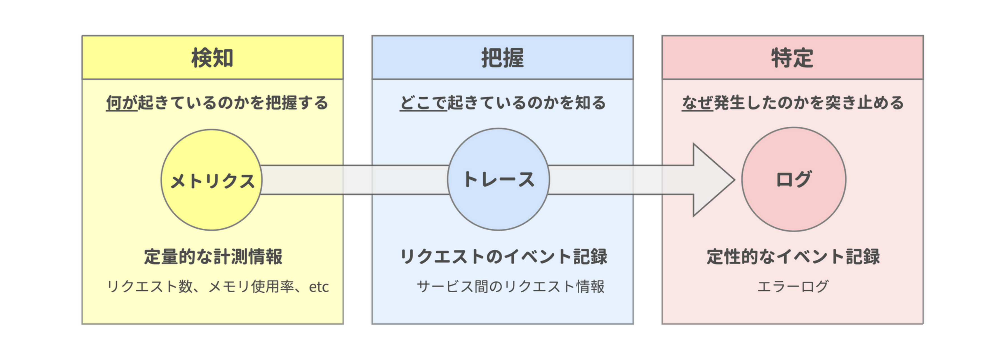

# オブザーバビリティー

オブザーバビリティーとは、システムの内部状態に関するデータ（メトリクス・トレース・ログ）を収集・保存し、それらを可視化・分析することでシステムの内部状態を把握できる能力のことを指します。

## データの収集と保存

収集・保存すべきデータは主に以下の3種類があります

1. メトリクス（CloudWatch Metrics）
   - システムの問題の有無を把握するための数値データ
   - 例：CPU使用率、メモリ使用率、リクエスト数、エラー数など
2. トレース（X-Ray）
   - 問題の発生箇所を特定するためのリクエスト追跡データ
   - マイクロサービス間のリクエストの流れや処理時間を記録
3. ログ（CloudWatch Logs）
   - 問題の原因を特定するための詳細な記録
   - アプリケーションログ、エラーログ、アクセスログなど

重要な点として、サーバーサイドアプリケーションだけでなく、クライアントアプリケーションからのデータも収集する必要があります。

## データの可視化と分析

収集したデータは以下の方法で可視化・分析できます

1. リアルタイムダッシュボード（CloudWatch Metrics）
   - メトリクスデータをグラフ化して視覚的に監視
   - システムの状態をリアルタイムで把握
2. SQLによる分析（Metrics Insights・Logs Insights）
   - メトリクスデータのSQL集計分析
   - ログデータからの問題箇所の特定と分析
3. アラート機能（CloudWatch Alarm・Anomaly Detection）
   - 設定した閾値超過や異常検知時の通知
   - 自動的な問題検出と迅速な対応が可能
