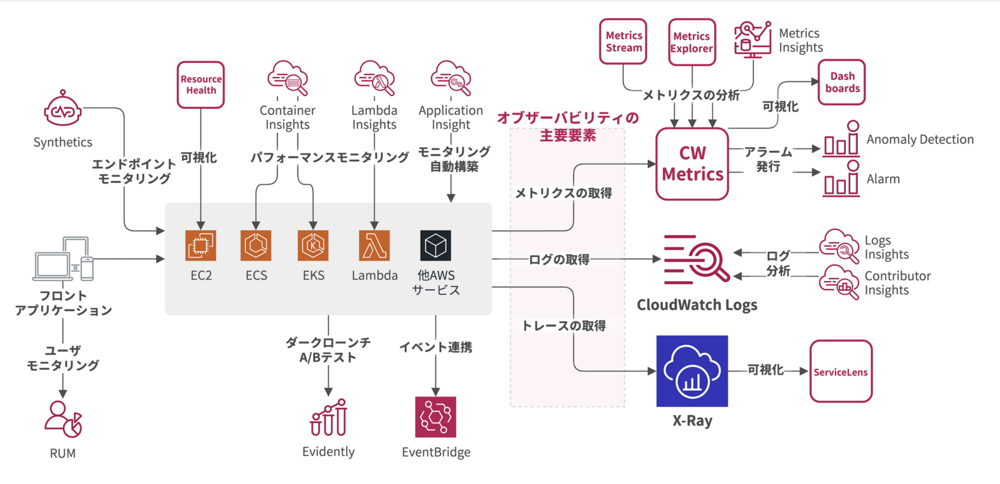

# CloudWatch

CloudWatch は、AWS 上で実行されるアプリケーションのメトリクス、ログ、トレースなどのデータを収集・保存し、可視化・分析・通知ができるモニタリングサービス。

## CloudWatch の構成

1. Dashboard  
   AWS 上で発生している事象の全体を監視し、カスタマイズしたグラフをダッシュボードとして表示が可能
2. Metrics  
   AWS サービスのメトリクスを収集・保存・可視化する
3. Metrics Explorer  
   タグベースでメトリクスを探索する
4. Metrics Streams  
   メトリクスを他の AWS サービス・外部 SaaS にストリームデータとして配信する
5. Metrics Insights  
   CloudWatch Metrics で収集したメトリクスに対してクエリを実行する
6. Container Insights  
   ECS・EKS のようなコンテナオーケストレーター上で動作するコンテナアプリの詳細情報を収集・保存する
7. Lambda Insights  
   Lambda で動作するアプリケーションの詳細情報を収集・保存する
8. Logs  
   ログを収集・保存する
9. Logs Insights  
   CloudWatch Logs で収集したログに対してクエリを実行する
10. Contributor Insights  
    CloudWatch Logs で収集されたログからアプリのボトルネックに寄与する箇所を特定する
11. X-Ray  
    サービス間をまたぐ一連の処理における処理の流れをトレースする
12. ServiceLens  
    X-Ray を含むトレース情報やアプリケーション全体の情報を統合管理する
13. Event(time-based)  
    cron・rate 式を使用してイベントを生成する
14. Event(event-based)  
    送信されたイベント、定義されたルールに基づいて連携先サービスにルーティングする（SNS、SQS、Lambda など）
15. Alarm  
    特定のしきい値やルールに基づいて通知を送信する
16. Anomaly Detection  
    機械学習で過去のメトリクスを学習し、通常の発生パターンと異なるパターンを検出し、通知を送信する
17. Synthetics  
    Synthetics モニタリングを実施する
18. RUM  
    クライアントアプリケーション（SPA・ネイティブアプリ）の状態を収集・保存する
19. Application Insights  
    アラームの自動構築、パフォーマンスの問題検出、依存関係の可視化など

