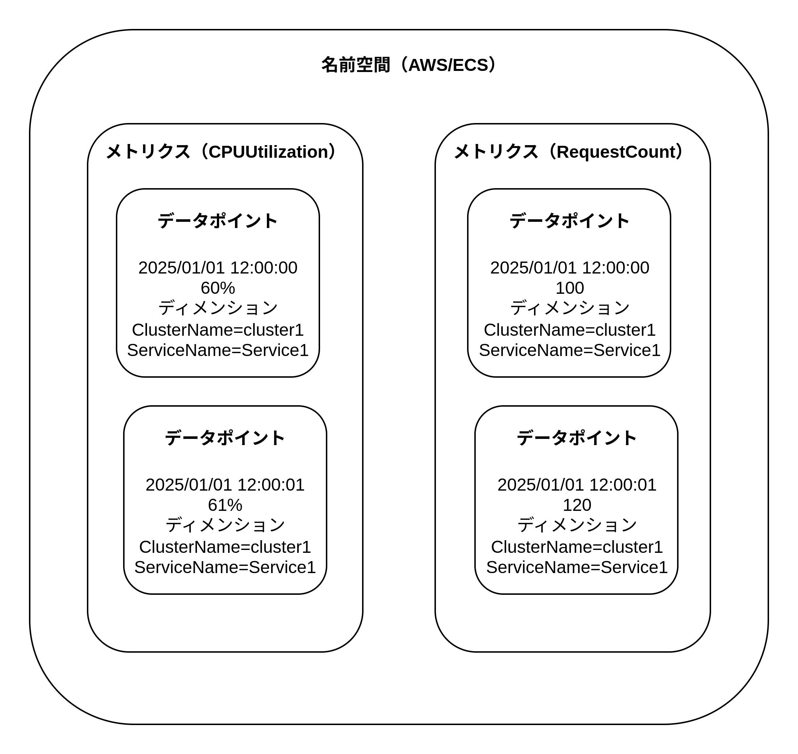

# CloudWatch Metrics

CloudWatchMetrics は AWS サービスのメトリクス情報を収集・保存・可視化・分析するサービス。

## Metrics データポイントの詳細

CloudWatch メトリクスの CPU 使用率のデータポイントは以下のようになる。

|名前空間|ディメンション|メトリクス名|分解能|タイムスタンプ|値|
|AWS/ECS|ClusterName=cluster1, ServiceName=service1|CPUUtilization|60s|2025/01/01 12:00|60%|
|AWS/ECS|ClusterName=cluster1, ServiceName=service1|CPUUtilization|60s|2025/01/01 12:01|61%|
|AWS/ECS|ClusterName=cluster1, ServiceName=service1|CPUUtilization|60s|2025/01/01 12:02|53%|



1. 名前空間  
   メトリクスが属する論理的なコンテナ。名前空間は大きく「AWS 名前空間」「カスタム名前空間」の２つに分類できる。  
   AWS 名前空間は AWS サービスが自動で収集するメトリクスの名前空間。「AWS/<サービス名>」のような命名規則がある。  
   カスタム名前空間は、ユーザーが独自に作成するメトリクスの名前空間。CloudWatch の SDK の PutMetricData API を使用してメトリクスデータを AWS に送信する場合、ContainerInsights や LambdaInsights を使用する場合、CloudWatch Logs Metrics Filter を使用する場合などにカスタム名前空間を作成する。
2. ディメンション  
   メトリクスデータに対して追加の属性情報を付与するためのキーバリューのペアの配列。  
   同一名前空間の同一メトリクスでもディメンションを使用することで各アプリケーションごとにフィルタリングやグループ化することが可能。  
   ECS の場合は、クラスター名・サービス名・タスク名・コンテナ名などがディメンションになる。  
    PutMetrics API を使用する場合は、ディメンションをユーザーが独自のキーバリューのペアを CloudWatch に送信する。API サーバーのレイテンシーのメトリクスを CloudWatch に保存する場合は、API の HTTP メソッドやパスなどをディメンションとして指定可能。（HTTPMethod=POST, Path=/users）
3. メトリクス名  
   メトリクスの名前。CPU 使用率・メモリ使用率・リクエスト数など。
4. 分解能  
   データポイントの時間ごとの集約。AWS が自動的に収集するデータポイントは 1 分間の分解能。PutMetricsData API を使用する場合は、分解能を 1 秒にすることができる。  
   例えば EC2 の CPU 使用率は、各 1 分間における CPU 使用率の平均値が計算され、CloudWatch に送信される。ELB のリクエスト数は、1 分間におけるリクエスト数の合計値が計算され、CloudWatch に送信される。
5. タイムスタンプ  
   データポイントを収集した時刻。
6. 値
   実際のメトリクスの値。

## メトリクスの保存期間

メトリクスのデータポイントは保存期間が長期になるとデータポイントが集約（間引き）される。1 秒間隔で取得されたデータポイントは 3 分間保持される。3 時間以降のデータは 1 分間隔のデータに集約される。15 日以降のデータは 5 分間隔のデータとして集約される。63 日以降のデータは 1 時間間隔のデータとなり 15 ヶ月間保存される。


## CloudWatch Metrics Insights

SQL を用いてメトリクスをグラフ化できる機能。

- SELECT: メトリクス名と集計関数を指定する
- FROM: 名前空間 または 「名前空間+ディメンション名の組み合わせ」が可能な SCHEMA 関数を指定する
- WHERE: ディメンションでフィルタリングする
- GROUP BY: ディメンションで結果を集約する

```SQL
SELECT AVG(CPUUtilization)
FROM "AWS/ECS"
WHERE ClusterName = 'cluster1'
GROUP BY ServiceName
ORDER BY AVG() DESC
LIMIT 5
```

## CloudWatch Metrics Streams

CloudWatch に保存された各メトリクスを CloudWatch Metrics Streams を使用して、ほぼリアルタイムに S3 や外部 SasS へストリーミングする。外部 SasS に転送する場合、Kinesis Data Firehose を経由する。Kinesis Data Firehose に指定可能なデータ転送の最小待機時間は 60 秒。よって CloudWatch から外部 SasS にデータが到達するまで最短約 3 分の所要時間が必要。


