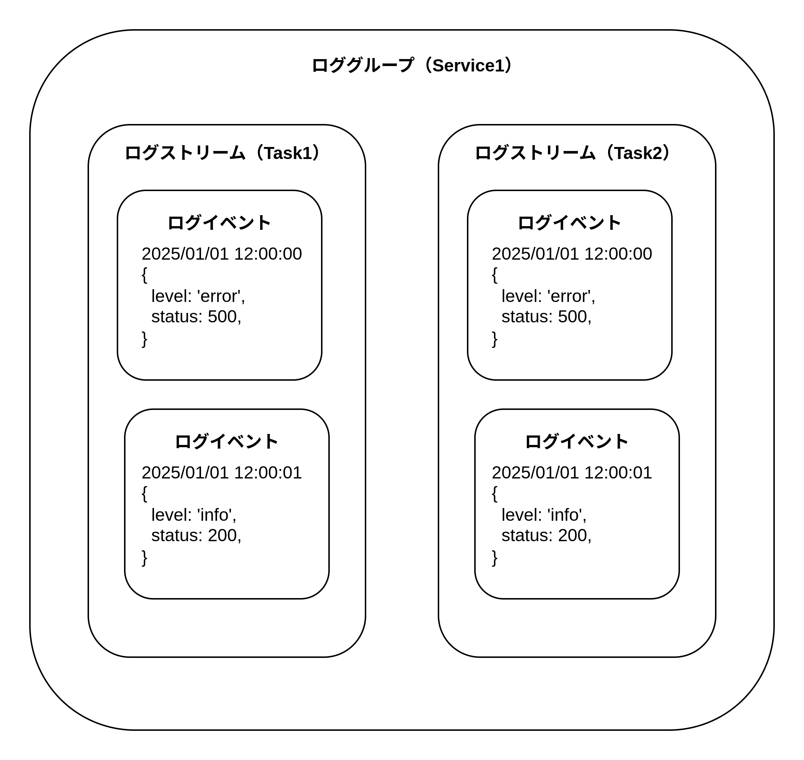
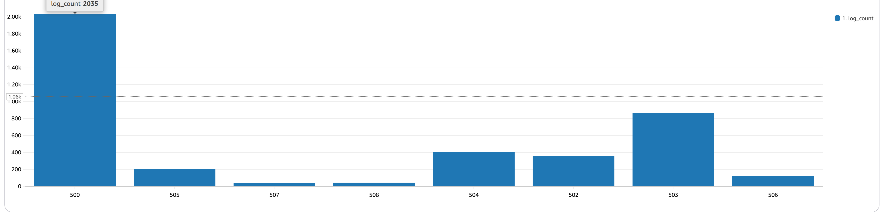

# CloudWatch Logs

CloudWatch Logs はログデータを収集・保存・分析するサービス。

## ログの詳細

ログは、ロググループ・ログストリーム・ログイベントから構成される。

1. ロググループ  
  ログイベントを保存する論理的なコンテナ。ロググループはログストリームの集合。  
  主にアプリケーションごとに作成される。
2. ログストリーム  
  ロググループ内に作成される。ログストリームはログイベントの集合。  
  主にログのソース（Lambda 関数の場合はインスタンス ECSの場合はタスク）ごとに作成される。
3. ログイベント  
  ログストリーム内に作成される。ログイベントはメッセージ（ログ本文）とタイムスタンプから構成される。  
  JSON 形式のログデータは構造化された状態で閲覧でき、LogsInsightsで各フィールドを自動で検出してくれる。




## サブスクリプションフィルター

指定した文字列パターンでログデータをフィルタリングし、一部のAWSサービスに連携が可能なフィルター。Kinesis Data Firehoseと連携してS3にログを出力可能。また、サブスクリプションフィルターの抽出条件を「$.level = 'error'」として、Lambda関数に転送し、Lambda関数からSlackチャンネル通知用のAPIをコールしたりSNSと連携してメール経由でアプリのアラートを通知することが可能。


## メトリクスフィルター

指定した文字列パターンでログデータをフィルタリングし、CloudWatch Metrics メトリクス地を出力可能なフィルター。メトリクスフィルターの抽出条件を「$.level = 'error'」として、CloudWatch Metrics にメトリクスを出力することで、1分間隔のエラー数を可視化できる。CloudWatch Alarmと連携することでエラーが発生したときにアラームを発報することができる。


## Logs Insights

SQL を用いてログデータを分析できる機能。  
ログイベントがJSON形式で出力される場合、各フィールドを自動で検出してくれるため、SQLのWHERE句やGROUP BY句でログのフィールドを指定することができる。  
ログ本文のJSONフィールド以外のフィールドとして以下のフィールドを指定可能。

| フィールド | 説明 |
| --- | --- |
| `@message` | ログ本文 |
| `@timestamp` | ログのタイムスタンプ |
| `@logStream` | ログストリーム名 |
| `@log` | ロググループ名 |

- SELECT: 集計関数、JSONフィールド、`@timestamp` などを指定する
- FROM: ロググループ名を指定する
- WHERE: JSONフィールドでフィルタリング可能
- GROUP BY: JSONフィールドでグループか可能

```SQL
SELECT @logStream, @timestamp, @message
FROM `log-group-name`
WHERE `@message` LIKE '%error%'
```

集計をすることでグラフとして可視化することも可能。以下のSQLを実行すると、HTTPステータスごとのエラー数をグラフとして可視化することができる。

```SQL
SELECT COUNT(*)
FROM `log-group-name`
WHERE level = 'error'
GROUP BY status
ORDER BY COUNT(*) DESC
```

