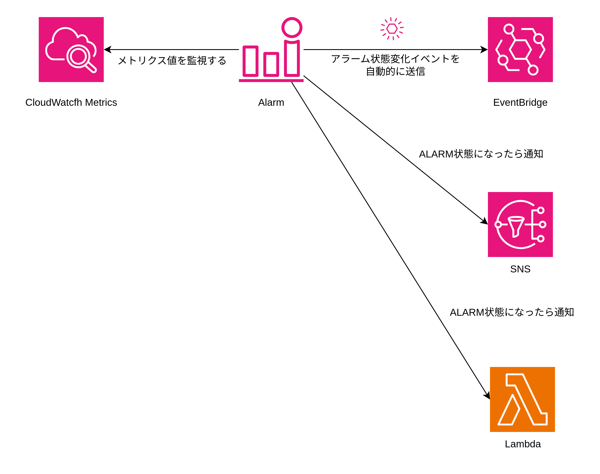
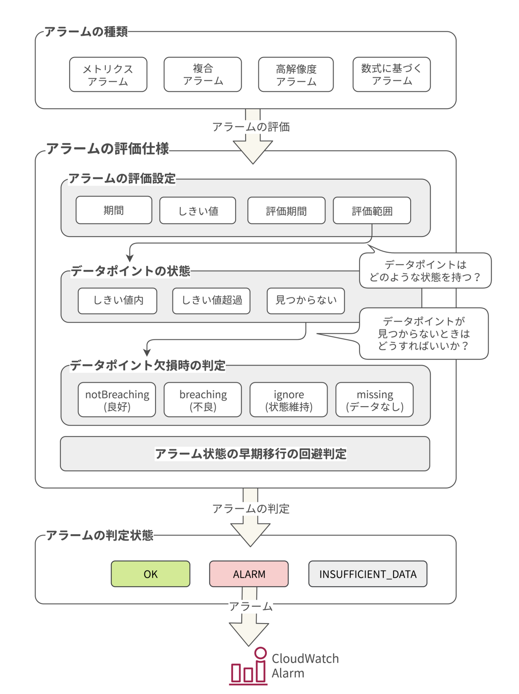

# CloudWatch Alarm

CloudWatch Alarm は、CloudWatch のメトリクスに特定のしきい値やルールを設定してターゲットにイベントを送信する機能。SNS・Lmabdaをターゲットにすることができる。また、EventBridgeに自動的にアラームの状態変化イベントを送信するため、EventBridgeのルールによって、SQSなどにもルーティングすることで間接的に連携することができる。

## アラームの詳細

アラームは、アラームの種類・アラームの評価仕様・アラームの状態から構成される。

### アラームの種類

アラームの種類は、メトリクスアラーム・複合アラーム・高解像度アラーム・数式に基づくアラームがある。

| アラームの種類 | 説明 |
| --- | --- |
| 標準アラーム | メトリクスのしきい値から定義されたアラーム |
| 複合アラーム | 標準アラームをもとにして複合的に定義されたアラーム |
| 高解像度アラーム | 10秒もしくは30秒の期間で取得した高分解能のデータをもとに定義されたアラーム |
| 数式に基づくアラーム | CloudWatch のメトリクスを数式に基づいて定義されたアラーム |

### アラームの評価仕様

|設定項目|説明|
|---|---|
|対象メトリクス|アラームの評価対象のメトリクス|
|分解能|メトリクスの分解能（1分間隔、5分間隔、1時間間隔など）|
|統計|メトリクスの統計（平均、最大、最小、合計、パーセンタイルなど）|
|しきい値|アラームのしきい値 + しきい値より大きい・以上・以下・未満|
|評価期間と評価範囲|3 / 5 でしきい値を超えた場合、アラームの状態を変化させる|
|欠損データの扱い|notBreacheng（しきい値内のデータとみなす）・breaching（しきい値超過のデータとみなす）・ignore（データを無視する）・missing（データがない状態とみなす）|
|通知先|どのアラームの状態のときに通知するか + 通知先AWSサービス|

### アラームの状態

| アラームの状態 | 説明 |
| --- | --- |
| OK | メトリクスの値がしきい値内に収まっている |
| ALARM | メトリクスの値がしきい値を超えている |
| INSUFFICIENT_DATA | メトリクスの値がしきい値内に収まっているが、メトリクスの値が少ない |

### アラームの通知先

アラームの状態変化イベントを自動的にEventBridgeに送信する。EventBridgeのルールでアラームの状態がALARMになった場合に、SQSなどの通知先に通知可能。  

通知先として直接SNSやLambdaを指定することも可能。

