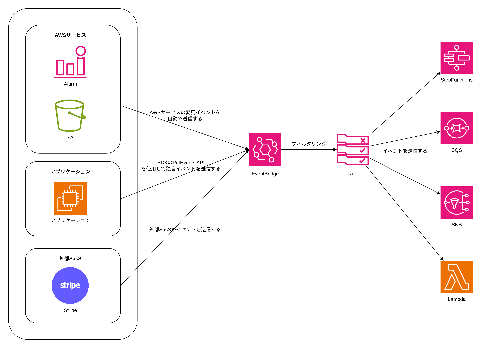
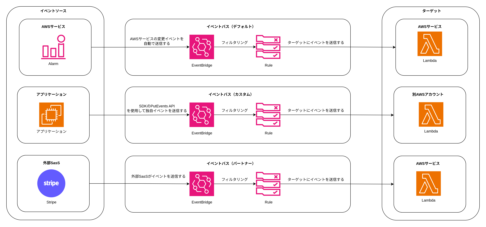
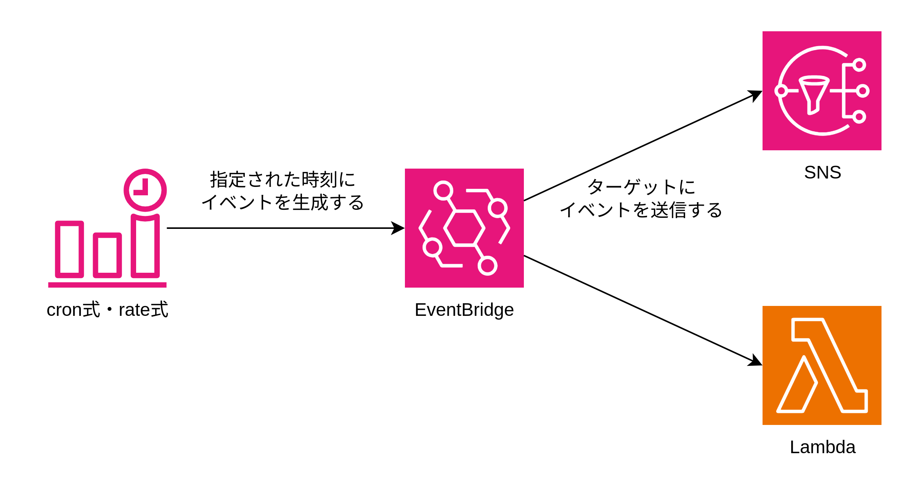

# EventBridge

EventBridgeには以下2種類の機能がある。

1. event-based  
  AWSサービス・アプリケーション・外部SasSのようなイベントソースから送信されたイベントを一元的に受信し、設定したルールに基づいて複数のターゲット（SQS、SNS、Lambda、StepFunctionsなど）へルーティングする。  
  ストリームデータを扱うメッセージブローカーの一種と考えることができる。
2. time-based  
  cron式やrate式を使用して、定期的にイベントを生成し、ターゲットにイベントをルーティングする。  
  バッチ処理を行うためのスケジューリング機能と考えることができる。

主にAWSインフラの変更イベントを受け取り、それをターゲットが消費するために使用される。  

## event-basedの流れ

1. イベントソースからイベントを受信する。
2. 設定したルールに基づいて複数のターゲットへルーティングする
3. EventBridgeは、イベントを受信し、設定したルールに基づいて複数のターゲットへルーティングする。




### イベントソース

イベントソースは、AWSサービス・アプリケーション・外部SasSがある。

#### AWSサービス

イベントソースとしてのAWSサービスの例は以下になる。

- CloudWatch Alarm: アラームの状態変化イベントをEventBridgeに送信する
- CloudTrail: AWSのAPI呼び出しや管理アクティビティーなどアカウント内で発生したイベントをEventBridgeに送信する
- Amazon S3: オブジェクトの作成や削除などのイベントをEventBridgeに送信する
- AWS CodePipeline: パイプラインの実行状態の変化に基づいてイベントが生成される

#### アプリケーション

AWS SDK の PutEvents APIを使用することで、EventBridgeにイベントを送信することができる。

#### 外部SasS

- Datadog: 異常なメトリクスを検出したらEventBridgeにイベントを送信する
- Auth0: ユーザーがログイン失敗を繰り返したら、ログイン失敗イベントをEventBridgeに送信する
- Stripe: 支払いが失敗したら、支払い失敗イベントをEventBridgeに送信する

### ルール

ルールは、イベントソースから受信したイベントを、ルールに一致した場合に複数のターゲットへルーティングする。例えば以下のJSONは、CloudWatch Alarmの状態が変化したら該当イベントをターゲットへルーティングするためのルール。

```JSON
{
  "source": ["aws.cloudwatch"],
  "detail-type": ["CloudWatch Alarm State Change"],
  "detail": {
    "state": {
      "value": ["ALARM"]
    }
  }
}
```

### ターゲット

ターゲットは、EventBridgeに送信されたイベントを受け取るサービス。（SQS、SNS、Lambda、StepFunctionsなど）

### イベントバス

イベントバスは、イベントソースからイベントが送信される論理的なコンテナ。例えば、AWSサービスがEventBridgeにイベントを送信する場合は、デフォルトイベントバスにイベントを送信する。アプリケーションがPutEvents APIを使用してEventBridgeにイベントを送信する場合は、defaultイベントバスにイベントを送信することも可能だが、ユーザが独自に作成したカスタムイベントバスにイベントを送信することも可能。

|イベントバス|説明|
|---|---|
|デフォルトイベントバス|AWSサービスが自動的に送信するイベントの場合、デフォルトイベントバスにイベントが送信される|
|カスタムイベントバス|ユーザが独自に作成したカスタムイベントバス。デフォルトイベントバスとカスタムイベントバストイベントを送信する論理歴なコンテナを分けることでイベントを整理できる。また、カスタムイベントバスを使用することで異なるAWSアカウント間でイベントをやり取りすることも可能。|
|パートナーイベントバス|外部SasSが提供するイベントバス。外部SaaSからのイベントを受けとり、外部Sassにイベントを送信することが可能。|



## time-basedの流れ

1. cron式やrate式に一致する時刻になると、EventBridgeがイベントを生成する。
2. 生成されたイベントを、設定したターゲットへルーティングする。



生成されるイベントの例

```JSON
{
  "version": "0",
  "id": "12345678-1234-1234-1234-123456789012",
  "detail-type": "Scheduled Event",
  "source": "aws.events",
  "account": "123456789012",
  "time": "2025-02-23T12:34:56Z",
  "region": "us-east-1",
  "resources": [
    "arn:aws:events:us-east-1:123456789012:rule/MyScheduledRule"
  ],
  "detail": {}
}
```