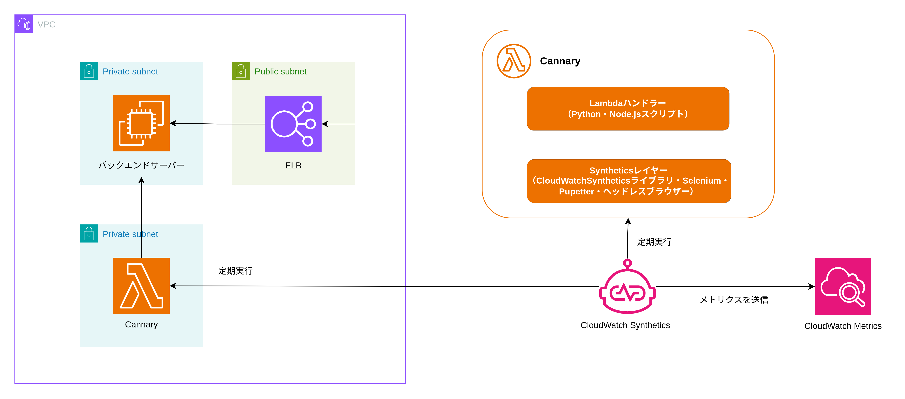

# CloudWatch Synthetics

CloudWatch Syntheticsは、本番環境のシステムに対してSynthetic Monitoringを実行することができる。

## Synthetic Monitoring

Synthetic Monitoringは、本番環境のシステムに対して、実際にユーザーがアプリにアクセスする際の挙動を模倣するテスト（シナリオ）を自動実行し、パフォーマンスや死活監視を行う。

- プロアクティブな検知  
  実際のユーザーが問題に遭遇する前に、シミュレーションによってエラーやパフォーマンス低下を検出する。CloudWatch Alarmは、メトリクスの異常やエラーログの出力をリアクティブに監視する。しかしリアクティブ監視は、問題が発生した後に検知するため、プロアクティブな検知はできない。
- 自動テスト（Cannary）  
  事前に定義したシナリオを定期実行し、WebサイトやAPIの正常性をチェックする。シナリオは、SeleniumやPuppeteerを使用することでブラウザの操作を模倣する。E2Eテストに似ているが、E2Eテストはアプリのバグを発見することに重点を置いているのに対し、Synthetic Monitoringは本番システムの正常性を監視することに重点を置いている。
- 継続的な監視  
  シナリオを継続的に実行し、本番環境の正常性を監視する。問題発生時にはアラートを発報できる。

## CloudWatch Syntheticsの詳細

Amazon CloudWatch Synthetics では、スケジュールに沿って実行されるNode.jsまたは Pythonで記述されたスクリプトである Canary を作成し、エンドポイントと API をモニタリングできます。  
Cannaryは、スクリプトをLambdaとして実行し、Node.jsではPupetter、PythonではSeleniumを使用してヘッドレスブラウザーを操作する。Cannaryは、CloudWatch Syntheticsライブラリ・Selenium・Pupetterを含むLambdaレイヤーを使用する。  
Cannaryは、実行結果をCloudWatch Metricsに送信し保存する。`CloudWatchSynthetics`名前空間にいくつかのメトリクスを作成する。これらのメトリクスにはディメンションとして、CanaryNameがある。

## SynthticsのBlueprint

|Blueprint|説明|想定アプリケーション|
|---|---|---|
|ハートビートモニター|指定したURLにアクセスし、ページのスクリーンショットとHTTPアーカイブファイルを保存する|Webアプリ|
|API Cannary|APIエンドポイントに対してリクエストを送信して応答をテストする|REST APIアプリ|
|ビジュアルモニタリング|指定したURLのページのスクリーンショットとベースラインのスクリーンショットを比較テストする|Webアプリ|
|Cannaryレコーダー|Cannaryスクリプト作成のための補助機能。Webページにおける入力役リッキのユーザー操作を記録して同じ操作をするCanaryスクリプトを作成する。Chrome拡張機能として提供されている|Webアプリ|

## シナリオの例

1. ログインシナリオ
  - 手順:
    - ログインページにアクセス
    - 有効なメールアドレスとパスワードを入力
    - ログインボタンをクリック
  - 期待結果:
    - ユーザーのダッシュボードやホームページが表示され、正常にログインできる
2. ショッピングカートシナリオ
  - 手順:
    - 商品一覧ページから商品を選択
    - 商品詳細ページで「カートに追加」ボタンをクリック
    - カートページを確認し、商品の内容と価格が正しいことを確認
  - 期待結果:
    - 商品が正しくカートに追加され、注文手続きに進める
