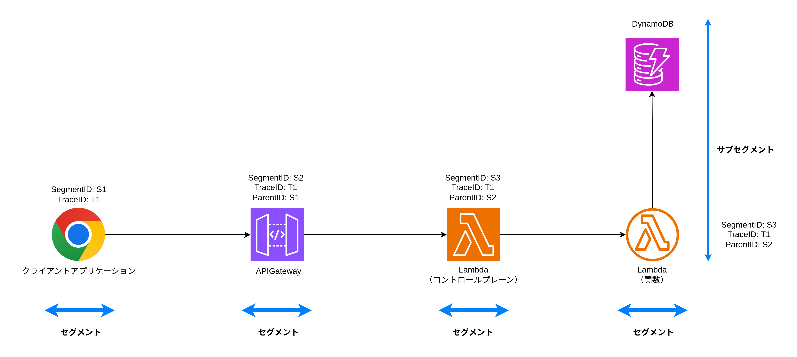
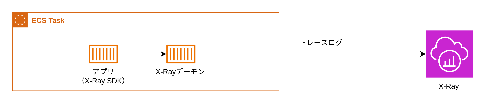
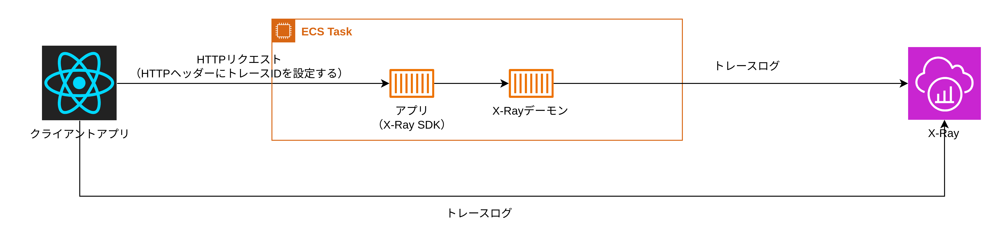

# X-Ray

X-Rayは、トレースを収集・保存・可視化するサービス。

## X-Rayの詳細

### セグメント・サブセグメント

リクエストを処理するコンポーネントごとに生成するトレースログの単位。例えば、WebアプリがAPIGatewayに対してHTPPリクエストを送信し、Lambdaで処理を受け付けてDynamoDBへアクセスするケースを考える。この場合、Webアプリ・Lambdaコントロールプレーン・Lamba関数に対してセグメントが発行され、それぞれのセグメントをトレースログとしてX-Rayに保存する。コンポーネント内で外部APIを呼び出す場合は、セグメント内に「サブセグメント」を発行しセグメント内のデータのやり取りを詳細化する。Lambda関数からDynamoDBへのアクセスはサブセグメントとして記録される。

### トレース

トレースは1つのリクエストの中で生成されたすべてのセグメントの集合。リクエストを追跡するためにトレースIDが使用される。トレースの最初のリクエスト時にリクエストごとに一意なトレースIDを生成し、HTTPリクエスト時に`X-Amzn-Trace-Id`ヘッダーにトレースIDを設定して、すべてのセグメントで共有のトレースIDを使用する。



### X-Rayトレースログ

各セグメントがトレースログをX-Rayに送信し保存することで、トレースログを可視化することができる。トレースログは以下のようになる。

```JSON
{
  "trace_id": "1-64f1a2b3-abcdef1234567890abcdef12",
  "id": "abcdef1234567890",
  "name": "MyLambdaFunction",
  "start_time": 1690000000.123,
  "end_time": 1690000001.456,
  "annotations": {
    "lambda_version": "$LATEST",
    "memory_size": "128"
  },
  "metadata": {
    "custom": {
      "request_context": {
        "user": "exampleUser",
        "operation": "PutItem"
      }
    }
  },
  "subsegments": [
    {
      "id": "subseg1234567890",
      "name": "DynamoDB.PutItem",
      "start_time": 1690000000.456,
      "end_time": 1690000001.123,
      "namespace": "aws",
      "aws": {
        "operation": "PutItem",
        "region": "us-west-2",
        "table_name": "MyDynamoDBTable",
        "request_id": "abcd1234-efgh-5678-ijkl-9012mnop3456"
      },
      "http": {
        "request": {
          "method": "POST",
          "url": "https://dynamodb.us-west-2.amazonaws.com"
        },
        "response": {
          "status": 200
        }
      }
    }
  ]
}
```

トレースログのスキーマ

- trace_id  
  トレース全体を一意に識別するためのトレースID
- id  
  セグメントを一意に識別するためのセグメントID
- name  
  セグメントの名前（Lambda関数名など）
- start_time / end_time  
  セグメントの実行開始・終了時刻（Lambda関数の実行開始・終了時刻）
- subsegments  
  セグメントで実行された外部リクエスト（DynamoDBへのリクエストなど）のサブセグメント
  - name  
    サブセグメント名
  - httpオブジェクト
    HTTPリクエスト・レスポンスの詳細

### X-Rayの仕組み

#### バックエンド

バックエンドでは、X-Ray SDKを使用してリクエストごとにトレースログを生成し、X-Rayデーモンに送信する。X-Rayデーモンはトレースログをバッファリングし、定期的にX-Rayにトレースログを送信する。



#### フロントエンド

フロントエンドでは、RUMを使用してX-Rayにトレースログを送信する。ただし、サーバー側のようにX-Rayデーモンは使用せず、直接X-Rayにトレースログを送信する。

#### 実際の流れ

1. クライアントアプリケーションがRUMのSDKを使用して、トレースIDを生成し、トレースログをX-Rayに送信する。サーバーサイドアプリケーションへのリクエスト時には、HTTPリクエストヘッダーにトレースIDを設定する。
2. サーバーサイドアプリケーションが、HTTPリクエストヘッダーからトレースIDを取得し、X-Ray SDKを使用してトレースログをX-Rayデーモンに送信する。
3. サーバーサイドアプリケーションと同一サーバー上で動作しているX-Rayデーモンがトレースログをバッファリングし、定期的にX-Rayにトレースログを送信する。

