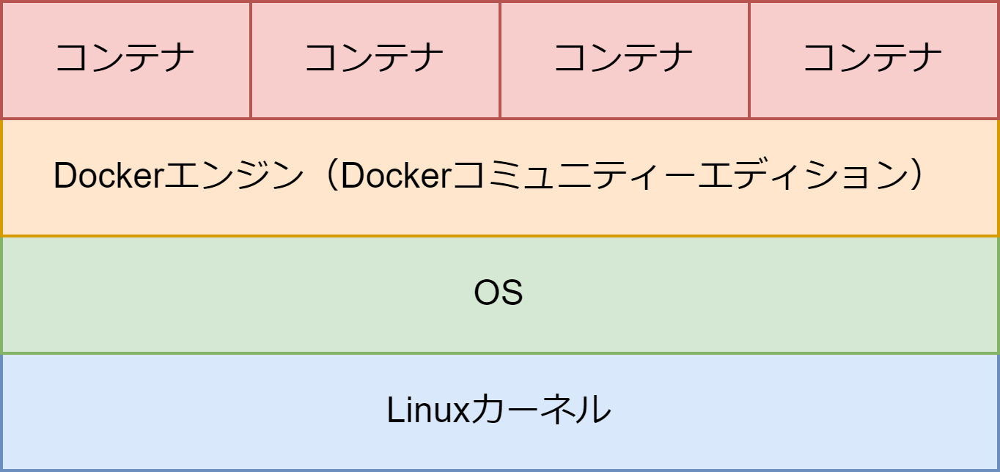

# Docker の仕組み

## Docker とは

Docker はコンテナに新しいルートファイルシステムを構築し、ホストとは異なるディストリビューション・基本コマンド・各言語のランタイムやライブラリーを持つ環境を構築できる。コンテナは Docker エンジン上で動き、カーネルはホスト OS と同じカーネルを共有する。

## 名前空間（Namespace）

Docker は複数の異なる空間を作成することができるが、この分離された空間を実現しているのが名前空間（Namespace）である。ホスト OS で実行される各プロセスごとに異なる空間を作成できる。コンテナを作成するとコンテナごとに名前空間を作成する。名前空間は以下のように様々なものを分離できる。

| 名前空間の種類 | 説明                                                                                         |
| :------------- | :------------------------------------------------------------------------------------------- |
| mnt            | ファイルシステムのマウント情報を分離する。                                                   |
| net            | ネットワークの制御を分離する。コンテナごとにネットワークインターフェースを持つ               |
| pid            | プロセスを分離する。                                                                         |
| user           | ユーザー ID とグループ ID を分離する。名前空間ごとに異なるユーザー ID とグループ ID を持つ。 |

ホスト OS から見ると複数のコンテナ（複数の名前空間）のプロセスが動いているように見える。各コンテナ（各名前空間）ではコンテナ内で動いているプロセスしか見えない。

Docker は各コンテナごとに別々のファイルシステムの名前空間を作成する。これにより各コンテナに好きなコマンドや言語ランタイムをインストールしてホスト OS とは異なる実行環境を作成できる。ホスト OS からは/var/lib/docker 配下に各コンテナのファイルシステムが見える。

## cgroup（control group）

cgroup は各コンテナごとに使用できるハードウェア資源を制限できる。CPU・メモリ・ディスクなどをユーザーが定義したタスクのグループに割り当てグループに対して資源利用の制限や開放を設定できる。

## Docker のコンポーネント

docker コマンドは docker デーモンに HTTPS 接続し、高レベルコンテナランタイムの containerd に gRPC 接続し、低レベルランタイムの runc を実行ファイルから実行する。runc が名前空間や cgroup を作成してコンテナを実行する。

## Docker のリソース

- イメージ  
  ディストリビューションやアプリケーション、言語ランタイムを含んだ環境ごとのイメージ

- コンテナ  
  分離された名前空間とアプリケーションの実行環境

- ボリューム  
  ホスト OS からコンテナ名前空間のディレクトリにマウントされるディレクトリ。ホストからコンテナにディレクトリを提供できる。ホスト OS の/var/lib/docker/volumes 以下に存在する。

- ネットワーク  
  コンテナが所属する仮想的な LAN

## Docker CE(Community Edition)

Docker エンジンは Docker 社が提供する無償版の Docker CE と無償の Docker デスクトップ、Mirantis 社が提供する Mirantis Container Runtime(MCR)が存在する。**Docker CE を使用すればよい。**Ubuntu であれば apt の sources.list にリポジトリを追加して Docker CE をダウンロードできる。
