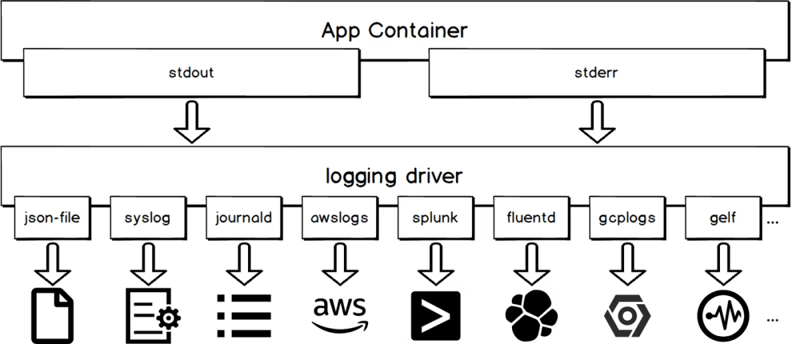

# コンテナ

## Systemd に対応したコンテナ

コンテナで Systemd を利用する条件

1. /tmp と/run が tmpfs としてマウントされている
2. コンテナが Docker ホストの全デバイスにアクセスできる権限が付与されている(privileged)
3. コンテナ起動時に/usr/lib/systemd/systemd を実行する

```Dockerfile
FROM ubuntu:22.04

# systemdとapache2をインストールし、apache2.serviceが起動時に自動的に起動するよう設定する
RUN apt update && apt -y install systemd apache2 && \
    systemctl enable apache2.service

# コンテナ起動時にsystemdを起動する
ENTRYPOINT ['/usr/lib/systemd/systemd']
```

```bash
# イメージを作成する
docker image build -f Dockerfile -t ubuntu:systemd .
# Dockerホストの全デバイスにアクセスできるようprivilegedを付与し、/tmpと/runをtmpfsとしてマウントしてコンテナを起動する
docker container run -tid --name ubuntu-systemd -h ubuntu --privileged --tmpfs /run --tmpfs /tmp --stop-signal SIGRTMIN+3 ubuntu:systemd
```

## ホスト OS からコンテナへのディレクトリ提供

Docker ではホスト OS からコンテナにディレクトリをマウントすることで、ホスト OS とコンテナ間でディレクトリやファイルを共有できる。ホストからコンテナにファイルを見せる方法としては以下の 3 種類の方法がある。

| 方法        | 説明                                                                              |
| :---------- | :-------------------------------------------------------------------------------- |
| bind mount  | ホスト上のデバイスファイルやディレクトリをコンテナにマウントする                  |
| volume      | Docker が管理するボリューム(/var/lib/docker/volumes 以下)をコンテナにマウントする |
| tmpfs mount | ホストのメモリを tmpfs としてコンテナにマウントする                               |

- bind mount

```bash
docker container run --mount type=bind,source=/hostdir,target=/root/ctdir ubuntu:22.04
docker container run -v /hostdir:/root/ctdir ubuntu:22.04
```

- volume

```bash
docker container run --mount type=volume,source=vol01,target=/root/ctdir ubuntu:22.04
# 匿名ボリュームを作成して/root/ctdirにマウントする
docker container run -v /root/ctdir ubuntu:22.04
# ボリュームを作成してからコンテナを実行する
docker volume create vol01
docker container run -v vol01:/root/ctdir ubuntu:22.04
```

- tmpfs mount

```bash
docker container run --mount type=tmpfs,target=/datadir,tmpfs-mode=1770,tmpfs-size=4249672960 ubuntu:22.04
docker container run --tmpfs /datadir ubuntu:22.04
```

## ログ出力

標準入力と標準エラー出力に出力されたログはログドライバーによって処理され、ホスト OS のファイルに保存されたり、外部ストレージに転送されて保存される。

```bash
# dockerが使用しているログドライバーを表示する
docker system info --format '{{.LoggingDriver}}'
```


