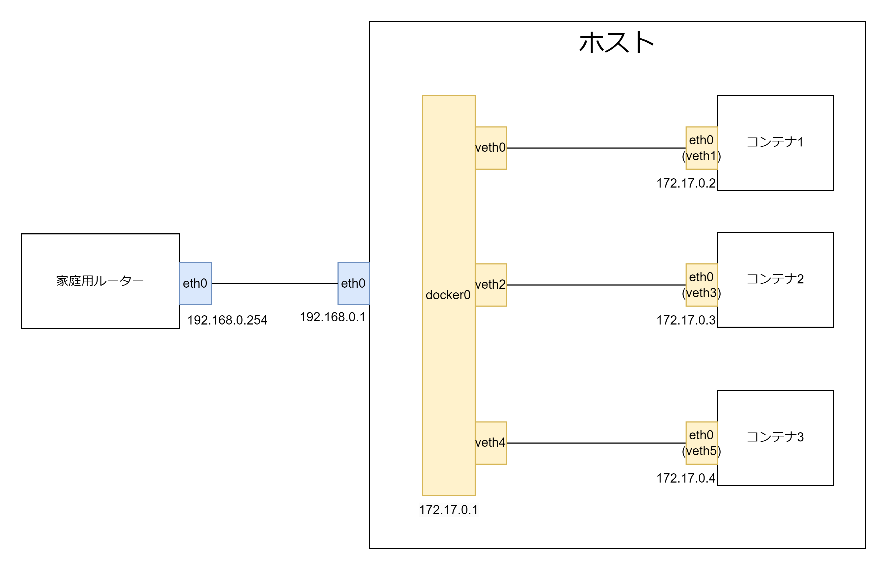
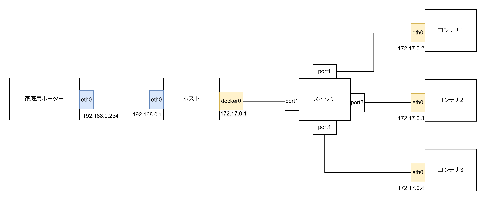
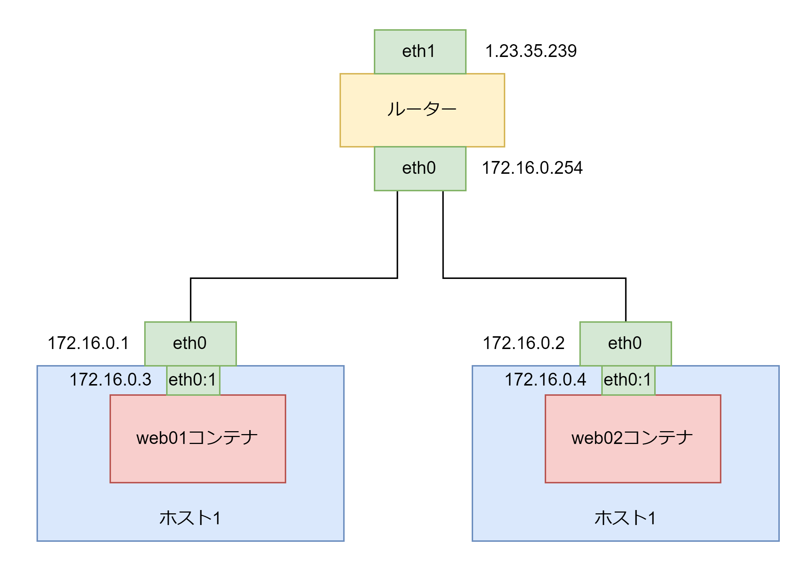
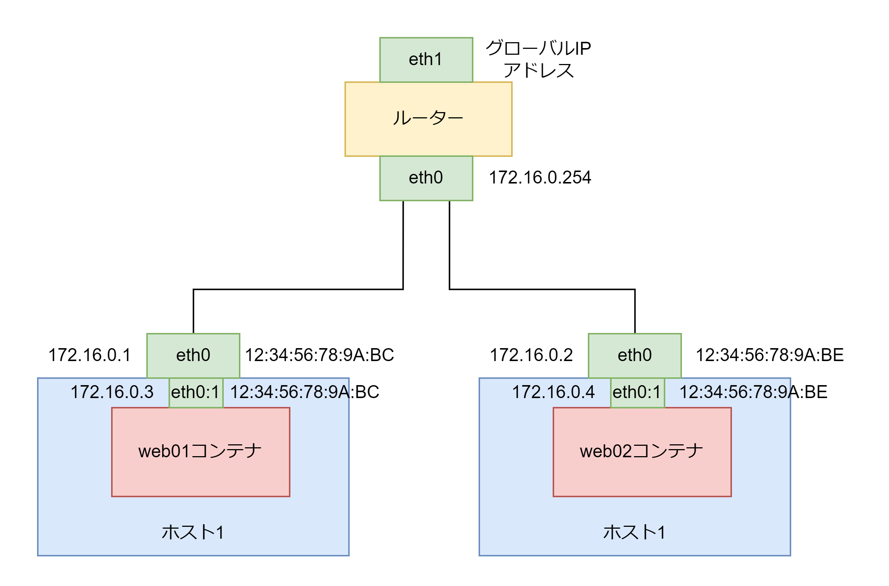

# ネットワーク

## ブリッジネットワーク

ホストとコンテナでブリッジネットワーク（仮想的な LAN）を形成して LAN 内で通信を行う。

```bash
# 1.ブリッジインターフェースを作成する
sudo ip link add name docker0 type bridge
sudo ip addr add 172.17.0.1/24 dev docker0
sudo ip link set dev docker0 up

# 2.vethペアを作成する
sudo ip link add veth0 type veth peer name veth1

# 3.veth0をdocker0ブリッジに接続する
sudo ip link set veth0 master docker0
sudo ip link set veth0 up

# 4.veth1をコンテナに割り当てる。※ ネームスペースによってコンテナ内ではveth0ではなくeth0のように違うインターフェース名が表示される
```

docker0 ブリッジに veth0・veth1 のような veth ペアが接続されている。コンテナ側の veth は Namespace によってコンテナ内からは eth0 というインターフェース名になる。172.17.0.0/24 の LAN を形成する。ホストは docker0 の IP アドレス 172.17.0.1 になる。  
コンテナのデフォルトゲートウェイは docker0 の 172.17.0.1 に、DNS キャッシュザーバーの IP アドレスはホストと同じ IP アドレスが設定される。



ブリッジネットワークは以下の画像のようなイメージになる。コンテナと各コンテナはスイッチで繋がり LAN(172.17.0.0/24)を形成する。各コンテナは独立したサーバーとして考える。  
コンテナからインターネットに通信する場合は docker0 で NAPT（IP MASQUERADE）されて送信元 IP アドレスがホストの IP アドレス(192.168.0.1)に変換され、送信元ポート番号は任意のポート番号に変換される。ホストのルーティングテーブルには 172.17.0.0/24 はローカルでネットワークインターフェース docker0 のエントリーが追加される。  
コンテナは Namespace によって独自のネットワーク空間を持つ。コンテナのデフォルトゲートウェイはホストの docker0(172.17.0.1)になる。DNS キャッシュザーバーの IP アドレスはホストと同じ IP アドレスが設定される。



## Macvlan

ホストのネットワークインターフェースのサブインターフェース（スレーブインターフェース）に MAC アドレスと IP アドレスを割り当てることでホストと同じ LAN に所属することができる。

**docker network create コマンドのオプション**
| オプション | 説明 |
| :------------------------------------- | :--------------------------------------------------------------------------------------- |
| -d <ドライバー名> | ドライバーを指定する。bridge, macvlan など |
| -o | オプションを指定する |
| --subnet <CIDR> | CIDR 表記のネットワークアドレスを指定する |
| --gateway <IP アドレス> | デフォルトゲートウェイの IP アドレスを指定する |
| --ip-range | コンテナに割り当てる IP アドレスの範囲を指定する。基本はサブネットと同じ |
| --aux-address "<ホスト名=IP アドレス>" | サブネットに指定した IP アドレスの範囲でコンテナに割り当てたくない IP アドレスを指定する |

```bash
# ホスト1
docker network create -d macvlan -o parent=eth0 --subnet 172.16.0.0/24 --gateway 172.16.0.254/24 --ip-range=172.16.0.0/24 --aux-address "host1=172.16.0.2" --aux-address "host2=172.16.0.2" net01

docker container run -d --net net01 --ip 172.16.0.3 --name web01 -h web01 nginx:latest

# ホスト2
docker network create -d macvlan -o parent=eth0 --subnet 172.16.0.0/24 --gateway 172.16.0.254/24 --ip-range=172.16.0.0/24 --aux-address "host1=172.16.0.2" --aux-address "host2=172.16.0.2" net01

docker container run -d --net net01 --ip 172.16.0.4 --name web21 -h web02 nginx:latest

# ホスト1とホスト2、web01コンテナ、web02コンテナ、ルータ（172.16.0.254）は同じ172.16.0.0/24のLANセグメントに所属する。
```



## IPvlan

IPvlan はホストのインターフェースカードのサブインターフェースにホストと同じ MAC アドレスとホストと異なる IP アドレスを割り当てることでホストと同じ LAN セグメントに所属させることができる。Docker 環境では以下の 3 種類の IPvlan がサポートされている。

| モードの種類                     | 説明                                                                                                       |
| :------------------------------- | :--------------------------------------------------------------------------------------------------------- |
| IPvlan L2 モード                 | コンテナにホスト OS と同じサブネットを付与できる                                                           |
| IPvlan 802.1q トランク L2 モード | Docker ホストの NIC のサブインターフェース に複数の VLAN ID を付与でき、LAN セグメントを仮想的に分離できる |
| IPvlan L3 モード                 | Docker ホストの NIC が仮想的にルーターとしてふるまう                                                       |

- IPvlan L2 モード

同じ LAN セグメントに所属するのでホストからデフォルトゲートウェイと DNS キャッシュサーバーの IP アドレスを受け継ぐ

```bash
# ホスト1
docker network create -d ipvlan -o ipvla_mode=l2 -o parent=eth0 --subnet 172.16.0.0/24 --gateway 172.16.0.254 --aux-address="host1=172.16.0.1" --aux-address="host2=172.16.0.2" net01
docker container run -d --net net01 nginx:latest

# ホスト2
docker network create -d ipvlan -o ipvla_mode=l2 -o parent=eth0 --subnet 172.16.0.0/24 --gateway 172.16.0.254 --aux-address="host1=172.16.0.1" --aux-address="host2=172.16.0.2" net01
docker container run -d --net net01 nginx:latest
```



- IPvlan 802.1q トランク L2 モード

```bash
docker network create -d ipvlan -o parent=eth0.30 --subnet 192.168.1.0/24 --gateway 192.168.1.1 net01
docker network create -d ipvlan -o parent=eth0.40 --subnet 192.168.2.0/24 --gateway 192.168.2.1 net02

docker container run -d --net net01 --name web01 nginx:latest
docker container run -d --net net02 --name web02 nginx:latest
```
