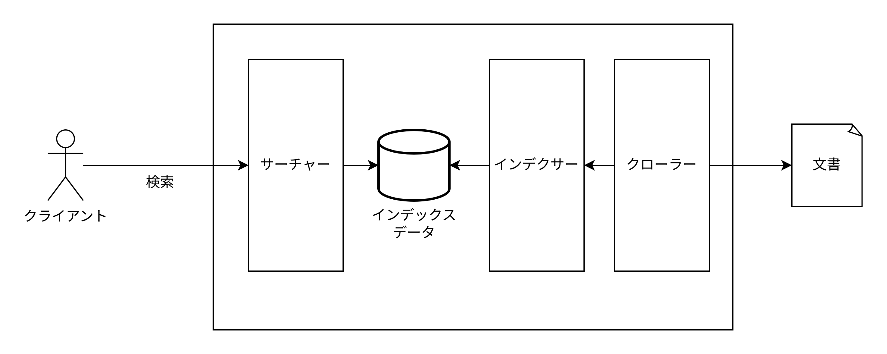
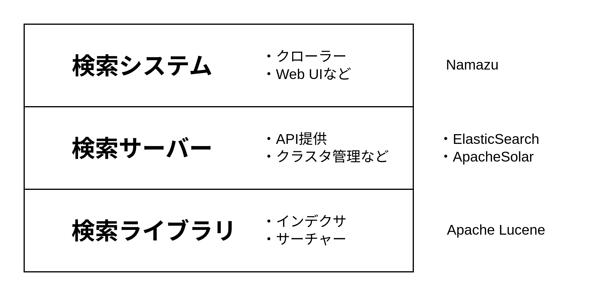
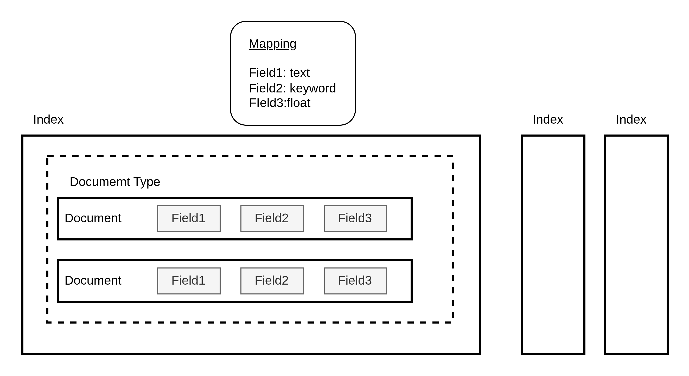
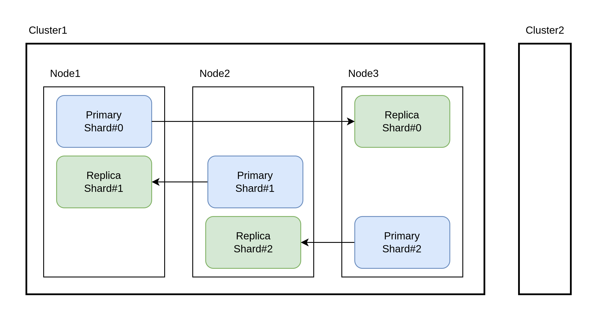
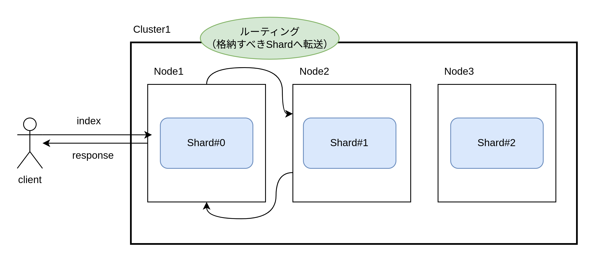
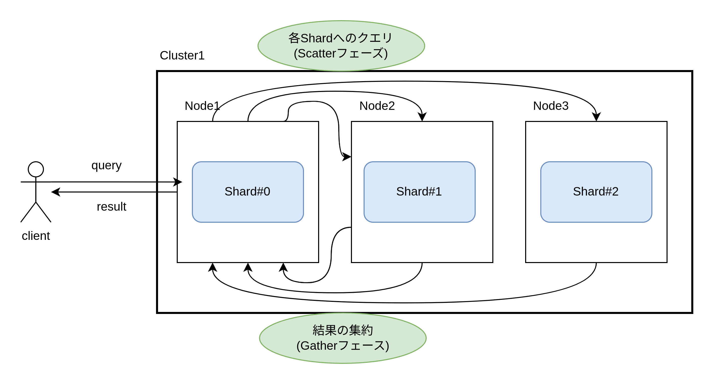
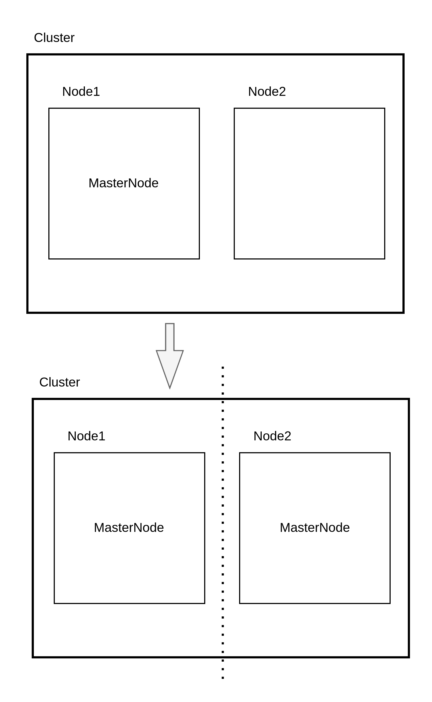
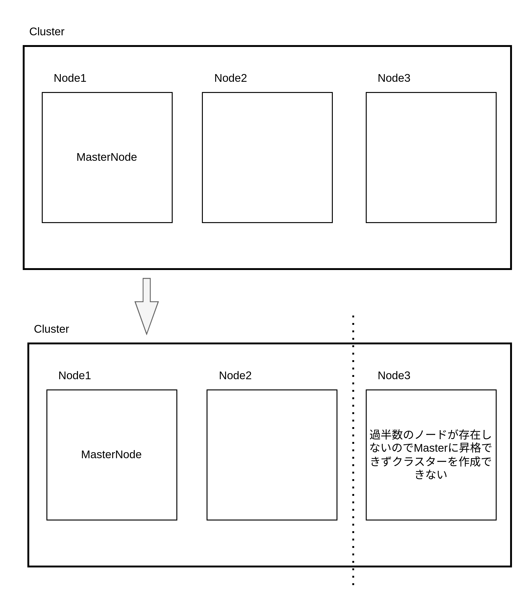

# Elasticsearch とは

Elasticsearch は全文検索ソフトウェア

## 全文検索の仕組み

- 逐次検索
  - 全文章を走査しながら目的の文字列を探す
  - Linux で利用される grep コマンドと同じことを行う方式
  - 検索対象が多いと時間がかかる
- 索引型検索
  - 事前に文書を高速に検索できるよう索引を構成しておき、検索時にはこの索引をキーに目的の文書を探す方式
  - 索引は「**インデックス**」とも呼ばれる
  - Elasticsearch で採用されている検索方法

## 転置インデックス

- 文書内に含まれる各単語と、その単語が出現する文書（文書 ID）の組み合わせをインデックスとして構成する
- このインデックスを用いることで指定する単語が含まれている文書（文書 ID）を素早く探し出すことができる
- 各単語をインデックスとして抽出する際には英語であれば単語間の空白を区切りにし、日本語の場合は文字数(n-gram)または文章を形態素解析という名詞や動詞などの品詞単位に分解する処理を行って各単語を抜き出す

転置インデックス

| 単語     | DocumentId |
| :------- | :--------- |
| 東京     | 1,2        |
| イベント | 1          |
| マラソン | 2          |

Elasticsearch は転置インデックスだけでなく列指向の doc values も持つ。以下に user インデックスの doc values を示す。

```TypeScript
// name列
['john_doe', 'jane_sm', 'alice_w', 'charlie']

// age列
[34, 21, 47, 10]

// 実際の値
[
  {
    docId: 1,
    name: 'john_doe',
    age: 34,
  },
  {
    docId: 2,
    name: 'jane_sm',
    age: 21,
  },
  {
    docId: 3,
    name: 'alice_w',
    age: 47,
  },
  {
    docId: 4,
    name: 'charlie',
    age: 10,
  },
]
```

docId の昇順にそれぞれの列ごとの値を持っている。

## 全文検索システムの構成



- インデクサ
  - 対象ドキュメントから形態素解析/n-gram により単語を抽出し、インデックスのデータベースを構成する
  - インデックスデータベースには、ドキュメント自体/転置インデックス/doc values などが格納される
- サーチャー
  - インデクサが構成したインデックスに基づいて検索クエリの機能を提供するサーバー
  - REST API や Java API などのインターフェースが公開される
- クローラー
  - 検索対象を定期的に巡回してドキュメントをインデクサに渡してインデックスを更新する
  - クローラーを用いない場合も多い

## 全文検索システムのレイヤー



- 検索ライブラリレイヤ
  - コアと鳴るインデクサとサーチャーの機能を提供するレイヤ
  - Apache Lucene が存在する。Lucene は転置インデックス方式の検索機能を提供するソフトウェアであり、Java で書かれたライブラリ
  - 利用者が文書の作成と全文検索を行う場合は Lucene を呼び出す Java プログラムを実行する必要がある
- 検索サーバーレイヤ
  - 検索ライブラリ単体で提供される機能を保管するためにインターフェースや管理機能を提供するレイヤ
  - Apache Solar や Elasticsearch がある
  - Solar や Elasticsearch は Lucene を補完するように REST API のインターフェース層を備えており複数ノードからなるクラスター構成を取ることができる
  - REST API にインデックス作成指示や検索クエリを投げると内部で Lucene の JavaAPI を呼び出す
- 検索システムレイヤ
  - クローラー機能や Web ユーザーインターフェース機能などを追加したレイヤ
  - namazu/Fess などがある

## Elasticsearch の用語と概念

### 論理的な概念



- インデックス(Index)
  - ドキュメントを格納する場所
  - 転置インデックスや doc_values など様々な形式で保存される
  - RDB のテーブルとほぼ同じ
  - 「インデックスする」というようにドキュメントを格納する動作を表す用語でもある
- ドキュメントタイプ(Document Type)
  - ドキュメントがどのようなフィールドから構成されているかという構造を表す概念
  - 1 つのインデックスには 1 つのドキュメントタイプしか定義できない
- マッピング(Mapping)
  - ドキュメントタイプを具体的に定義したもの
  - ドキュメント内の各フィールドのデータ構造やデータ型を記述した情報
- ドキュメント(Document)
  - インデックスに格納する 1 つの文章の単位
  - RDB のレコードとほぼ同じ
  - JSON オブジェクト
  - ドキュメントごとに一意なドキュメント ID(文字列型)をもつ。UUID による自動生成または手動でドキュメント ID を指定する。
- フィールド(Field)
  - ドキュメントの各フィールド
  - フィールドのデータ型（一部を以下に示す）
    - keyword: 転置インデックスを作成する際にアナライザによる単語分割処理が実施されない
    - text: アナライザによって単語に分割されて転置インデックスが作成される
    - boolean
    - date/date_nanos
    - long/short/integer/float
    - マルチフィールド型: 1 つのフィールドに複数のデータ型を指定できる。keyword/text の両方を指定すると単語分割された転置インデックスと分割されていない転置インデックスの両方が作成される。

Mapping

```JSON
{
  "Properties": {
    "user_name": { "type": "text "},
    "message": { "type": "keyword" }
  }
}
```

### 物理的な概念



- Cluster(クラスター)
  - 一意のクラスタ名を持つ
  - 同じクラスタ名を持つノードを見つけるとクラスタを形成する
  - クラスタを作成するには各ノードのクラスタ名が同じノードを起動する
  - 2 つのクラスタを作成するには 2 つのノードのクラスタ名をそれぞれ異なる名前に設定する
- ノード(Node)
  - Elasticsearch が動作するサーバー
  - 一意のノード名を指定する
- シャード(Shard)
  - インデックスのデータを一定するに分割する
  - ドキュメントのハッシュ値によってどのシャードにドキュメントを格納するか決まる。3 つのシャードを作成すると、各シャードに全体のドキュメント数の約 1/3 のドキュメントが格納される。
  - 1 つのノードにドキュメントを格納するより遥かに多くのドキュメントを格納できる。1 つのノードで検索処理を行うよりはるかに検索効率が高くなる。
  - インデックス作成後にシャード数を変更できない
- レプリカ(Replica)
  - 自動的に複製されたシャードをレプリカとよぶ
  - 複製元のオリジナルのシャードを**プライマリーシャード**、複製されるシャードのことを**レプリカシャード**と呼ぶ
  - プライマリーシャードが失われた場合はレプリカシャードがプライマリーシャードに昇格する
  - レプリカシャードにも並列に検索することで検索効率が高くなる

## 各ノードの役割

- Master(Master-eligible)ノード
- Data ノード
- Ingest ノード
- MachineLearning ノード(オプション機能)
- Coordinating Only ノード

1 台のノードが全ての役割を兼ねることもある。

### Master(Master-eligible)ノード

クラスタの管理を行うノード

- ノードの参加と離脱の管理
  - Master ノードは定期的に全ノードに対して生存確認のための ping を送信し、各ノードからの返信の有無で生死判定を行う
- クラスタメタデータの管理
  - クラスタ内のノード構成情報/インデックス/マッピングに関する設定情報、シャード割当やステータスに関する情報を管理し、更新情報を随時各ノードに伝達する
- シャードの割当と再配置
  - 新しいシャードの割り当て、既存シャードの再配置を実行する

Master ノードはクラスタ内に常に 1 台だけ存在する。しかしその 1 台の Master ノードが停止するとクラスタ機能が停止するので Master ノードに昇格できる候補のノードが必要。この Master ノード候補のことを Master-eligible ノードと呼ぶ。設定ファイルに以下のように記述すると Master-eligible 専用ノードに設定できる。

```elasticsearch.yml
node.master: true
node.data: false
node.ingest: false
```

### Data ノード

データの格納/クエリへの応答/内部的に Lucene インデックスファイルの管理を行う役割を持つ。

設定ファイルに以下のように記述すると Data 専用ノードにできる。

```elasticsearch.yml
node.master: false
node.data: true
node.ingest: false
```

### Ingest ノード

ノード内部でデータの変換や加工が行える機能。

設定ファイルに以下のように記述すると Ingest 専用ノードにできる。

```elasticsearch.yml
node.master: false
node.data: false
node.ingest: true
```

### MachineLearning ノード(オプション機能)

機械学習機能の API リクエストを受け付けて指定された機械学習ジョブを実行できる。デフォルトの設定では全てのノードが MachineLearning の機能を持っている。利用するとベクトル検索が可能に鳴る。

設定ファイルに以下のように記述すると MachineLearning 専用ノードにできる。

```elasticsearch.yml
node.master: false
node.data: false
node.ingest: true
node.ml: true # oss版のElasticsearchでこの設定を記述するとエラーになる。
xpack.ml.enabled: true
```

### Coordinating only ノード

Master/Data/Ingest ノードは Coordinating と呼ばれるクライアントから受け付けたリクエストのハンドリング処理も行っている。

クライアントがドキュメントにインデックスを格納すると格納対象のシャード番号をハッシュ関数により決定してそのシャード番号を保持している Data ノードへ処理をルーティングする。



クライアントがクエリを実行するとクエリ内容に対応する 1 つ以上のシャードを持つ Data ノードへルーティングをお子なり、各 Data ノードからのレスポンスを集約してまとめられた結果をクライアントへ応答する。



coordinating 専用ノード設定

```elasticsearch.yml
node.master: false
node.data: false
node.ingest: false
```

### Master ノード選定

```elasticsearch.yml
cluster.name: my-cluster # クラスター名
discovery.seed_hosts: ["master1", "192.168.0.1"] # クラスタの他のノードを発見するための初期接続ポイント。基本的にはMaster-eligibleノードを指定する。
cluster.initial_master_nodes: ["master1", "192.168.0.1"] # クラスタの初回起動時にマスターノードの候補を指定する。初回以降使用されない設定。
```

- 接続したクラスタ上にまだ Master ノードがいない場合（クラスタ作成時）
  - cluster.initial_master_nodes で指定されたノード群の中から Master ノードを選出する
  - cluster.initial_master_nodes で指定されたノードの過半数が利用可能である必要がある（スプリットブレインを防ぐため）
- 接続したクラスタ上に既に Master ノードがいる場合
  - discovery.seed_hosts で指定されたホストに接続を試みる
  - 接続に成功するとクラスタ名が同じ場合に加入リクエストを送信する
  - クラスタに参加する

#### スプリットブレイン

ネットワーク分断が発生して Elasticsearch クラスタが 2 つに分断されてかつそれぞれのクラスタ上で Master ノードが稼働してしまう状態をスプリットブレインと呼ぶ。複数の Master ノードが稼働して同じ名前の複数のクラスタが作成されてしまう。



過半数のノードのグループでのみ Master 昇格が許されるようにするとスプリットブレインを防げる。過半数は Elasticsearch によって自動計算される。



## Docker を使用して Elasticsearch を起動する

```bash
docker image pull elasticsearch:<タグ名>
docker container run -p 9200:9200 --name elasticsearch -p 9300:9300 -e 'discovery.type=single-node' elasticsearch:7.6.2 #
```

- `discovery.type=single-node`はシングルノード構成に最適化した設定を Elasticsearch が自動でしてくれる。クラスタ形成プロセスの簡略化/シングルノード環境での最適化を行う。
- 9200 番ポートは Elasticsearch の API サーバーのポート番号/9300 番ポートは各ノードが生存確認やクラスタ形成に使用するポート番号

## 基本設定

Docker コンテナでは`/usr/share/elasticsearch/config`以下に設定ファイルを格納する。

| ファイル名        | 設定ファイルの用途                           |
| :---------------- | :------------------------------------------- |
| elasticsearch.yml | Elasticsearch サーバーのデフォルト設定を行う |
| jvm.options       | JVM オプションの設定を行う                   |
| log4j2.properties | ログ出力に関する設定を行う                   |

### elasticsearch.yml

クラスタ/各ノードに関する設定をするファイル

| パラメーター名               | デフォルト値                  | 設定内容                                                                                                                            |
| :--------------------------- | :---------------------------- | :---------------------------------------------------------------------------------------------------------------------------------- |
| cluster.name                 | elasticsearch                 | クラスタの名前                                                                                                                      |
| node.name                    | ホスト名                      | ノード名                                                                                                                            |
| network.host                 | localhost                     | クライアントからの REST API 及びノード間の通信をリッスンするアドレス                                                                |
| path.data                    | /usr/share/elasticsearch/data | インデックスデータの格納ディレクトリ                                                                                                |
| path.log                     | /usr/share/elasticsearch/logs | ログファイルの格納ディレクトリ(Docker の場合は標準出力に出力しホストには log-driver で json ファイルに出力するので設定する必要なし) |
| bootstrap.memory_lock        | false                         | true に設定すると JVM ヒープがスワップされないようにできる                                                                          |
| discovery.seed_hosts         | ["127.0.0.1", "[::1]"]        | クラスタ高税時における Master-eligible ノードの接続先                                                                               |
| cluster.initial_master_nodes | [](空リスト)                  | 初期クラスタ構成を行うノード群の指定                                                                                                |
| node.master                  | true                          | Master-eligible ノードの役割を持つ場合に true にする                                                                                |
| node.data                    | true                          | Data ノードの役割を持つ場合に true にする                                                                                           |
| node.ingest                  | true                          | Ingest ノードの役割を持つ場合に true にする                                                                                         |
| node.ml                      | true                          | 機械学習ノードの役割を持つ場合に true にする。oss 版だと機械学習をサポートしないためエラーになる                                    |

- cluster.name パラメータ
  - クラスタ名を決めるパラメータ
  - 同じクラスタ名を持つ複数のノードが起動すると、これらは互いに同じクラスタに属するノードとして認識する
  - クラスタ名が異なるノードがある場合、互いに異なるクラスタに属するノードと認識される
- node.name パラメータ
  - ノード名を決めるパラメータ
  - デフォルトではホスト名が設定される
- path.data パラメータ
  - インデックスファイルの格納先を指定するパラメータ
  - os 領域とは別パーティションにすることも検討
- path.logs パラメータ
  - ログファイルの格納先を指定するパラメータ
  - os 領域とは別パーティションにすることも検討
  - Docker の場合は標準出力/標準エラー出力にログを出力するため指定する必要なし
- network.host パラメータ
  - Elasticsearch が外部との通信を行う際にリクエストをリッスンするホスト情報を指定するパラメータ
  - 文字列または配列で指定する

```YAML
network.hosts: 192.168.100.50 # IPアドレス指定
network.hosts: 0.0.0.0 # 全てのNICを指定可能なワイルドカード
network.hosts: ["192.168.100.50", "localhost"] # 複数の値を配列で指定
network.hosts: eth0 # NIC名を指定
```

- bootstrap.memory_lock パラメータ
  - JVM で使うヒープメモリがディスクにスワップされることによる一時的な性能低下を防ぐためのパラメータ
  - true に設定するとヒープ領域はスワップされずにメモリ上に固定される
  - JVM ヒープサイズの設定値が大きい場合には設定を検討する
- discovery.seed_hosts パラメータ
  - ノード起動時にクラスタに接続する際の接続先となる Master-eligible ノードを指定するパラメータ
  - 設定値は IP アドレスまたはホスト名を指定する
- cluster.initial_master_nodes パラメータ
  - 複数ノードからなるクラスタの初期化(クラスタブートストラップ)を実行する Master-eligible ノードを指定するパラメータ
  - 新しくクラスタを形成する際にこのパラメータに記載されたノードが初期化を実行する
  - 複数クラスターを構築する場合はスプリットブレインを防ぐため 3 ノード以上必要
  - 初期開口この設定値は使用されない
  - 設定値は IP アドレスまたはホスト名を指定する

### jvm.options

Elasticsearch を起動する JVM に関するオプションを指定する。JVM のヒープサイズは必ず確認する。ヒープサイズはメモリサイズの半分（ただし 32GB を超えないサイズ）にするのが理想。

| パラメータ名 | デフォルト値 | 設定値                               |
| :----------- | :----------- | :----------------------------------- |
| -Xms         | -Xms1g       | ヒープサイズの最小値(X Memory Start) |
| -Xmx         | -Xms1g       | ヒープの最大値(X Memory Max)         |

### DockerCompo

docker ディレクトリにクラスタ構成の docker-compose.yml を格納してある

### ブートストラップチェック

network.host の値を localhost 以外に設定すると本番用途とみなされてブートストラップチェックが有効になる。例えば JVM ヒープサイズの最小値(-Xms)と最大値(-Xmx)の値が同一でない場合は不正とみなされてエラーログを出力して起動に失敗する。

| network.hosts の値      | ブートストラップチェック |
| :---------------------- | :----------------------- |
| localhost(デフォルト値) | 無効                     |
| localhost 以外          | 有効                     |

## Kibana

Elasticsearch に格納されたデータをブラウザを用いて可視化、分析するためのツール。

kibana.yml

```YAML
server:
  host: 0.0.0.0 # リッスンする外部アドレスを指定
elasticsearch:
  hosts: [http://192.168.10.2:9200] # 接続するElasticsearchのURL
```
