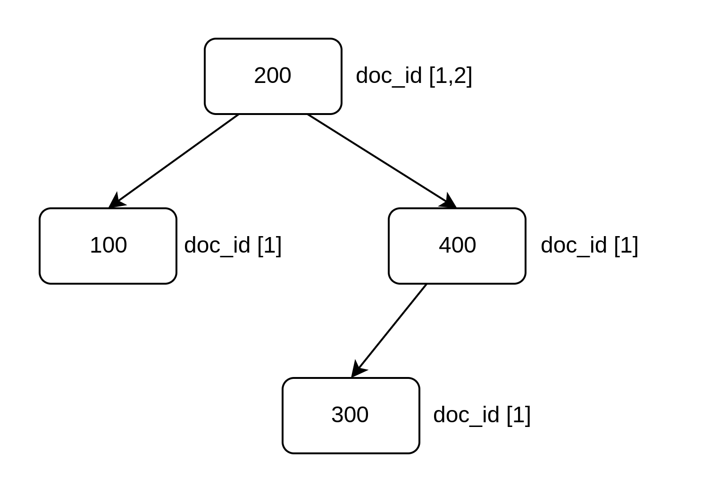

# インデックス/マッピング定義

Elasticsearch はインデックスとマッピング定義を事前に作成していなくでもドキュメント登録時に自動的にインデックスとマッピング定義を作成する。一方で明示的にインデックスとマッピング定義を作成しておくほうが望ましいケースもある。以下に示す。

- デフォルト値とは異なるシャード数/レプリカ数のインデックスを作成したい場合
- 登録するドキュメントのデータ型が予めわかっていて、Elasticsearch に型の自動推論をさせることなく明示的にマッピングを指定したい場合

## インデックスの設定

インデックスには以下の内容を設定できる。

- インデックス名
- シャード数/レプリカ数などのインデックスに関する設定
- マッピング定義

## インデックスの基本操作

- インデックスの登録
  - PUT <インデックス名>
- インデックス設定の更新
  - PUT <インデックス名>/\_settings
- インデックスマッピング定義の登録/フィールド追加
  - PUT <インデックス名>/\_mappings
- インデックスの削除
  - DELETE <インデックス名>
- インデックス設定の取得
  - GET <インデックス名>/\_settings
- インデックスマッピング定義の取得
  - GET <インデックス名>/\_mappings

### インデックスの登録

`PUT <インデックス名>`を使用してインデックスを登録する。リクエストボディーにインデックス設定/マッピング定義を指定することができる。

```HTTP
PUT my_index
{
  "settings": {
    "number_of_shards": 3,
    "number_of_replicas": 1
  },
  "mappings": {
    "properties": {
      "username": {
        "type": "text"
        "fields": {
          "keyword": {
            "type": "keyword",
            "ignore_above": 256
          }
        }
      },
       "message": {
        "type": "text",
        "fields": {
          "keyword": {
            "type": "keyword",
            "ignore_above": 256
          }
        }
      },
      "date": {
        "type": "date"
      }
    }
  }
}
```

### インデックス設定の更新

`PUT <インデックス名>/_settings`でインデックス設定を更新できる

```HTTP
PUT my_index/_settings
{
  "index": {
    "number_of_replicas": 4
  }
}
```

### インデックスマッピング定義の登録/フィールド追加

`PUT <インデックス名>/_mappings`でインデックスにマッピング定義を登録できる。既にインデックスにマッピング定義が登録されている場合はマッピング定義にフィールドを追加することのみ可能。

```HTTP
PUT my_index/_mappings
{
  "properties": {
    "username": {
      "type": "text"
      "fields": {
        "keyword": {
          "type": "keyword",
          "ignore_above": 256
        }
      }
    },
      "message": {
      "type": "text",
      "fields": {
        "keyword": {
          "type": "keyword",
          "ignore_above": 256
        }
      }
    },
    "date": {
      "type": "date"
    }
  }
}
```

### インデックスの削除

`DELETE <インデックス名>`で指定したインデックスを削除できる

```HTTP
DELETE my_index
```

### インデックス設定の取得

`GET <インデックス名>/_settings`でインデックス設定を取得できる

```HTTP
GET my_index/_settings
```

### インデックスマッピング定義の取得

`GET <インデックス名>/_mappings`でマッピング定義を取得できる

```HTTP
GET my_index/_mappings
```

## インデックステンプレート

ドキュメント登録時に事前に作成しておいたインデックステンプレートを基にインデックスを作成できる。例えば組織 ID ごとにインデックスを作成したいとする。その場合事前にマッピング定義やインデックス設定を記述したインデックステンプレートを作成しておき、`org-<組織ID>`のようなインデックスに初めてドキュメントを登録しようとするとインデックステンプレートを基に設定されたインデックスが作成される。

### 組織 ID ごとにインデックスを作成したい場合のインデックステンプレート使用例

特定のインデックス名の場合のみインデックステンプレートを使用するよう設定する必要がある。そのために index_patterns プロパティーを`org-*`のように設定する。

インデックステンプレート作成

```HTTP
POST _template/org_index_template
{
  "index_patterns": "org-*",
  "settings": {
    "number_of_shards": 3
  },
  "mappings": {
    "properties": {
      "Id": { "type": "keyword" },
      "name": { "type": "text" },
      "alias": { "type": "text" },
      "description": { "type": "text" }
    }
  }
}
```

ドキュメント登録（登録と同時にインデックステンプレートを基にインデックスが作成される）

```HTTP
POST org-1/_doc
{
  "Id": "1",
  "name": "customer",
  "alias": "顧客テーブル",
  "description": "ECサイトの顧客テーブル"
}
```

org-1 インデックスが org_index_template インデックステンプレートを基に作成される。

### テンプレートの複数定義

テンプレートには order プロパティーがありテンプレートの適用順序を指定できる。数が小さい順に適用され、後で適用されたテンプレートの設定が上書きされる。

## ダイナミックテンプレート

マッピング定義を動的に決定したい場合にはダイナミックテンプレートを使用できる。動的に型を決定できる。

ダイナミックテンプレートではフィールドの条件に基づいてテンプレートを適用するか判定する。以下のような条件を設定できる。

- フィールド名(match,unmatch)
- Elasticsearch が自動推定したフィールド型名(match_mapping_type)

### フィールド名に基づく判定(match,unmatch)

フィールド名が条件に一致(match)、不一致(unmatch)の場合に mapping 句の中で指定したフィールド型を適用する。

price で始まり、created で終わらないフィールド名の型を float 型にするダイナミックテンプレートを作成する。

```HTTP
PUT my_index/_mappings
{
  "properties": {
    "item": { "type": "text" }
  },
  "dynamic_templates": [
    {
      "price_as_float": {
        "match": "price_*",
        "unmatch": "*_created",
        "mapping": {
          "type": "float"
        }
      }
    }
  ]
}
```

### Elasticsearch が自動推定したフィールド型名に基づく指定(match_mapping_type)

Elasticsearch ではマッピング定義がない場合フィールドの方は自動的に推定される。その推定された型が match_mapping_type で指定した型と一致する場合は mapping の中でユーザーが指定した任意の型に変更する。

Elasticsearch が long 型と推定したフィールドの型を integer 型に変更する。

```HTTP
PUT my_index/_mapping
{
  "dynamic_templates": [
    {
      "long_to_integer": {
        "match_mapping_type": "long",
        "mapping": {
          "type": "integer"
        }
      }
    }
  ]
}
```

## フィールドの型

### 配列を扱う場合

文字列の配列であれば keyword 型/text 型を指定し、日付型であれば date 型/date_nanos 型を指定し、数値型であれば integer 型/float 型などを指定すれば良い。なぜなら配列の各要素が自動的に 1 つの文字列/日付/数値とみなされ、転置インデックスの値や、BKD ツリーの値として採用されるから。以下に例を示す。

#### keyword 型の配列

例えば tags 配列フィールドを keyword 型として定義し、`doc_id=1 ["apple", "orange"]`, `doc_id= 2["apple", "banana"]`をドキュメントとして格納した場合、転置インデックスは以下のようになる。

| 単語   | ドキュメント ID |
| :----- | :-------------- |
| apple  | 1,2             |
| orange | 1               |
| banana | 2               |

#### text 型の配列

例えば tags 配列フィールドを text 型として定義し、`doc_id=1 ["Hello World", "This is Elasticsearch"]`, `doc_id= 2["Hello Mike", "This is MySQL"]`をドキュメントとして格納した場合、転置インデックスは以下のようになる。

| 単語          | ドキュメント ID |
| :------------ | :-------------- |
| Hello         | 1,2             |
| World         | 1               |
| This          | 1,2             |
| is            | 1,2             |
| Elasticsearch | 1               |
| Mike          | 2               |
| MySQL         | 2               |

keyword 型と異なり、単語に分割されて転置インデックスが作成されている。

#### 数値型の配列

例えば prices 配列フィールドを integer 型として定義し、`doc_id=1 [100, 200, 300]`、`doc_id [200, 300, 400]`をドキュメントとして格納した場合、BKD ツリーは以下のようになる。



### オブジェクトを扱う場合

オブジェクトのフィールドには object 型と nested 型が主に使用される（他の型も存在する）

- object 型
  - デフォルトのオブジェクト型
  - 親にフラット化されてインデックスされる（内部構造が失われる）
- nested 型
  - 配列内の各オブジェクトを独立して扱いたい場合に使用する
  - 内部構造を保持したままインデックス化
  - クエリ時に各オブジェクトを個別に扱える
  - パフォーマンスコストが高い

つまり普通のオブジェクトの場合は object 型を使用し、object の配列の場合は nested を使用する。

#### object 型

以下にオブジェクト型のがフラット化されるイメージを示す。例としてユーザーが住所情報をオブジェクトとして持つデータ型を使用する。

```JSON
{
  "id": 1,
  "name": "佐藤",
  "address": {
    "city": "東京都",
    "addressInfo": "新宿区10-23",
    "building": "新宿ビル20階"
  }
}
```

上記をドキュメント化すると以下のようになる。

```JSON
{
  "id": 1,
  "name": "佐藤",
  "city": "東京都",
  "addressInfo": "新宿区10-23",
  "building": "新宿ビル20階"
}
```

#### nested 型

以下に nested 型が複数のドキュメントとして登録されるイメージを示す。例としてユーザーがポスト配列を持つ例を示す。

```JSON
{
  "id": 1,
  "name": "佐藤",
  "posts": [
    {
      "id": 1,
      "title": "post1"
    },
    {
      "id": 2,
      "title": "post2"
    }
  ]
}
```

上記をドキュメント化すると以下のようになる。

```JSON
{
  "id": 1,
  "name": "佐藤",
  "posts": ["doc_id_2", "doc_id_3"]
}
{
  "parent_doc_id": "1",
  "id": 1,
  "title": "post1"
}
{
  "parent_doc_id": "1",
  "id": 2,
  "title": "post2"
}
```

posts を object 型にした場合は以下のようにフラット化される。

```JSON
{
  "id": 1,
  "name": "佐藤",
  "post_id": 1,
  "post_title": "post1",
  "post_id": 2,
  "post_title": "post2"
}
```

クエリとして`posts.id = 1 and posts.title = "post2"`を条件とするユーザ検索を実行すると nested 型はドキュメントを取得しないが、object 型はフラット型されているため検索にヒットしドキュメントを取得してしまう。
