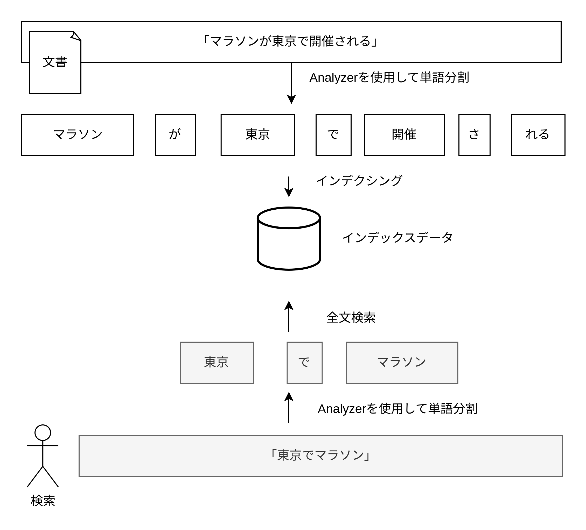
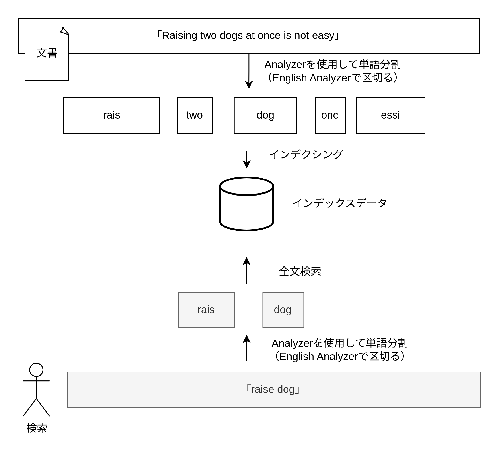
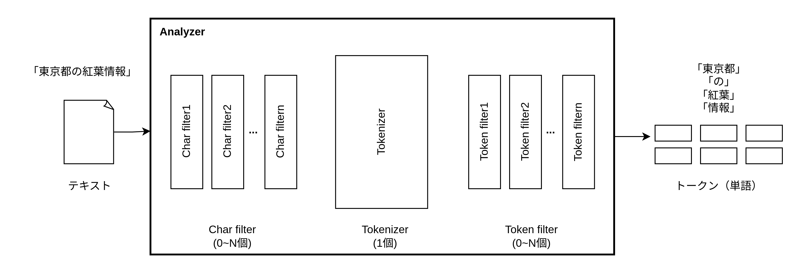

# Analyzer

Analyzer は転置インデックスを作成するために文章を単語単位に分割することができる。またクエリ検索時の文字列を単語単位に分割する際にも使用される。

- ドキュメント登録時に文章を単語単位に分割して転置インデックスを作成する
- クエリ検索時に検索文字列を単語単位に分割してヒットするドキュメントを取得する



## Analyzer の仕組み

Analyzer は文章を単語単位に分割する。しかし単純に単語単位に分割して転置インデックスを作成するだけだと例えば dog/Dog/dogs のような表記ゆれが発生するため、単語を分割する差に表現を揃えることを目的として以下のような処理が行われる。

- ステミング
  - 語形の変化を揃えて同一の表現に変換する処理
  - ステム(stem)は語幹という意味であり語形変化の幹となる部分を抽出する
  - 例）"making","makes"を"make"に変換する。"食べる","食べた"を"食べ"に変換する
- 正規化
  - 文字単位での表記ゆれを揃えるための変換処理
  - 大文字を全て小文字に変える、カタカナをひらがなに変える、全角文字を半角文字に揃えるなどがある
- ストップワード
  - 文章には含まれているが単語自体に意味や情報を持たない語を除外する処理
  - "the","of","は","が"などの冠詞、前置詞、助詞などを除外する

英語の場合は English Analyzer を用いると空白文字で単語を分割してステミング処理やストップワード処理を行える  
日本語の場合は Kuromoji Analyzer/N-gram Tokenizer を用いることができる



## 単語分割方法

- 空白文字によって単語を分割する
  - Standard Tokenizer
  - 英語/フランス語など空白文字によって単語を分割できる言語で使用される
- 機械的に固定長の語に分割する（N-gram）
  - N-gram Tokenizer
  - 主に空白文字によって単語を分割できない言語で使用される
  - 文章の先頭から機械的に n 文字に分割するため、検索漏れが起こりづらい。一方で意図しないクエリでヒットする可能性が高い。
  - 分割後の語の数が形態素解析よりも多くなる
- 品詞を推定して品詞単位で単語分割する（形態素解析）
  - Kuromoji Tokenizer
  - 日本語のみで使用可能
  - 予め用意された辞書に基づいて品詞の単位で分割される
  - 辞書にない単語は認識できないため新語や人名などを正しく識別しようとする場合には辞書のメンテナンスが必要になる
  - 品詞の抽出結果によっては細かい検索漏れが起こる可能性がある（"東京都"ではヒットするが"東京"ではヒットしないなど）

形態素解析と N-gram を組み合わせて使用することも可能。

## Analyzer の指定方法

### 検索アナライザーの指定方法

ドキュメント登録時に転置インデックスを作成するために使用するアナライザー

- インデックスのデフォルトの検索アナライザーを指定する
- フィールド毎に検索アナライザーを指定する
- クエリ発行時に検索アナライザーを指定する

インデックスのデフォルトのアナライザーを指定する（analysis.analyzer.default_search でデフォルトの検索アナライザーを指定する）

```HTTP
PUT testindex
{
  "settings": {
    "analysis": {
      "analyzer": {
        "default_search": {
          "type": "kuromoji"
        }
      }
    }
  }
}
```

フィールド毎に検索アナライザーを指定する

```HTTP
PUT testindex
{
  "mappings": {
    "properties": {
      "filed": {
        "type": "text",
        "search_analyzer": "kuromoji"
      }
    }
  }
}
```

クエリ発行時に検索アナライザーを指定する

```HTTP
GET testindex/_search
{
  "query": {
    "match": {
      "field": {
        "query": "speak the truth",
        "analyzer": "kuromoji"
      }
    }
  }
}
```

### インデックスアナライザーの指定方法

検索クエリの文章を分割する際に使用するアナライザー

- インデックスのデフォルトのインデックスアナライザーを指定する
- フィールド毎のインデックスアナライザーを指定する

インデックスのデフォルトのインデックスアナライザーを指定する

```HTTP
PUT testindex
{
  "settings": {
    "analysis": {
      "analyzer": {
        "default": {
          "type": "simple"
        }
      }
    }
  }
}
```

フィールド毎のインデックスアナライザーを指定する

```HTTP
PUT testindex
{
  "mappings": {
    "properties": {
      "field": {
        "type": "text",
        "analyzer": "simple"
      }
    }
  }
}
```

## Analyzer の構成要素

Analyzer は内部では次の 3 つの処理ブロックから構成される。

- Char Filter
- Tokenizer
- Token filter



### Char filter

入力されたテキストを前処理するためのフィルター機能。次の 3 種のビルトイン Char filter が提供されている。

- HTML Strip Character Filter
  - HTML フォーマットのテキストに含まれるタグを除去するフィルター
- Mapping Character Filter
  - 入力文字に含まれる特定の文字に対してマッピングルールを定義しておきルールに基づいた変換処理を行うフィルター
  - 例）":)" → "happy"
- Pattern Replace Character Filter
  - 定義された正規表現ルールに基づいて入力文字の変換処理を行うフィルター
  - 例）"123-456-789" → "123_456_789"

### Tokenizer

Char filter の出力テキストを入力としてテキストの分割処理を行い、トークン（単語）を生成する

- 単語分割用の Tokenizer
  - 空白など単語の境界を識別して、トークン（単語）に分割するタイプの Tokenizer
  - Standard Tokenizer、Whitespace Tokenizer
- N-gram 分割用の Tokenizer
  - N-gram 分割を行うための Tokenizer
  - N-gram Tokenizer、Edge N-gram Tokenizer
- 構造化テキスト分割用の Tokenizer
  - メールアドレス、URL、ハイフン区切りの文字列、ファイルパス文字列などの構造化テキストを分割するために用いられる Tokenizer
  - Keyword Tokenizer、Pattern Tokenizer、Path Tokenizer

### Token filter

Tokenizer が分割したトークン（単語）に対してトークン単位での変換処理を行うためのフィルター機能。デフォルトで提供されるビルトイン Token filter は 40 個以上存在する。

- Lowercase Token filter
  - トークン文字列を全て小文字に変換する
- Stop Token filter
  - ストップワードの除去を行うフィルター。言語毎にデフォルトのストップワードリストが定義されている。
- Stemmer Token filter
  - 言語毎に定義されたステミング処理を行うフィルター
- Synonym Token filter
  - 類義語（シノニム）を正規化して 1 つの単語に変換するフィルター

## Analyzer のカスタム定義

Analyzer、Char filter、Tokenizer、Token filter はそれぞれカスタム定義できる。

### Analyzer 構成のカスタム定義

```HTTP
PUT myindex
{
  "settings": {
    "analysis": {
      "analyzer": {
        "default": {
          "type": "custom",
          "char_filter": ["html_strip"],
          "tokenizer": "standard",
          "filter": ["lowercase", "stop"]
        }
      }
    }
  }
}
```

独自 Analyzer を使用するということで type を"custom"に指定する。最後に char_filter、tokenizer、filter についてそれぞれ定義を記述する。

### Char filter/Tokenizer/Token filter の設定カスタマイズ

stop token filter のカスタム定義例

```HTTP
PUT myindex
{
  "settings": {
    "analysis": {
      "filter": {
        "my_stop": {
          "type": "stop",
          "stopwords": ["the", "a", "not", "is"]
        }
      }
    }
  }
}
```

カスタム Token filter と Analyzer をまとめて定義する例

```HTTP
PUT myindex
{
  "settings": {
    "analysis": {
      "analyzer": {
        "default": {
          "type": "custom",
          "char_filter": ["html_strip"],
          "tokenizer": "standard",
          "filter": ["lowercase", "my_stop"]
        }
      },
      "filter": {
        "my_stop": {
          "type": "stop",
          "stopwords": ["the", "a", "not", "is"]
        }
      }
    }
  }
}
```

## Analyzer の動作確認方法

- インデックスとフィールドを指定して Analyzer の動作を確認する（フィールドに使用されている Analyzer を使用する）
- アナライザーを指定して Analyzer の動作を確認する

インデックスとフィールドを指定して Analyzer の動作を確認する例

```HTTP
POST myindex/_analyze
{
  "field": "message",
  "text": "Runs with a dog"
}
```

アナライザーを指定して Analyzer の動作を確認する例

```HTTP
POST /_analyze
{
  "analyzer": "standard",
  "text": "Hello Elasticsearch"
}
```
