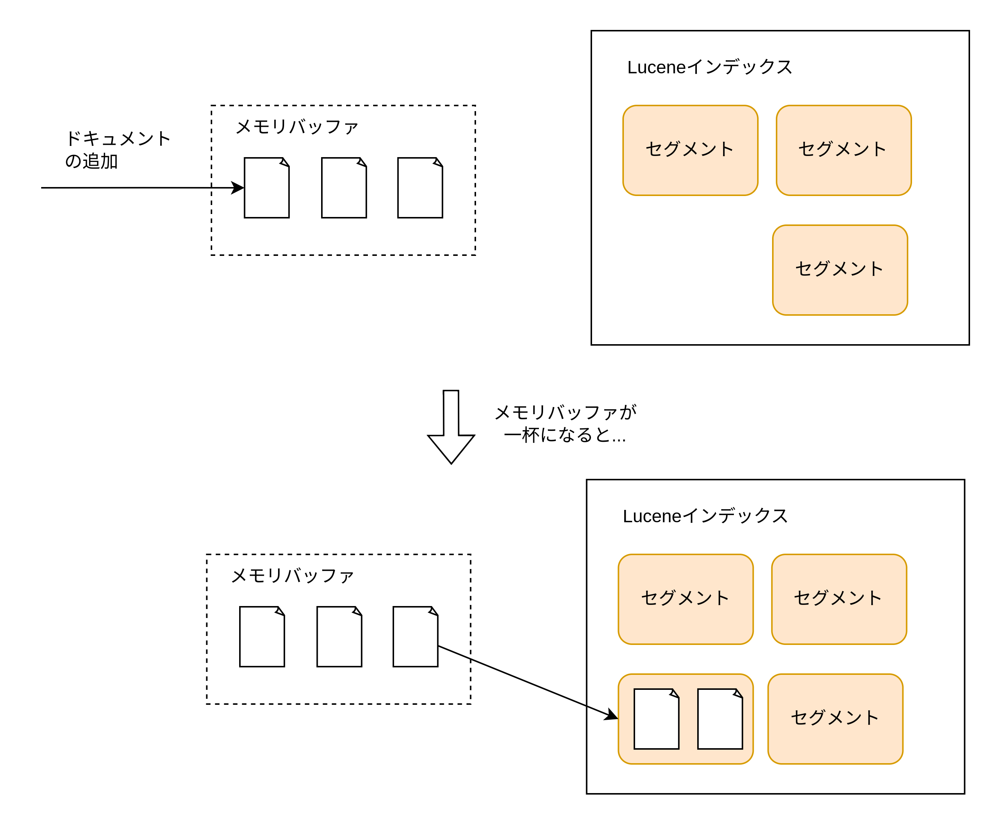

# インフラ管理

## 動作状況確認 API

Elasticsearch の動作状況を確認する方法を以下に示す。

- \_cat API を利用した動作確認
- クラスタ API を利用した動作確認
- Elasticsearch の出力するログ確認

### \_cat API を利用した動作確認

`_cart/<確認項目名>`を指定して GET メソッドを実行すると、UNIX/Linux コマンド出力のようなフォーマットで出力できる。`?v`というオプションを指定するとヘッダー情報も出力する。

| 名前         | API エンドポイント | 出力内容                                               |
| :----------- | :----------------- | :----------------------------------------------------- |
| Aliases      | \_cat/aliases      | インデックスエイリアスの状態                           |
| Allocation   | \_cat/allocation   | シャードの割当状況                                     |
| Count        | \_cat/count        | クラスタ全体あるいは特定のインデックスのドキュメント数 |
| Health       | \_cat/health       | クラスタの health 状態                                 |
| Indices      | \_cat/indices      | インデックスの状態                                     |
| Master       | \_cat/master       | マスタノードの ID および IP アドレス                   |
| Nodes        | \_cat/nodes        | ノードの状態（ID、IP、役割、リソース状態）             |
| Repositories | \_cat/repositories | スナップショットリポジトリの配置先                     |
| Shards       | \_cat/shards       | シャードの状態、格納ノード/インデックス先、統計状況    |
| Segments     | \_cat/segments     | Lucene セグメントレベルでの統計情報                    |
| Snapshots    | \_cat/snapshots    | スナップショットの状態                                 |
| Templates    | \_cat/templates    | インデックステンプレートの状態                         |

### クラスタ API を利用した動作確認

クラスタ API は\_cat API と比較してより詳細な状態を取得するために使用することができる。

| 名前                   | API エンドポイント      | 出力内容                                                   |
| :--------------------- | :---------------------- | :--------------------------------------------------------- |
| Cluster Health         | \_cluster/health        | 簡易なクラスタ状態の確認                                   |
| Cluster State          | \_cluster/state         | 詳細なクラスタ状態の確認                                   |
| Cluster Stats          | \_cluster/stats         | クラスタの詳細な利用統計情報                               |
| Pending Cluster Tasks  | \_cluster/pending_tasks | インデックス作成などのクラスタ状態変更タスクの実行待ち状態 |
| Cluster Reroute        | \_cluster/reroute       | シャード割当の変更（POST メソッドで変更する）              |
| Cluster Update Setting | \_cluster/settings      | クラスタ設定変更（PUT メソッドで変更する）                 |
| Node Info              | \_nodes                 | ノード情報の確認                                           |
| Node Stat              | \_nodes/stat            | ノード統計情報の確認                                       |

### Elasticsearch の出力するログ確認

Elasticsearch は通常のログを/var/log/elasticsearch/<クラスタ名>.log ファイルに出力する。（ただし Docker の場合は標準出力に出力する）  
通常のログファイル以外にも以下の 2 種類のログファイルがある。

#### deprecation ログ（<クラスタ名>\_deprecation.log）

deprecation ログには以前は使えていたがバージョンアップにより非推奨になった機能についての渓谷が出力される。

#### スローログ（<クラスタ名>\_index_indexing_slowlog.log および <クラスタ名>\_index_search_slowlog.log）

インデックス登録、もしくはクエリ時に一定以上の時間が経過した場合にログに出力する機能

## 設定変更操作

Elasticsearch での設定変更には以下の 2 種類がある。

- 静的な設定変更  
  &emsp;ノード単位で行う設定変更。環境変数/コマンド引数/elasticsearch.yaml ファイルの 3 種類の方法でノード起動時に設定を反映できる。全てのノードの設定を変更したい場合は、全てのノードに対して設定変更する必要がある。
- 動的な設定変更  
  &emsp;クラスタ単位で行う設定変更。クラスタ設定変更用 API(PUT \_cluster/settings)で変更を行う。クラスタ内で設定情報が一元管理されるため各ノードに設定を行う必要はない。設定項目によっては動的な設定変更をサポートしていない場合もあるため、その場合は静的な設定変更を行う必要がある。
  - 一時的なクラスタ設定変更（"transient"）  
    &emsp;クラスタが再起動するまでの期間で有効になる設定変更。クラスタが停止すると設定が失われる。
  - 恒久的なクラスタ設定変更（"persistent"）  
    &emsp;明示的に削除もし桑上書きされるまで高級的に残る設定変更。クラスタが再起動しても設定が失われない。

設定変更の優先順位は以下のようになる。


## クラスタの起動、停止、再起動

Elasticsearch にはクラスタ全体を一度に起動、停止、するためのコマンドや API は提供されていないため 1 ノードずつ操作する必要がある。

### 停止前の準備

ノードを停止するとデフォルトでは 60 秒後にシャードの再配置（リバランシング）が実行される。またノードがクラスタに復帰する際にもシャードの再配置が実行される。ノード停止前にはあらかじめシャードの再配置を無効にする設定をしたほうが良い。

シャード再配置の無効化例

```HTTP
PUT _cluster/settings
{
  "persistent": {
    "cluster.routing.allocation.enable": "none"
  }
}
```

1 つのノードが停止すると、停止したノードのシャードが他のノードに作成され、ノードのクラスタ復帰時には、復帰したノードにシャードが移動するため。再配置を無効にするとノード停止時にシャードが別のノードに作成されることもなく、復帰時に復帰したノードにシャードが移動してくることもない。ただし再配置を無効にしていても停止するノードにプライマリーシャードが存在していた場合、別のノードのレプリカシャードがプライマリーシャードに昇格する。


ノード停止前に flush 操作を実行し、メモリバッファ、トランザクションログをクリアしてディスクにデータを書き込む。これによりノード再起動時にメモリ再構築、ログの適用などの処理を実行させないようにして再起動時間を早くできる。

手動 flush 操作

```HTTP
POST _flush/synced
```

### 停止・起動

各ノードを systemctl stop コマンドで停止する。その後ノードのメンテナンスなど必要な作業を行った後に systemctl start コマンドで起動する。クラスタ全体を再起動する場合は、Master-eligible ノードから先に起動して先にクラスタ形成を完了させる必要がある。

### 起動確認・事後確認

まずクラスタの状態を確認する。

```HTTP
GET _cat/health?v
```

ノード数が正しいことを確認した後に、シャードの再配置を有効化する。ノード停止前にシャードの再配置を無効にしているため再起動したノードのシャードが未初期化状態になり使用可能な状態ではなくなっているため、シャードの再配置が完了するまでクラスタのステータスは red になる。シャードの再配置を有効化すると再配置が実行されてクラスタのステータスが green になる。

```HTTP
PUT _cluster/settings
{
  "persistent": {
    "cluster.routing.allocation.enable": "all"
  }
}
```

## ノード単位の Rolling Restart

クラスタ全体を一度に再起動するのではなく、クラスタ全体を停止させることなく RollingRestart できる。1 ノードずつ「停止前の準備」「停止・起動」「起動確認・事後対応」を実行することで実現する。

## ノード拡張

- `cluster.name`パラメータに参加したいクラスタ名を指定する
- `discovery.seed_hosts`パラメータにノード起動時に接続する際の接続先ノードを指定する。Master-eligible ノードを指定するのが良い。

ノードがクラスタに参加するとシャードが再配置されて、ノードにシャードが移動してくる。

## ノード縮退

シャードのレプリカが他のノードにも必ず配置されている場合であれば、ノードを停止するだけでレプリカがプライマリーシャードに昇格したり、適切にレプリカが再構成される。ただし安全のために事前にシャードを他のノードに移動させるほうが望ましい。

シャードを別ノードに移動させる例

```HTTP
PUT _cluster/settings
{
  "transient": {
    "cluster.routing.allocation.exclude._ip": "<縮退したいノードのIPアドレス>"
  }
}
```

## スナップショットとリストア

Elasticsearch で格納したインデックスデータをバックアップするためにはスナップショットを利用する。スナップショットは任意のタイミングで増分で取得することができる。定期的にスナップショットを取得することで不測の事態によりデータが失われた場合でも安全にデータを復元できる。


### リポジトリの登録

スナップショットを格納するためのリポジトリとして S3 を指定できる。手順は以下の通り。

1. S3-Repository のプラグインをインストールする
2. Elasticsearch にバケット名などを指定してリポジトリを登録する
3. keystore にアクセスキー/シークレットキーを登録し、keystore をリロードする

S3 プラグインをインストール

```bash
sudo bin/elasticsearch-plugin install repository-s3
```

S3 バケットをリポジトリとして登録

```HTTP
PUT _snapshot/s3-repository
{
  "type": "s3",
  "settings": {
    "bucket": "my-bucket"
  }
}
```

キーストアにアクセスキー/シークレットキーを登録してリロード

```bash
bin/elasticsearch-keystore add s3.client.default.access_key
bin/elasticsearch-keystore add s3.client.default.secret_key
```

```HTTP
POST _nodes/reload_secure_settings
{
  "secure_settings_password": "keystore-password"
}
```

### スナップショットの取得

スナップショットを作成したいインデックス名と、アップロードするリポジトリ名を指定してスナップショットを作成する。

```HTTP
PUT _snapshot/s3-repository/snapshot1?wait-for-completion=true
{
  "indices": "my-index"
}
```

### リストア

スナップショット名と復元したいインデックス名を指定して、インデックスをリストアする。

```HTTP
POST _snapshot/s3-repository/snapshot1/_restore
{
  "indices": "my-index"
}
```

## インデックス管理とメンテナンス

Elasticsearch を既にサービスで運用中である場合に、サービス停止せずにインデックス管理とメンテナンス管理する方法をこの節に書く。

### インデックスエイリアス

&emsp;インデックスには、エイリアス（別名）を設定できる。ドキュメント格納や検索クエリをエイリアスに対して実行すると、参照されている実態のインデックスが操作される。Linux のシンボリックリンクに近い概念。  
&emsp;Elasticsearch を一度運用環境で稼働させるとインデックス定義を変更したくなってもサービスへ影響が出るため変更が難しくなる。また、クライアントアプリケーションから Elasticsearch へアクセスしている場合にも、インデックス名を変更するとアプリケーションコードを改修しないといけない。  
&emsp;インデックスの実態が変更されてもエイリアス名を変更しなくてすむため変更に強いシステムを作ることができる。


インデックスエイリアスの使い道には主に 2 種類ある。

- 実態のインデックスの変更時に参照先を切り替える目的でエイリアスを使用する
- 複数のインデックスを 1 つのインデックスに束ねて横断検索する

前者では通常運用時には常にエイリアスを設定しておき、クライアントからはエイリアスを参照する。もしも、マッピング定義やフィールド定義に変更が発生した場合は新しい実態のインデックスを作成した上でエイリアスの参照先を新しいインデックスに切り替える。

#### インデックスエイリアスの作成と削除

data-v01 インデックスに対して data-alias エイリアスを作成する例

```HTTP
PUT data-v01/_alias/data-alias
```

data-v01 インデックスに対する data-alias エイリアスを削除する例

```HTTP
DELETE data-v01/_alias/data-alias
```

#### インデックスエイリアスのより汎用的な操作

data-v01 インデックスに対して data-alias エイリアスを作成する例

```HTTP
POST _aliases
{
  "actions": [
    {
      "add": {
        "index": "data-v01",
        "alias": "data-alias"
      }
    }
  ]
}
```

data-v01 インデックスの data-alias エイリアスを削除する例

```HTTP
POST _aliases
{
  "actions": [
    {
      "remove": {
        "index": "data-v01",
        "alias": "data-alias"
      }
    }
  ]
}
```

エイリアスを切り替える例（アトミックに実行されるため切り替え途中でエイリアスを参照できなくなる心配がない）

```HTTP
POST _aliases
{
  "actions": [
    {
      "remove": {
        "index": "data-v01",
        "alias": "data-alias"
      }
    },
    {
      "add": {
        "index": "data-v02",
        "alias": "data-alias"
      }
    }
  ]
}
```

複数のインデックスを対象としたエイリアスを定義する例

```HTTP
PUT log-2020-01-01,log-2020-01-02/_aliases/log-alias
```

```HTTP
POST _aliases
{
  "actions": [
    {
      "add": {
        "index": "log-2020-01-01",
        "alias": "log-alias"
      }
    },
    {
      "add": {
        "index": "log-2020-01-02",
        "alias": "log-alias"
      }
    }
  ]
}
```

ただし複数のインデックスと対象としたエイリアスには検索はできるが書き込むことができない。ただし、書き込むインデックスを 1 つだけ指定することで指定したインデックスにドキュメントを格納できる。

```HTTP
POST _aliases
{
  "actions": [
    {
      "add": {
        "index": "log-2020-01-01",
        "alias": "log-alias",
        "is_write_index": true
      }
    },
    {
      "add": {
        "index": "log-2020-01-02",
        "alias": "log-alias"
      }
    }
  ]
}
```

### 再インデックス

&emsp;再インデックスは既存のインデックスにあるドキュメントを別のインデックスにコピーできる機能。ある条件のデータのみをコピーする、コピー先のインデック定義を変更するといった操作が可能。  
&emsp;特にシャード数の変更時によく利用される。一度作成したインデックスのプライマリーシャー度数の数は後から増やすことができないため、まず新しいインデックスを任意のシャード数で作成してから再インデックスの機能を用いてコピーする。

全ドキュメントを対象とした再インデックス例

```HTTP
POST _reindex
{
  "source": {
    "index": "my-index"
  },
  "dest": {
    "index": "my-index-copy"
  }
}
```

コピー対象をクエリで絞り込んだ再インデックス

```HTTP
POST _reindex
{
  "source": {
    "index": "my-index",
    "query": {
      "match": {
        "message": "Elasticsearch"
      }
    }
  },
  "dest": {
    "index": "my-index-copy"
  }
}
```

### インデックスの open と close

インデックスを close 処理すると読み書きを停止することができる。close されたインデックスはメタデータの維持をする以外はリソースを消費しない。

インデックスの close の例

```HTTP
PUT my-index/_close
```

close したインデックスに再度アクセスしたい場合は、open 処理をすることで復帰させることができる。open 処理を実行するとシャードの再割り当てなどが行われ時間がかかる。

インデックスの open の例

```HTTP
PUT my-index/_close
```

Analyzer を変更する場合はインデックスを close する必要がある。

### インデックスの shrink

shrink は使用されなくなったインデックスのシャード数を縮小させることができる。ただし shrink 操作の中でシャード数を少なくした新しいインデックスが作成され、基のインデックスのデータをハードリンクで参照するため、シャード数を少なくしたインデックスにデータをコピーするのに近い処理を行う。

shrink を使用する条件

- shrink 元のシャード数が shrink 先のシャード数の倍数であること。（基のインデックスのシャード数が 8 の場合、shrink するインデックスのシャード数は 4、2、1 のいずれか）
- 実行前に全てのシャードを 1 つのノードに移動させる
- 実行前にインデックスへの書き込みをブロックする

1\. shrink 元のインデックス作成

```HTTP
PUT my-index-06
{
  "settings": {
    "number_of_shards": "6",
    "number_of_replicas": "1"
  }
}
```

2\. shrink 実行前の準備

```HTTP
PUT my-index-06/_settings
{
  "index": {
    "routing.allocation.require._ip": "192.168.10.2",
    "blocks.write": true
  }
}
```

3\. shrink 操作の実行

```HTTP
PUT my-index-06/_shrink/my-index-02
{
  "settings": {
    "index.number_of_shards": "2",
    "index.number_of_replicas": "1"
  }
}
```

4\. shrink 先インデックスの設定を戻す

```HTTP
PUT my-index-02/_settings
{
  "index": {
    "routing.allocation.require._ip": null,
    "blocks.write": null
  }
}
```

5\. shrink 元のインデックスを削除する

```HTTP
DELETE my-index-06
```

## refresh と flush

&emsp;refresh は Elasticsearch に格納したドキュメントを検索可能にするために必要になる機能。flush はノードが突然停止したような場合にその得てドキュメントデータを定期的に同期的に書き出す機能。  
&emsp;これらの内部動作には Elasticsearch が基盤としている Lucene のインデックスの内部構造について知る必要がある。

### Lucene のインデックスファイル構造

Elasticsearch のインデックスは複数のシャードから構成されており、それぞれのシャードは実際には Lucene のインデックスに該当する。更に Lucene のインデックスは複数のセグメントで構成されている。


Elasticsearch にドキュメントを追加する際は、まずメモリバッファにドキュメントが追加され、メモリバッファが一杯になるとセグメントを作成しディスクに同期的に書き込む。



### refresh

refresh 操作を行うと追加したドキュメントを検索可能状態にする。  
具体的には以下のような操作が行われる。

1. メモリバッファに保存されているドキュメントや更新がインメモリの Lucene セグメントとして作成される。（まずメモリ上に書き込む内容をバッファして、後から非同期にディスクへ書き込む）
2. Lucene の検索用オブジェクトが更新され新しいセグメントが含まれるようになる


### トランザクションログ

&emsp;refresh 操作をしてもディスクに同期的に書き込まれるわけではないのでディスクに書き込まれる前にサーバーがダウンすると、ドキュメントの情報が失われる。安全のためにドキュメントを 1 つ追加する毎にドキュメントをディスクに同期的に書き込むとディスク I/O がボトルネックになる。これらの問題を解決するために Elasticsearch ではトランザクションログが使用されている。トランザクションログには index,update,delete などのユーザーリクエストの情報がディスク上に書き込まれており、万が一の障害の場合もトランザクションログの情報を基にシャードをリカバリできるようになっている。  
&emsp;つまりドキュメントを同期的にディスクに書き込む重い操作の代わりに、リクエスト情報を同期的にディスクに書き込む軽い操作に変更するためにトランザクションログが必要。

#### トランザクションログの書き込みの仕組み

トランザクションログは Elasticsearch の各シャード内に作成、保持される。新しいドキュメントが登録されるたびに、Lucene のメモリバッファと同時にトランザクションログにも情報を書き込む。トランザクションログへの書き込みは fsync システムコールにより同期的に書き込みを行う。


### flush

flush はメモリバッファやインメモリに存在しているセグメントを同期的にディスクに書き込む。  
具体的には以下のような操作が行われる。

1. メモリバッファに存在するドキュメントを lucene セグメントとして同期的にディスクに書き込む
2. メモリ上にしか存在しない lucene セグメントを同期的にディスクに書き込む
3. Lucene の検索用オブジェクトを更新し、新しいセグメントを追加する
4. 情報が失われる可能性がなくなったのでトランザクションログをクリアする


### refresh と flush の違い

- refresh は非同期にセグメントをディスクに書き込む
- flush は同期的にセグメントをディスクに書き込み、トランザクションログの内容を全てクリアする
