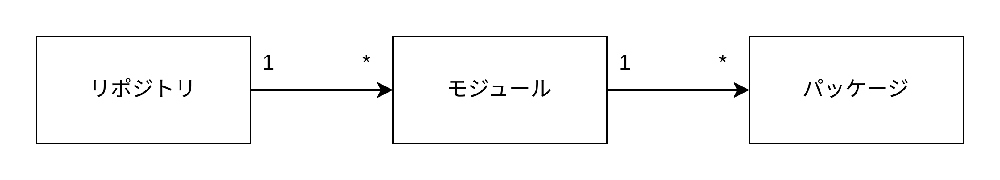
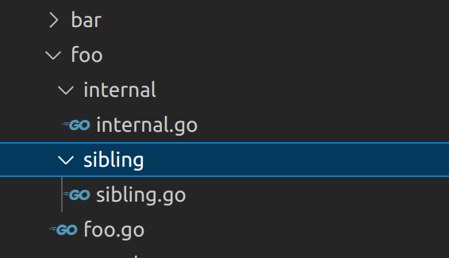
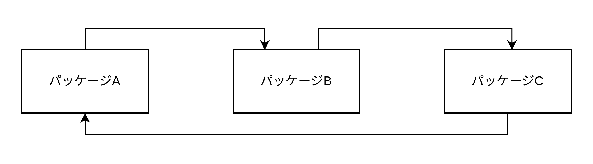

# モジュールとパッケージ

## リポジトリ・モジュール・パッケージ

Go のライブラリーは大きい方から「リポジトリ（Git リポジトリ）」「モジュール」「ライブラリー」の 3 つの概念を使用して管理する。リポジトリは複数のモジュールを保持でき、モジュールは複数のパッケージを保持できる。ただし基本的に 1 つのリポジトリで 1 つのモジュールを管理する



標準ライブラリー以外のライブラリを使用する場合は、プロジェクトをモジュールとして宣言する必要がある。

## モジュールと go.mod ファイル

`go mod init <remote_repository_path>`でモジュールを作成する。モジュール名はリモートリポジトリのパス（github.com/kuritaeiji/test-go など）にする。

go.mod ファイル

```go.mod
module github.com/kuritaeiji/test-lib

go 1.22.3

require github.com/aws/aws-sdk-go-v2 v1.27.2
```

モジュール名・Go バージョン・ライブラリーのバージョン一覧

## ライブラリー使用方法

### インポート方法

標準ライブラリー以外のパッケージをインポートする場合は`import <モジュール名（リモートリポジトリ名）>/<パッケージ名>`を記述する。

```Go
package main

import (
  // github.com/kuritaeiji/test-libがリポジトリ名かつモジュール名（リポジトリ名とモジュール名は同じだから）
  // storeがダウンロードしたライブラリー内のパッケージ
  "github.com/kuritaeiji/test-lib/store"
  // 同じライブラリーの別パッケージであるstackをインポートしている
  "github.com/kuritaeiji/test-lib/stack"
)

func main() {
  store.Insert("1", "user-name")
  stack.NewCallStack(errors.New("エラー")) // stackパッケージ
}
```

`go mod tidy`を実行することで GitHub などのリモートリポジトリなどからソースコードをダウンロードする。`~/go/pkg/mod`以下にソースコードがダウンロードされる。

### インポート時にパッケージ名をオーバーライドする

同一名称のパッケージを複数インポートしたい場合はパッケージに別名を割り当てることができる。

```Go
import (
  // crandという別のパッケージ名を割り当てている
  crand "crypto/rand"
  "math/rand"
)
```

### ブランクインポート

パッケージの init 関数のみ実行したい場合はブランクインポートを使用する。ブランクインポートを使用すると、パッケージ内の init 関数は起動するが、パッケージ内のエクスポートされた識別子にはアクセスできない。

```Go
import (
  "database/sql"

  _ "github.com/lib/pq"
)
```

## パッケージの構築

### パッケージの命名

パッケージ名とパッケージの親ディレクトリは同じ名前にする。

### internal パッケージ

internal パッケージでエクスポートされた識別子は、internal の直接の親パッケージと、internal の兄弟パッケージ内でのみ使用可能。



internal.go

```Go
package internal

func Test() string {
  return "test"
}
```

foo.go

```Go
package foo

import "github.com/kuritaeiji/test/foo/internal"

func main() {
  internal.Test()
}
```

sibling.go

```Go
package sibling

import "github.com/kuritaeiji/test/foo/internal"

func main() {
  internal.Test()
}
```

### 循環参照

パッケージ A がパッケージ B をインポートしている場合、パッケージ B がパッケージ A をインポートすることはできない。3 つ以上のパッケージで循環参照する場合もあるのでどのパッケージが循環参照しているかわからない場合は上に書き出す。



循環参照を修正する場合は循環参照の原因となった項目だけを別パッケージに移動するまたは、その項目だけからなる新しいパッケージ医を作成する。

## モジュール（ライブラリ）の公開

1. リモートリポジトリを GitHub などに作成する
2. `go mod init <リポジトリ名>`でモジュールを作成する
3. `store`や`util`などのパッケージを作成しエクスポートしたい識別子を宣言する
4. バージョン番号のタグを付与したコミットを作成する（git tag -a -m 'initial commit' v0.0.1）
5. リモートリポジトリに Push する

ライブラリを利用する際は`go get リポジトリ名`や`go mod tidy`を使用する

### エクスポート方法

- パッケージレベルで変数・定数・関数・型を宣言する
- 変数・定数・関数・型の識別子を大文字にする

```Go
package store

var A string = "a"
const B = "b"
func C() {}
type D int
```

A,B,C,D がエクスポートされる

## モジュールプロキシサーバー・チェックサムデータベース

1. `go get`コマンドを使用すると Google が管理するプロキシサーバーにリクエストを送る
2. 世界で初めてダウンロードされるライブラリの場合、リポジトリから直接ダウンロードし、プロキシサーバーにソースコードのコピーが作成される。コピーがすでに存在する場合はプロキシからダウンロードする。
3. Google が管理するチェックサムデータベースでダウンロードするソースコードのチェックサムと DB 上のチェックサムを比較し改ざん検知する。
4. チェックサムが一致する場合ダウンロードが実行される。

### プロキシサーバーの設定

- 環境変数 GOPROXY を direct に設定することでプロキシ機能を無効にできる
- 独自のプロキシサーバーをホストして、環境変数 GOPROXY をサーバーの URL にする

### プライベートなリポジトリ

プライベートなリポジトリに存在するモジュールを使用する場合 Google のプロキシサーバー経由でモジュールをダウンロードできない。環境変数 GOPROVATE にドメイン名を設定することで、特定のドメイン名の場合のみプロキシサーバーを経由せず直接ソースコードをダウンロードできる。ただしチェックサムデータベースにチェックサムが登録されないためチェックサムによる改ざん検知ができなくなる。

```bash
export GOPRIVATE=*.example.com,github.com/kuritaeiji
```
