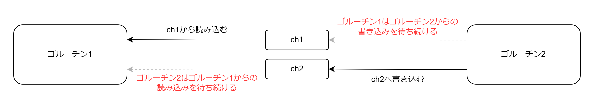
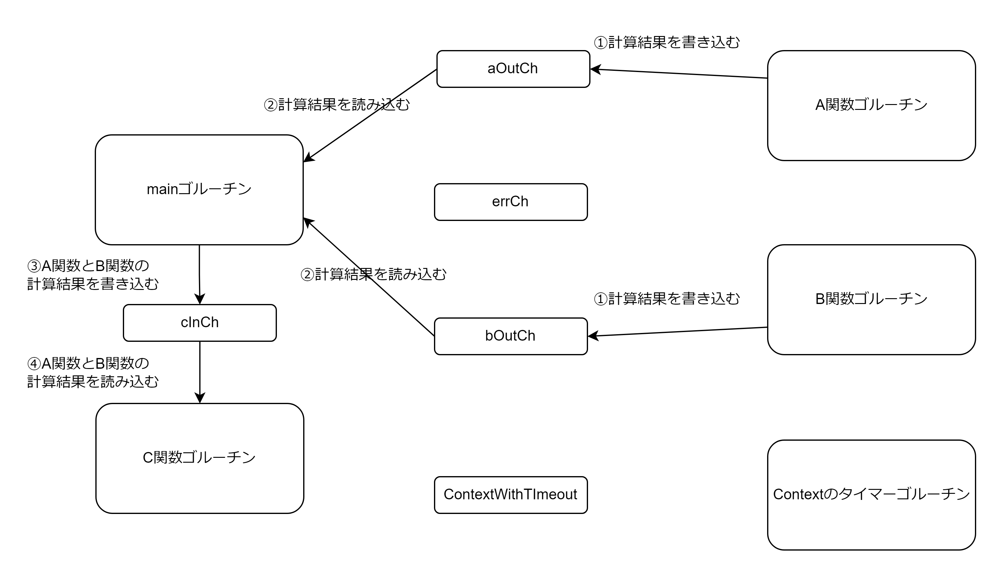

# 並行処理

並行処理はディスクあるいはネットワークを介した読み書きのような、処理に長い時間がかかる場合に使用する。並行処理を実現するのにもコストがかかるため I/O 関連の時間のかかる処理でのみ並行処理を使用する。

## ゴルーチン

ゴルーチンは Go のランタイムが管理する「スレッド」。関数の前に go キーサードを置くことでゴルーチンにできる。  
main 関数もゴルーチン。main 関数が終了するとプログラム全体が終了して他の起動しているゴルーチンも終了してしまうので注意する。（sync.WaitGroup を使用すると他のゴルーチンの終了前に main 関数が終了しないようにできる）

```Go
var client http.Client

go func() {
	println("ゴルーチン")
}()
```

## チャネル

チャネルはゴルーチン同士（main 関数と他のゴルーチンの場合もある）の情報のやり取りに使用する。  
マップやスライスと同様に、チャネルの値はチャネルの実態へのポインターになる。よって関数にチャネルを渡すととき実際にはチャネルの実態へのポインターがコピーされる。チャネルのゼロ値は nil。  
チャネルは make 関数によって初期化する。

```Go
// バッファーなしのチャネルを作成する
make(chan int)
// バッファーありのチャネルをキャパシティーを指定して作成する
make(chan int, 1)
// len関数でチャネルに何個の値が存在するか、cap関数で最大のバッファーの数がわかる
len(ch)
cap(ch)
```

### チャネルの動作

- バッファリングされない普通のチャネル
  - 書き込みは、別のゴルーチンが読み込みを行うまでブロックする
  - 読み込みも、別のゴルーチンが書き込みを行うまでブロックする
  - 複数のゴルーチンが平行に実行されていないとチャネルへの読み書きはできない
- バッファー付きのチャネル
  - 書き込みは、バッファー数を超えるまでは書き込みが可能。バッファー数を超えた場合、別のゴルーチンが読み込みを行いバッファーに空きがでるまで書き込みがブロックされる。
  - 読み込みは、1 つ以上の値がバッファーに存在する場合は読み込み可能。バッファーに値が存在しない場合は別のゴルーチンが書き込みを行うまではブロックされる。

### チャネルのクローズ

チャネルへの書き込みが終わったら組み込み関数`close`を使用してチャネルを閉じることができる

- チャネルがクローズされた後で書き込みをしようとしたり、クローズしようとするとパニックが発生する
- バッファー付きのチャネルかつ値が残っていないまたは普通のチャネルがクローズされた後で読み込みをすると常にゼロ値が返却される
- バッファー付きのチャネルに値が残っている場合は、その値が順番に返却される
- カンマ ok イディオムを使用することでチャネルがクローズされたかどうかを検知できる

```Go
// okがtrueであるならばオープンされた状態で、falseであるならばクローズされた状態
v, ok := <-ch
```

### for-range

for-range ループを使用してチャネルから値を読み込むことができる。
チャネルがクローズされるとforループから抜ける。

```Go
for v := range ch {
  fmt.Println(ch)
}
```

クローズされないチャネルの場合、別のゴルーチンからの書き込みを待ち続けパニックが発生するため注意する。

### チャネルの動作まとめ

|          | バッファ無+開                        | バッファ無+閉                                                               | バッファ有+開                                                                                                          | バッファ有+閉                                                                                                                           | nil                      |
| :------- | :----------------------------------- | :-------------------------------------------------------------------------- | :--------------------------------------------------------------------------------------------------------------------- | :-------------------------------------------------------------------------------------------------------------------------------------- | :----------------------- |
| 読み込み | 別のゴルーチンが書き込むまでブロック | ゼロ値が返る（カンマ ok イディオムを使用して close されているか確認できる） | バッファーに値が存在する場合は読み込むことができ、バッファーに値が存在しない場合は別のゴルーチンが書き込むまでブロック | バッファーに残っている値が返る。バッファーに値がなくなるとゼロ値を返す。（カンマ ok イディオムを使用して close されているか確認できる） | 無限にブロックされ続ける |
| 書き込み | 別のゴルーチンが読み込むまでブロック | パニック                                                                    | バッファー数まで書き込むことができ、値の個数がバッファー数を超えると別のゴルーチンが読み込むまでブロック               | パニック                                                                                                                                | 無限にブロックされ続ける |
| close    | クローズする                         | パニック                                                                    | クローズする                                                                                                           | パニック                                                                                                                                | パニック                 |

クローズされたチャネルに書き込むまたは再クローズしようとするとパニックになる。

## select

キーワード select を使用することで複数のチャネルに対する読み込み、書き込みの操作が可能になる。

```Go
select {
case v := <-ch1:
  println(v)
case v2 <-ch2:
  println(v2)
case ch3<-v3:
  println("write")
}
```

複数の case が読み込みまたは書き込み可能なチャネルを持つ場合はランダムに選択して読み込みまたは書き込みを行う。

## チャネルのデッドロック

2 つのゴルーチンと 2 つのチャネルが存在する場合に、ゴルーチン 1 がチャネル 1 から読み込もうとし、ゴルーチン 2 がチャネル 2 に書き込もうとしている。チャネル 1 に書き込むゴルーチンが存在しないのでチャネル 1 は永遠にブロックされ、チャネル 2 から読み込むゴルーチンが存在しないのでチャネル 2 は永遠にブロックされる。互いに相手のゴルーチンがチャネルに読み書きするのを待ち続けることになるので「デッドロック状態」になる。デッドロック状態になった場合 Go のランタイムはプログラムを強制終了する。

```Go
func main() {
	ch1 := make(chan int)
	ch2 := make(chan int)

	// ゴルーチン2はch2に書き込む
	// ゴルーチン1がch1から読み込むのを待ち続ける
	go func() {
		ch2 <- 1
	}()

	// ゴルーチン1はch1から読み込む
	// ゴルーチン2がch1に書き込むのを待ち続ける
	v := <-ch1
	println(v)
}
```



ゴルーチン 1 もゴルーチン 2 もお互いの処理完了を待ち続けるためデッドロックが発生する。

## context

context を使用することでも複数のゴルーチン同士の情報のやり取りを可能にする。context は done チャネルをフィールドに持つ構造体を使用することでゴルーチン同士の情報のやり取りを可能にしているため実質的にはチャネルを使用している感覚で扱える。context は以下の 2 つの情報のやり取りを可能にする。

- キャンセレーション
- タイムアウト

```Go
type ContextWithCancelOrTimeout struct {
	parent context.Context
	done chan struct{}
}
```

context を第一引数に受け取る関数は done チャネルを受けとっているとみなす。

### キャンセレーション

context を使用することでゴルーチン 1 からゴルーチン 2 に処理を中止しゴルーチンを終了してほしいという情報を伝えることができる。以下に 2 つのゴルーチンを起動し、1 つのゴルーチンがエラーになったらもう 1 つのゴルーチンを終了させるために context のキャンセレーションを使用する例を示す。

```Go
func generateInt(ctx context.Context) ([]int, error) {
	ctx, cancel := context.WithCancel(ctx)
	defer cancel()

	resultCh := make(chan int)
	errCh := make(chan error)

  // int生成ゴルーチン1
	go func() {
		// 0~1秒スリープ
		select {
		case <-sleep(1):
		case <-ctx.Done():
			return
		}
		num := rand.Intn(10)
		if num < 5 {
			resultCh <- num
		} else {
			errCh <- errors.New("生成したランダム値が5より大きいです")
		}
	}()

  // int生成ゴルーチン2
	go func() {
		// 0~1秒スリープ
		select {
		case <-sleep(1):
		case <-ctx.Done():
			return
		}
		num := rand.Intn(10)
		if num < 5 {
			resultCh <- num
		} else {
			errCh <- errors.New("生成したランダム値が5より大きいです")
		}
	}()

	var count int
	result := make([]int, 0, 2)
	for count < 2 {
		select {
		case r := <-resultCh:
			result = append(result, r)
			count++
		case err := <-errCh:
			cancel()
			return []int{}, err
		}
	}

	return result, nil
}

// 最大でmax秒間スリープした後にdoneチャネルをクローズしてスリープが終了したことを通知する関数
func sleep(max int) <-chan struct{} {
	ch := make(chan struct{})
  // sleepゴルーチン
	go func() {
		time.Sleep(time.Duration(rand.Intn(max)) * time.Second)
		close(ch)
	}()
	return ch
}
```

**int 生成ゴルーチンが両方ともエラーにならなかった場合**


**先にランダム値を返却した int 生成ゴルーチンがエラーになった場合**


main 関数が errCh からエラーを読み込むと、int 生成ゴルーチン 2 を終了させる。main 関数が context の cancel 関数を呼び出し context が内部的に持つチャネルをクローズすることで int 生成ゴルーチン 2 を終了させる。

**後にランダム値を返却した int 生成ゴルーチンがエラーになった場合**


main 関数が errCh からエラーを読み込むと context の cancel 関数を呼び出し context が内部的に持つチャネルをクローズする。しかし既に context が内部的に持つチャネルを読み込むゴルーチンが存在しないため特に意味がないことをしている。

#### context.WithCancel の疑似コード

```Go
package context

type contextWithCancel struct {
  parent context.Context
  done chan struct{}
}

// doneチャネルをもつContextと、doneチャネルをクローズするキャンセル関数を返却する
func WithCancel(ctx context.Context) (context.Context, func()) {
  done := make(chan struct{})
  cancel = func() {
    close(done)
  }
  ctx = contextWithCancel{
    parent: ctx,
    done: done,
  }
  return ctx, cancel
}
```

### タイムアウト

`context.WithTimeout`関数を使用すると時間制限のあるコンテキストを生成する。このコンテキストは時間を図るゴルーチンを起動し、指定時間経過後にコンテキストが内部的に持つチャネルをクローズする。

```Go
func exampleWithTimeout(ctx context.Context) (int, error) {
	ctx, cancel := context.WithTimeout(ctx, 500 * time.Millisecond)
	defer cancel()
	resultCh := make(chan int)
	errCh := make(chan error)

	go func(){
		time.Sleep(time.Duration(rand.Intn(1000)) * time.Millisecond)
		num := rand.Intn(10)
		if num < 5 {
			resultCh <- num
		} else {
			errCh <- errors.New("生成された値が5以上でした")
		}
	}()

	select {
	case r := <-resultCh:
		return r, nil
	case err := <-errCh:
		return 0, err
	case <-ctx.Done():
		return 0, ctx.Err()
	}
}
```

**context のタイマーゴルーチンが context のチャネルをクローズするよりも int 生成ゴルーチンがランダム値を生成してチャネルに書き込むほうが早かった場合**


関数はランダム値を返却する

**int 生成ゴルーチンがランダム値を生成するよりも、context が生成したタイマーゴルーチンが context のチャネルをクローズするほうが早かった場合**


関数は Context.Err() を返却する

#### context.WithTimeout の疑似コード

```Go
package context

type ContextWithTimeout struct {
  parent context.Context
  done chan struct{}
}

func WithTimeout(ctx context.Context, t time.Duration) (context.Context, func()) {
  done := make(chan struct{})
  cancel = func() {
    close(done)
  }

  ctx = ContextWithTimeout{
    parent: ctx,
    done: done,
  }

  // 時間t秒後にdoneチャネルをクローズするゴルーチンを起動する
  go func() {
    time.Sleep(t)
    cancel()
  }()

  return ctx, cancel
}
```

## 並行処理のパターン

### for ループ内でゴルーチンを起動する

下記コードを実行すると「4, 4, 4, 4」のようにすべて 4 が出力される。ゴルーチンが起動するときにはすべてのループ処理が終了して変数 n は 4 になってしまっている。これを解決するには for ループ以下のブロックで n を代入した別のローカル変数を作成すればよい。

```Go
func main() {
	s := []int{1, 2, 3, 4}
	ch := make(chan int)
	for _, n := range s {
		go func() {
			ch <- n
		}()
	}
	for i := 0; i < len(s); i++ {
		println(<-ch)
	}
}
```

解決策 1: for ブロック内に同じ n というローカル変数を定義する（シャドーイング）

```Go
for _, n := range s {
  // 新たなローカル変数nを定義する
	n := n
	go func() {
		ch <- n
	}()
}
```

解決策 2: ゴルーチンの無名関数の引数として n を定義して、引数の値として変数 n を渡す

```Go
for _, n := range s {
	go func(n int) {
		ch <- n
	}(n)
}
```

### ゴルーチンに終了のシグナルを送る

Go のランタイムは全く使われないゴルーチンを検知できない。ゴルーチンが終了しない場合、スケジューラーは何もしないゴルーチンに対して時間を割り振る。これを`ゴルーチンリーク`と呼ぶ。以下のような done チャネルパターンを使用するとゴルーチンに対して処理を終了すべきというシグナルを送信できる。

以下に複数のゴルーチンを起動して一番早く結果を返したゴルーチン以外は終了させるコードを示す。

```Go
func searchData(s string, searchers []func(string) []string) []string {
	resultCh := make(chan []string)
	done := make(chan struct{})

	for _, f := range searchers {
		go func(f func(string) []string) {
			select {
			case resultCh <- f(s):
				return
			case <-done:
				return
			}
		}(f)
	}

	r := <-resultCh
	close(done)
	return r
}
```

main 関数ゴルーチンの流れ

1. 複数のゴルーチンを起動する
2. main 関数ゴルーチンは resultCh からの読み込みを待機する
3. resutCh から一番早く処理を終えたゴルーチンからのデータを読み込む
4. done チャネルをクローズして他の searchData ゴルーチンを終了させる

1 番早く処理を終えた searchData ゴルーチンの流れ

1. searcher 関数の処理を開始する
2. 戻り値を resultCh に書き込む
3. ゴルーチンを終了する

1 番早く処理を終えれなかった searchData ゴルーチンの流れ

1. searcher 関数の処理を開始する
2. done チャネルからゼロ値を受け取りゴルーチンを終了する


### キャンセレーション関数を用いたゴルーチンの終了

関数からチャネルだけでなく処理をキャンセルする「キャンセレーション関数」も戻すことで、ゴルーチンの実行をキャンセルしたくなった時にキャンセルできるようにする。

```Go
func countTo(max int) (<-chan int, func()) {
	resultCh := make(chan int)
	done := make(chan struct{})
	cancel := func() {
		done <- struct{}{}
	}

	go func() {
		for i := 0; i < max; i++ {
			select {
			case resultCh <- i: // 別ゴルーチンが読み込みをしてくれないと書き込みが始まらない
			case <-done: // 別ゴルーチンがresultChを読み込みせず、doneチャネルがクローズされた場合にゴルーチンを終了する
				return
			}
		}
	}()

	return resultCh, cancel
}

func main() {
	ch, cancel := countTo(10)
	results := []int{}
	for r := range ch {
		if r > 5 {
			cancel()
			break
		}

		results = append(results, r)
	}
	fmt.Printf("%#v\n", results)
}
```


### select における case の無効化

並行実行されている複数のゴルーチンから受け取るデータを結合する場合は select が有用。ただしクローズされたチャネルを適切に処理する必要がある。クローズされたチャネルは常にゼロ時を返却し続け、クローズされたチャネルから読み込み処理を行う case が常に実行されることになってしまう。チャネルを nil にすることで case を無効化できる。

```Go
for {
  select {
  case v, ok := <-ch1
    if !ok {
      ch1 = nil // このcaseが再度成功することはない
      continue
    }
    println(v)
  case v, ok := <-ch2:
    if !ok {
      ch2 = nil // このcaseが再度成功することはない
      continue
    }
    println(v)
  case <-done:
    return
  }
}
```

### タイムアウト

タイマーのゴルーチンが done チャネルをクローズするのが早いか、目的のゴルーチンが結果をチャネルに返却するのが早いかという見方をするといい。

```Go
func main() {
	// 複数の結果を別のゴルーチンから別のゴルーチンに伝えたい場合はチャネルを使用して値を伝えるのではなく共有変数を使用することもできる。ゴルーチンの終了はdoneチャネルをクローズすることでmain関数ゴルーチンに通知する
	var result string
	var err error
	done := make(chan struct{})
	go func() {
		result, err = "result", nil
		close(done)
	}()

	timer := time.NewTimer(2 * time.Second)
	defer timer.Stop()

	select {
	case <-done:
		fmt.Println(result, err)
	case <-timer.C:
		fmt.Printf("[ERROR] timeout")
	}
}
```

指定時間内に execute ゴルーチンが終了した場合


指定時間内に execute ゴルーチンが終了しなかった場合


### WaitGroup の利用

1 つのゴルーチンが複数のゴルーチンの隆昌を待つ必要がある場合は sync パッケージの WaitGroup を使用する。

- Add メソッド: 終了を待つゴルーチン数のカウンタを指定した数だけ増やす
- Done: カウンタをデクリメントする
- Wait: カウンタがゼロになるまでそれを含むゴルーチンをポーズする

```Go
func main() {
	data := []int{1, 2, 3, 4}
	var wg sync.WaitGroup
	wg.Add(len(data))
	resultCh := make(chan int, len(data))

	for _, d := range data {
		go func(d int) {
			defer wg.Done()
			resultCh <- d * 2
		}(d)
	}

	wg.Wait()
	close(resultCh)
	result := make([]int, 0, len(resultCh))
	for r := range resultCh {
		result = append(result, r)
	}
	fmt.Printf("%#v\n", result)
}
```

## 並行処理のプログラム

3 つの関数に対してそれぞれゴルーチンを作成する。3 つの関数のうちの 2 つの結果を受け取る。受け取った 2 つの結果を 3 つ目の関数に渡す。すべての関数は 20ms 以内に実行されなければならい。以下にこのコードを示す。

```Go
func a() (int, error) {
	time.Sleep(time.Duration(rand.Intn(20)) * time.Millisecond)
	num := rand.Intn(2) // 0 or 1
	if num == 1 {
		return 1, nil
	}
	return 0, errors.New("a error")
}

func b() (int, error) {
	time.Sleep(time.Duration(rand.Intn(20)) * time.Millisecond)
	num := rand.Intn(2) // 0 or 1
	if num == 1 {
		return 1, nil
	}
	return 0, errors.New("b error")
}

func c(inputA int, inputB int) (int, error) {
	time.Sleep(time.Duration(rand.Intn(20)) * time.Millisecond)
	num := rand.Intn(2) // 0 or 1
	if num == 1 {
		return inputA + inputB, nil
	}
	return 0, errors.New("c error")
}

type CIn struct {
	InputA int
	InputB int
}

func main() {
	ctx, cancel := context.WithTimeout(context.Background(), 20*time.Millisecond)
	defer cancel()

	aOutCh := make(chan int)
	bOutCh := make(chan int)
	cOutCh := make(chan int)
	errCh := make(chan error, 2)
	cInCh := make(chan CIn)

	go func() {
		r, err := a()
		if err != nil {
			errCh <- err
			return
		}

		aOutCh <- r
	}()

	go func() {
		r, err := b()
		if err != nil {
			errCh <- err
			return

		}

		bOutCh <- r
	}()

	go func() {
		select {
		case arg := <-cInCh:
			r, err := c(arg.InputA, arg.InputB)
			if err != nil {
				errCh <- err
				return
			}
			cOutCh <- r
		case <-ctx.Done():
			return
		}
	}()

	var count int
	var cIn CIn
	for count < 2 {
		select {
		case r := <-aOutCh:
			cIn.InputA = r
			count++
		case r := <-bOutCh:
			cIn.InputB = r
			count++
		case err := <-errCh:
			fmt.Printf("[ERROR] %+v", err)
			return
		case <-ctx.Done():
			fmt.Printf("[ERROR] %+v", ctx.Err())
			return
		}
	}

	cInCh <- cIn
	select {
	case r := <-cOutCh:
		fmt.Printf("[INFO] %v", r)
	case err := <-errCh:
		fmt.Printf("[ERROR] %+v", err)
	case <-ctx.Done():
		fmt.Printf("[ERROR] %+v", ctx.Err())
	}
}
```

A 関数と B 関数がエラーを返却せず有効な値を返却する場合


A 関数と B 関数のどちらかがエラーを返却する場合


context のタイマーゴルーチンが指定時間経過後に done チャネルをクローズする場合


C 関数がエラーを返却せず有効な値を返却する場合


C 関数がエラーを返却する場合


context のタイマーゴルーチンが指定時間経過後に done チャネルをクローズする場合


## Mutex

共有変数を複数のゴルーチンで扱う場合は Mutex を使用する。

- Mutex: 排他ロック
- RWMutex: 共有ロック

```Go
package main

import "sync"

type scoreboard struct {
	l sync.RWMutex
	board map[string]int
}

func NewScoreboard() *scoreboard {
	return &scoreboard{
		board: map[string]int{},
	}
}

func (s *scoreboard) Update(name string, val int) {
	s.l.Lock()
	defer s.l.Unlock()

	s.board[name] = val
}

func (s *scoreboard) Read(name string) (int, bool) {
	s.l.RLock()
	defer s.l.RUnlock()

	val, ok := s.board[name]
	return val, ok
}
```
