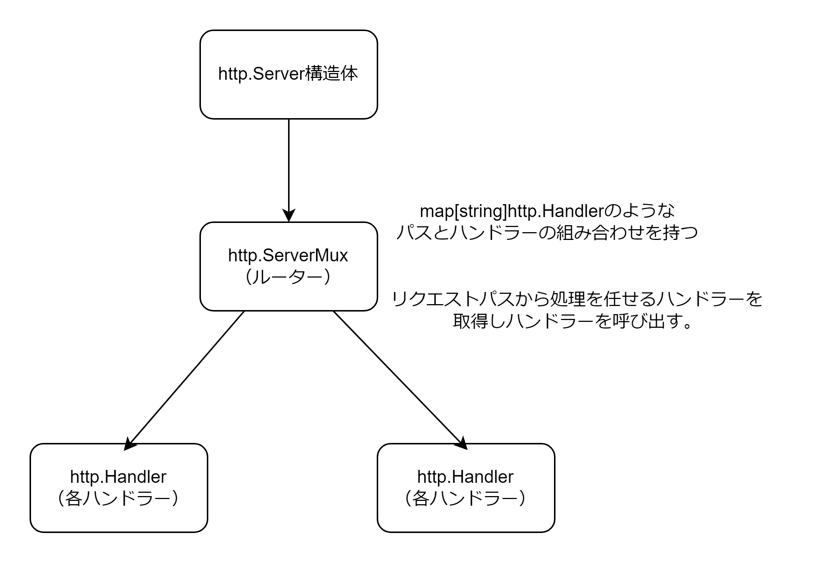

# 標準ライブラリー

## time

### 時間

時間は time.Duration 型で表現する。time.Duration 型は int64 を基底型とする型。  
ナノ秒を 1 としてマイクロ秒、ミリ秒、秒、分、時を定義している。

```Go
type Duration int64

const (
	Nanosecond  Duration = 1
	Microsecond          = 1000 * Nanosecond
	Millisecond          = 1000 * Microsecond
	Second               = 1000 * Millisecond
	Minute               = 60 * Second
	Hour                 = 60 * Minute
)
```

### 時刻

時刻は time.Time 型の構造体で表現される。time.Time 型はタイムゾーンと unix ナノ秒、モノトニックナノ秒（PC が起動してからナノ秒）を保持している。タイムゾーンは\*time.Location 型でポインターなので同じタイムゾーンでもポインター値が異なる可能性があるため time.Time 型の比較は「==」ではなく Equal メソッドを使用する。

time.Time から string への変換

```Go
tString := t.Format("2006/01/02 03:04:05")
```

string から time.Time への変換

```Go
t, err := time.Parse("2006/01/02 03:04:05", s)
```

time.Time 型同士の比較（Equal、After、Before メソッド）

```Go
t1 := time.Now()
t2 := time.Now()

t1.Equal(t2)
t1.After(t2)
t1.Before(t2)
```

time.Time 型同士の演算（Add、Sub メソッド）

```Go
t1 := time.Now()
t2 := time.Now()

t3 := t1.Add(1 * time.Second) // time.Time型が返却される
duration := t1.Sub(t2) // time.Duration型が返却される
```

タイマーとタイムアウト

- time.After: 指定時間後に一度だけ出力するチャネルを返却する（タイマーゴルーチンを起動する）
- time.Tick: 指定時間経過ごとに新しい値を出力するチャネルを返却する（タイマーゴルーチンを起動する）

```Go
// 1秒後に1度だけチャネルに書き込まれる
afterCh := time.After(1 * time.Second)
<-afterCh

// 1秒毎に何度もチャネルに書き込まれる
tickCh := time.Tick(1 * time.Second)
for {
  <-tickCh
}
```

## encoding/json

### 構造体タグ

`omitempty`オプションと`"-"`タグ

- `omitempty`オプションはフィールドの値が空の値（false, 0, 空文字列, nil, 空マップ、空スライス）の場合エンコーディング時のみフィールド自体を省略する
- `"-"`タグはエンコーディング時は常にフィールド自体を省略する。デコーディング時は常にゼロ値にする。

```Go
type Hoge struct {
	Field1 string `json:"field1"`

	// "omitempty" オプションは、フィールドの値が空の値の場合
	// エンコーディングするときに省略される
	Field2 string `json:"field2,omitempty"`

	// "-" は常にフィールドは省略される
	Field3 string `json:"-"`
}

// エンコーディング
var hoge Hoge
b, _ := json.Marshal(hoge)
fmt.Println(string(b)) // {"field1":""}

// デコーディング
b = []byte(`{"field1": "aa", "field2": "bb", "field3": "cc"}`)
json.Unmarshal(b, &hoge)
fmt.Printf("%#v\n", hoge) // {Field1:"aa", Field2:"bb", Field3:""}
```

json の null 値

フィールドが null の json をデコーディングするとゼロ値になる。例）`{"id": null}` → `{id: ""}`

### マーシャリングとアンマーシャリング

- マーシャリング: 構造体を json バイト列 にエンコードする
- アンマーシャリング: json バイト列 を構造体にデコードする

```Go
// マーシャリング
b, err := json.Marshal(user)

// アンマーシャリング
var u User
err = json.Unmarshal(jsonData, &u)
```


### JSON のリーダーとライター

- エンコーディング: 構造体を JSON に変換し io.Writer にエンコーディングする
- デコーディング: io.Reader から JSON を読み込み構造体にデコーディングする

```Go
// エンコーディング
var buff bytes.Buffer
err := json.NewEncoder(&buff).Encode(user)

// デコーディング
var u User
err = json.NewDecoder(&buff).Decode(&u)
```


### JSON 解析のカスタマイズ

JSON と構造体の変換時の挙動をデフォルトの挙動から変更することができる。以下に手順を示す。

1. 新しい型を作成する（埋め込みフィールドを使用する）
2. func MarshalJSON() ([]byte, error)メソッドを追加する
3. func UnmarshalJSON([]byte) error メソッドを追加する

```Go
type JSONTime struct {
	time.Time
}

func (t JSONTime) MarshalJSON() ([]byte, error) {
	ts := t.Format("2006/01/02 03:04:05")
	return []byte(fmt.Sprintf(`"%v"`, ts)), nil
}

func (t *JSONTime) UnmarshalJSON(b []byte) error {
	s := string(b)
	if s == "null" {
		return nil
	}

	parseT, err := time.Parse("\"2006/01/02 03:04:05\"", s)
	if err != nil {
		return err
	}

	t.Time = parseT
	return nil
}

type Order struct {
	CreateTime JSONTime
}
```

## net/http

### クライアント

以下に http クライアントの使用手順を示す

1. プログラム全体で 1 つの http.Client 構造体を作成する（タイムアウトを設定する）
2. http.NewRequestWithContext 関数を使用して http リクエストを作成する
3. http.Client.Do(\*http.Request)を使用して http リクエストを送信する
4. http.Client.Do メソッドから返却されたレスポンスを解析する

```Go
// 1.クライアント作成
var client = http.Client{
	Timeout: 30 * time.Second,
}

func main() {
	jsonS := `{"id": "1"}`
	var body bytes.Buffer
	body.WriteString(jsonS)

	// 2.リクエスト作成
	req, _ := http.NewRequestWithContext(
		context.Background(),
		http.MethodGet,
		"http://example.com",
		&body,
	)
	req.Header.Add("Authorization", "jwt")

	// 3.リクエスト送信
	res, _ := client.Do(req)
	defer res.Body.Close()
	println(res.Status)
}
```

コンテキストによるキャンセルとタイムアウトの http クライアントの疑似コード

```Go
package http

func (c *Client) Do(req *Request) (*Response, error) {
	ctx := req.Context()

	// コンテキストのチャネルを監視するゴルーチンを生成する
	go func() {
		<-ctx.Done()
		// TCP接続を閉じるまたは、リクエストを送信しているゴルーチンを終了させる
	}()

	// 以下にリクエスト送信を記述する...
}
```

### サーバー

1. http パッケージのデフォルトリクエストルーター http.ServeMux 構造体 を作成する
2. ServeMux.HandleFunc メソッドを使用してパスとハンドラーの組み合わせを登録する
3. http.Server 構造体を作成する
4. http.Server.ListenAndServe メソッドを実行してサーバーを起動する

```Go
// 1.http.ServeMuxを作成する
mux := http.NewServeMux()

// 2.http.ServeMuxにパスとハンドラーの組み合わせを登録する
mux.HandleFunc("/person", func(w http.ResponseWriter, r *http.Request) {
  w.Write([]byte("person"))
})
mux.HandleFunc("/dog", func(w http.ResponseWriter, r *http.Request) {
  w.Write([]byte("dog"))
})

// 3.http.Server構造体を作成する（handlerフィールドにはhttp.ServeMuxを指定する）
s := http.Server{
  Addr:         ":8080",
  ReadTimeout:  30 * time.Second,
  WriteTimeout: 30 * time.Second,
  IdleTimeout:  120 * time.Second,
  Handler:      mux,
}

// 4.サーバーを起動する
s.ListenAndServe()
```



### ミドルウェア

各ハンドラーをミドルウェアでラップすることでハンドラーにミドルウェアを適用できる。

```Go
func requestTimer(h http.HandlerFunc) http.HandlerFunc {
	return func(w http.ResponseWriter, r *http.Request) {
		start := time.Now()
		h(w, r)
		end := time.Now()
		fmt.Printf("[INFO] request time for %s: %v", r.URL.Path, end.Sub(start))
	}
}

func terriblePasswordProvider(password string) func(h http.HandlerFunc) http.HandlerFunc {
	return func(h http.HandlerFunc) http.HandlerFunc {
		return func(w http.ResponseWriter, r *http.Request) {
			if r.Header.Get("X-Secret-Password") != password {
				w.WriteHeader(http.StatusUnauthorized)
				w.Write([]byte("Unauthorized"))
				return
			}
			h(w, r)
		}
	}
}

mux := http.NewServeMux()
mux.Handle("/hello", terriblePasswordProvider("password1234")(requestTimer(http.HandlerFunc(func(w http.ResponseWriter, r *http.Request) {
	w.Write([]byte("Hello\n"))
}))))
```

### マルチプレクサー（ルーター）をサードパーティーのマルチプレクサーに置き換える

標準ライブラリーの http パッケージの欠点は、組み込みのリクエストルータ http.ServeMux 構造体の機能が貧弱なこと。よって`gorilla/mux`や`chi`のようなライブラリーでルーターを置換したほうが良い。

以下に chi の例を示す。

```Go
// 1. ルーター作成
mux := chi.NewRouter()
// 2. ルーターにパスとハンドラー登録
mux.Get("/hello", func(w http.ResponseWriter, r *http.Request) {
  w.Write("hello")
})
// 3. サーバー作成
s := http.Server{
  Addr: ":8080",
  Handler: mux,
}
// 4. サーバー起動
s.ListenAndServe()
```
