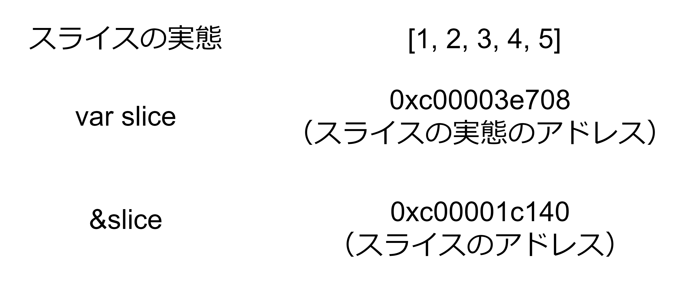
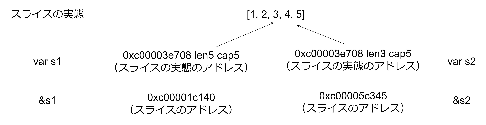
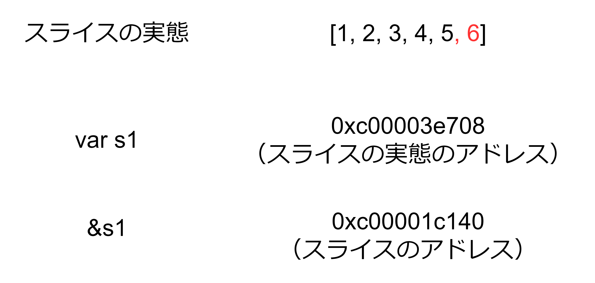
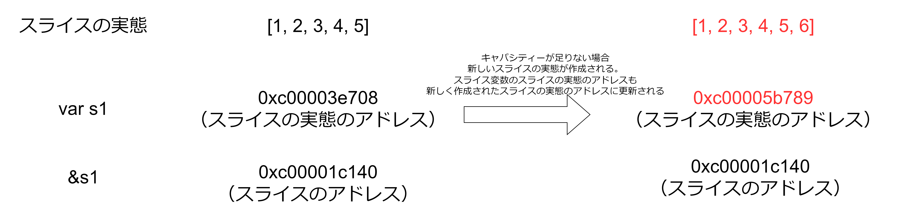
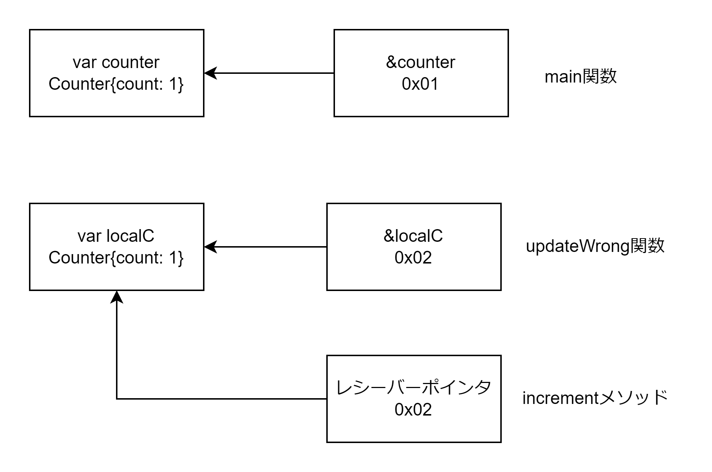
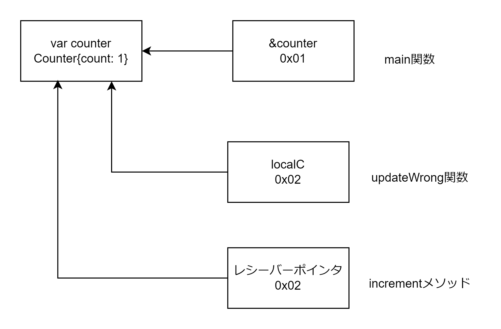

# 型

## リテラル

リテラルは untyped である。よって浮動小数点数リテラルを整数リテラルに代入したりできる。変数に代入するときなどに型が決まる。
例えば 1 を int 型の変数に代入する場合は 1 は int 型になり、1 を int32 に代入する場合は int32 型になる。  
以下にリテラルの種類を示す。

- 整数リテラル
- 浮動小数点数リテラル
- rune リテラル
- 文字列リテラル

```Go
// 整数リテラル
1
// 浮動小数点リテラル
1.21
// runeリテラル
'a'
// 文字列リテラル
"aaa"
```

## 型の種類

- 論理型 bool（ゼロ値: false）
- 数値型（ゼロ値: 0）
  - int8, int16, int32, int64, uint8, uint16, uint32, uint64
  - byte(uint8 の別名・1 バイトの正の数)
  - int(cpu により 64 ビットまたは 32 ビットになる)
  - uint(cpu により 64 ビットまたは 32 ビットになる)
  - rune(文字列の 1 文字を表現する・int32 の別名・4 バイトの正の数)
  - uintptr(メモリのアドレス・uint64 の別名)
- 浮動小数点数型（ゼロ値: 0）
  - float64, float32
- 文字列型 string（ゼロ値: ""）
- ルーン rune (ゼロ値: 0)
- スライス slice（ゼロ値: nil）
- マップ map（ゼロ値: nil）
- 関数 func（ゼロ値: nil）
- ポインター（ゼロ値: nil）
- インターフェース（ゼロ値: nil）
- 構造体 struct（ゼロ値: 全フィールドがゼロ値になる）

## 型変換

byte や rune は単なる整数値なのでコードポイントとみなして 1 文字の文字列型に変換したり int に変換できる。  
int64 なども string 型に型変換できるが存在しないコードポイントだと文字化けする。

```Go
var b byte = 97
var r rune = 'a'

s := string(b) // "a"
s = string(r) // "a"
i := int(b)
i = int(r)
```

## 定数

定数は単なるリテラルに定数名を付与しただけのもの。よって untyped 型かつポインターもない。

```Go
const a = 1
const b = true
const c = "hello"
```

## 文字列

文字列は裏側では byte 列を使用している。

```Go
s := "Hello, World"
b := s[0] // Hのaccii数値

s2 := "私"
b2 := s2[0] // 231 「私」はマルチバイト文字なので1バイト目のみ取得する
println(len(s2)) // 3「私」は3バイト文字なので長さは3になる
```

文字列と rune と byte は型変換できる。また文字列と rune のスライスと byte 列も型変換できる。

```Go
var r rune = 'a'
rs := string(r)
var b byte = 'y'
bs := string(b)

var s2 = "こんにちは、世界"
bs := []byte(s2)
rs := []rune(s2)
```

文字列に for-range を使用すると rune をループできる。

```Go
s := "Hello, World"
for _, r := range s {
  print(s) // "Hello, World"を表示する
}
```

## スライス

スライスはスライスの実態（配列本体）へのポインター。実際にはポインター以外にも長さ・キャパシティーも持つ。存在しないインデックス番号にアクセスすると panic が発生する。



### 初期化方法

1. ゼロ値(nill)で初期化
2. 長さ 0 で初期化
3. make 関数で長さ 0 で初期化
4. make 関数でキャパシティーを指定して初期化

```Go
var s1 []int // ゼロ値のnilで初期化（スライスの実態が作成されないのでスライスの実態のアドレスはnilになる）
s2 := []int{} // 長さ・キャパシティー0のスライスで初期化（スライスの実態は長さ0の配列、スライスの実態のアドレスは配列のアドレスになる）
s3 := make([]int, 0) // 長さ・キャパシティー0のスライスで初期化
s4 := make([]int, 0, 4) // 長さ0・キャパシティー4で初期化
```

### スライス式

スライスを切り出して別のスライスを作成可能。スライスの実態をコピーするのではなくスライスの実態のアドレス値がコピーされるため、スライスの要素を更新すると、s1 と s2 両方のスライスの要素が更新される。



```Go
s1 := []int{1, 2, 3, 4, 5}
s2 = s1[0:3]
s2[0] = 10 // s1とs2は両方とも[10, 2, 3, 4, 5] になる
```

### スライスの copy

スライス式ではスライスの実態の作成は行わない。copy 関数を使用することでスライスの実態レベルでコピーできる。

1. コピーしたいスライス s1 と同じ長さのスライス s2 を make 関数で作成する
2. copy 関数を使用して s1 から s2 へ各要素をコピーする

```Go
s1 := []int{1, 2, 3, 4}
s2 := make([]int, 4)
copy(s2, s1)
```

### append

append を使用してスライスに値を追加できる

- キャパシティーが足りている場合: 同一のスライスの実態に要素を追加する
- キャパシティーが足りない場合: キャパシティーを増やした新しいスライスの実態を作成し、新しいスライスに要素を追加する。スライス(var s1)の保持するスライスの実態のアドレスと長さとキャパシティーは更新される。スライスのポインター(&s1)は変わらない

キャパシティーが足りている場合の append


キャパシティーが足りていない場合の append



```Go
// キャパシティー足りる場合
s1 := make([]int, 1, 2)
println(s1) // 0xc00003e708
s1 = append(s1, 1)
println(s1) // 0xc00003e708　スライスの実態のアドレスは変わらない

// キャパシティー足りない場合
s2 := []int{0}
println(s2) // 0xc00001c140
s2 = append(s2, 1)
println(s2) // 0xc00005b234 スライスの実態のアドレスが変化したので表示される実態のアドレスも変わる
```

### スライスまとめ

- スライス式: スライスの実態は同じものを使用する
- append: キャパシティーが足りている場合はスライスの実態に要素を追加し、キャパシティーが足りない場合は新しいスライスの実態を作成し要素を追加する
- copy: スライス自体を新しく作成し、スライスの実態の各要素をコピーする

## マップ

マップもスライスと同様にマップの実態（構造体）をもちマップの変数(var m1)にはマップの実態のアドレスを持つ。

初期化方法

- ゼロ値(nil)で初期化する（マップの実態の構造体は作成されない）
- 要素なしで初期化する（マップの実態の構造体がフィールドなしで作成される）
- make 関数を使用して要素なしで初期化する

```Go
var m1 map[string]string
m2 := map[string]string{}
m3 := make(map[string][string], 0)
```

存在しないキーに対してはゼロ値が返却される。キーが存在するかどうかはカンマ ok イディオムを使用する。

```Go
m := map[string]int{
  "hello": 5,
  "world": 0,
}
v, ok := m["goodbye"] // v="", ok=false
```

マップから要素を削除する

delete 関数を使用するとマップから要素を削除できる

```Go
m := map[string]int{"hello": 0,}
delete(m, "hello")
```

```Go
package main

import "fmt"

func main() {
	m := map[string]int{
		"a": 1,
	}
	m2 := m
	m2["b"] = 2
	fmt.Printf("%#v %#v", m, m2)
}
```

## 構造体

### 無名構造体

変数に対して名前のない構造体を使用できる。

```Go
person := struct{
  name string
  age int
}{
  name: "佐藤",
  age: 20
}
```

### メソッド

- ポインタ型レシーバーのメソッド: レシーバーは構造体のポインターのコピーになる。よってデリファレンスを使用して構造体自体を変更することや、構造体のフィールドの値を更新できる。
- 値がレシーバーのメソッド: レシーバーは構造体自体のコピーになる。よって構造体のフィールドの更新などはできない。

```Go
type Counter {
  count int
}

// Counter構造体を別の構造体に置換する
func (c *Counter) replace(ac Counter) {
  *c = ac
}

// ポインターレシーバーなのでフィールドを更新できる
func (c *Counter) increment() {
  c.count += 1
}
```

```Go
func updateWrong(localC Counter) {
  c.increment()
}

func updateRight(localC *Counter) {
  c.increment()
}

func main() {
  var counter Counter
  updateWrong(c)
}
```


methodWrong 関数使用時は main 関数内とは異なる Counter 構造体を更新しているため main 関数内の counter 変数に更新が反映されない。


methodRight 関数使用時は main 関数内とは同じ Counter 構造体を更新しているため main 関数内の counter 変数が更新される。

#### nil に対してメソッドを呼び出す場合

- 値レシーバーの場合: panic になる
- ポインタレシーバーの場合: メソッドを呼び出す（ただしメソッド内でレシーバーが nil の場合の処理を追加する必要がある）

```Go
type IntTree struct {
  val int
  left, right *IntTree
}

func (it *IntTree) Insert(val int) *IntTree {
  if (it == nil) {
    return &IntTree{val: val}
  }

  if val < it.val {
    it.left = it.left.Insert(val)
  } else {
    it.right = it.right.Insert(val)
  }

  return it
}

func (it *IntTree) Contains(val int) bool {
	switch  {
	case it == nil:
		return false
	case val < it.val:
		return it.left.Contains(val)
	case val > it.val:
		return it.right.Contains(val)
	default:
		return true
	}
}
```

### 埋め込み

- 構造体に構造体を埋め込むことができる
- 埋め込まれた構造体は上位の構造体のフィールドやメソッドに昇格し、構造体から埋め込んだ下位の構造体のフィールドやメソッドを呼び出すことができる

```Go
type Employee struct {
	ID string
	Name string
}

func (e *Employee) String() string {
	return fmt.Sprintf("[%s] %s", e.ID, e.Name)
}

type Manager struct {
	Employee
	Reports []Employee
}

func main() {
	e := Manager{
		Employee: Employee{ID: "0001", Name: "豊臣"},
		Reports: []Employee{{ID: "0002", Name: "徳川"}},
	}
	println(e.ID) // Manager構造体からEmployeeのフィールドIDを呼び出せる
	println(e.Name) // Manager構造体からEmployeeのフィールドNameを呼び出せる
	println(e.String()) // Manager構造体からEmployeeのStringメソッドを呼び出せる
}
```

testify の mock パッケージで使用されている。mock.Mock 構造体を埋め込むことで mock.Mock 構造体が持つ On などのメソッドを使用することができる。

```Go
type UserRepository struct {
  mock.Mock
}
```

## ユーザー定義型

- int や string などを基底型としたユーザー定義型を作成できる
- ユーザー定義型は「ドキュメント」としての役割が大きい
- const と組み合わせて利用可能（ログレベル INFO,ERROR などに使用される）
- ユーザー定義型を基底型に代入したりはできない。（ユーザー定義型を基底型に型変換してから代入する必要がある）

```Go
type MailCategory int // int型を基底型とするMailCategory型を作成

const (
  UnCategorized MailCategory = iota
  Personal
  Spam
)

category := MailCategory(1)
var i int = int(category) // intに型変換してから代入する
```
