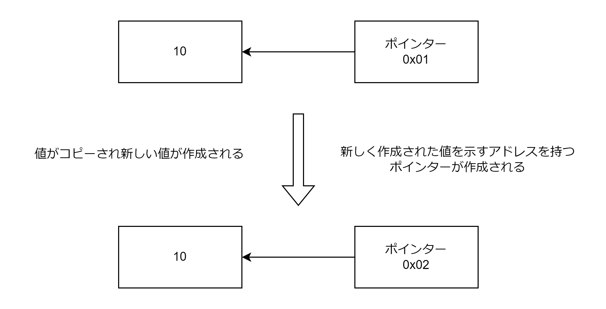
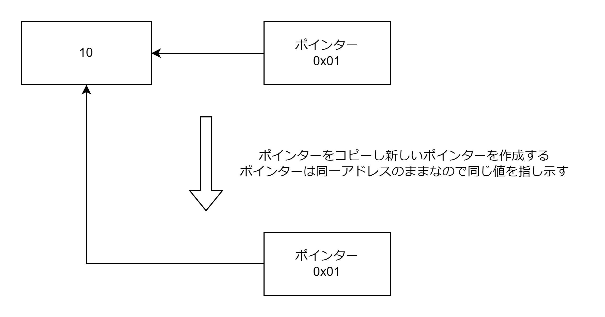

# function

## 引数

- オプション引数（構造体を引数にとることで実現する）
- 可変長引数

オプション引数

```Go
type MyFuncOpts struct {
	LogLevel   string
	httpClient http.Client
}

func MyFunc(opts MyFuncOpts) error {
	fmt.Println(opts)
	return nil
}
```

可変長引数

```Go
func addTo(base int, vals ...int) []int {
	out := make([]int, 0, len(vals))
	for _, val := range(vals) {
		out = append(out, base + val)
	}
	return out
}

func main() {
  s := []int{1, 2, 3}
  addTo(10, s...)
  addTo(10, 1, 2)
}
```

## 戻り値

- 複数の戻り値
- 名前付き戻り値
  - 名前付きの戻り値は関数実行直後にゼロ値で初期化される
  - return 文に戻り値を渡さなくても名前付き戻り値が返却される
  - 名前付き戻り値には値を代入可能
  - 明示的に値を指定して return した場合、名前付き戻り値に値が代入される
  - defer に指定した関数で戻り値によって条件分岐したい場合のみ、名前付き戻り値は使用する

名前付き戻り値

```Go
func divAndRemainder(numerator int, denominator int) (divResult int, remainder int, err error) {
	// divResult=0, remainder=0, err=nilで初期化される
	if denominator == 0 {
		err = errors.New("zero division error")
		// divResult=0, remainder=0, err=errors.new("zero division error")が返却される
		return
	}

	divResult, denominator = numerator/denominator, numerator%denominator
	err = nil
	// divResult=割り算の結果, remainder=余り, err=nilが返却される
	return
}
```

## defer

関数終了直後（return 文の後）に必ず実行される処理。ファイルやネットワーク接続の後片付けを実行するために使用する。

```Go
func main() {
	f, _ := os.Open(os.Args[1])
	defer f.Close()
}
```

defer の関数内で戻り値によって条件分岐したい場合は名前付き戻り値を使用する。終了時にアスペクト指向のようなことができる。

```Go
func DoSomeInserts(ctx context.Context, db *sql.DB, value string) (err error) {
	tx, err := db.BeginTx(ctx, nil)
	if err != nil {
		return err
	}
	defer func() {
		// deferはreturnの後に実行されるためerr戻り値にはエラーが発生した場合はエラーが設定されている
		if err == nil {
			err = tx.Commit() // 返り値にエラーが存在しない場合はCommitする
		}
		if err != nil {
			tx.Rollback() // 返り値にエラーが存在する場合はRollbackする
		}
	}()
	_, err = tx.ExecContext(ctx, "INSERT INTO FOO (val) values $1", value)
	if err != nil {
		return err
	}
	return nil
}
```

## 値渡し

- 引数に値を渡した際には Go は値のコピーを作成して関数に渡す
- 戻り値も呼び出し元にコピーした値を渡す

値を引数に渡す場合: 値のコピーが作成され、値のアドレスが変更されるので変更後のアドレスの新しいポインターも作成される。値のコピーが渡される。



ポインターを引数に渡す場合: ポインターのコピーが作成されるが、ポインターに格納されている値のアドレスは変わらないのでポインターは同じ値を参照し続ける。ポインターのコピーが渡される。


