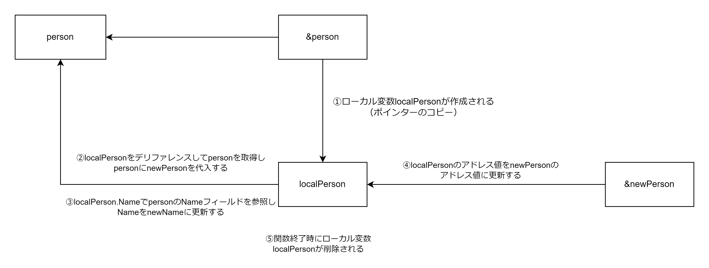
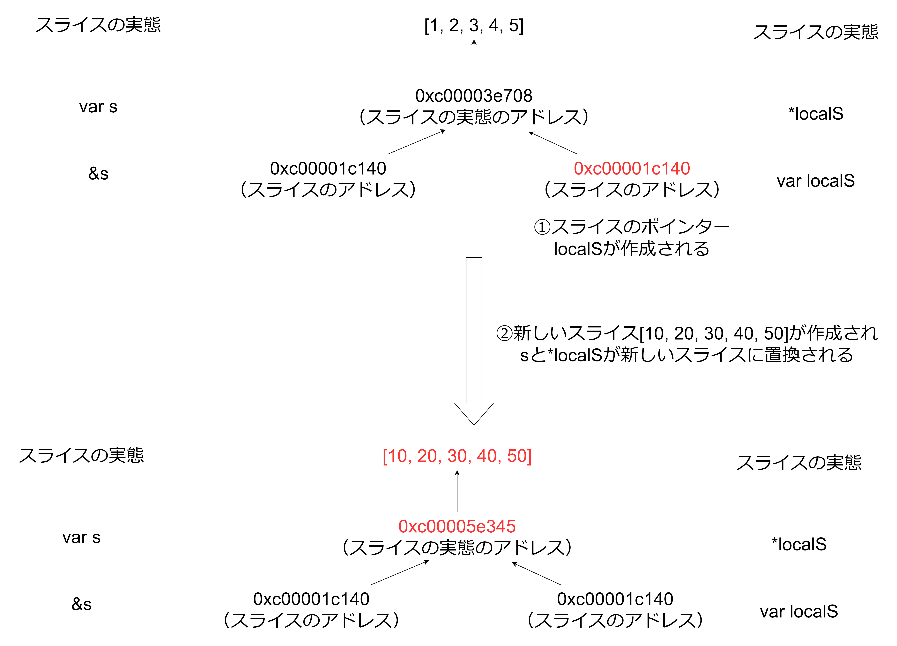
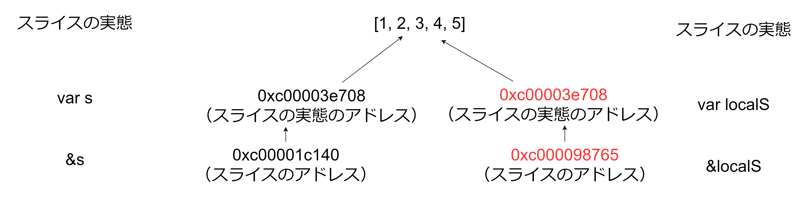

# ポインター

Go 言語では関数の引数や戻り値として、値もしくはポインターを使用するかを選択できる。

- 値を引数または戻り値として使用する場合: 値がコピーされ、コピーされた値に対する新しいポインターも生成する
- ポインターを引数または戻り値として使用する場合: ポインターがコピーされ、ポインターが指し示す値は変わらない

## ポインターの使用方法

- &値: 値のポインターを取得できる
- \*ポインター: ポインターの値を取得できる（デリファレンスする際はポインターが nil でないことを確認する。nil をデリファレンスすると panic が発生する）
- \*型: 型のポインター型を定義できる

```Go
s := "hello"
ps := &s
s = *ps

type ps = *string
```

## ポインター（構造体）を引数に渡した場合

```Go
type Person struct {
  Name string
  Age int
}

// 新しくlocalPersonというポインタ変数が作成される
// localPersonはpersonへのアドレス値を持つ
func changeStruct(localPerson *Person) {
  newPerson := Person{
    Name: "a",
    Age: 1
  }
  // localPersonをデリファレンスすると呼び出し元のpersonの値を取得できる
  // 呼び出し元のpersonの値をnewPersonにしているので呼び出し元のpersonがnewPersnoになる
  *localPerson = newPerson

  // localPerson.NameはlocalPersonが指し示すアドレス値に存在するperson構造体の値のNameフィールドを取得する
  // person構造体のフィールド値を変更すると呼び出し元のperson構造体のフィールド値も変更される
  localPerson.Name = "newName"

  // ローカルのポインタ変数localPersonのアドレス値をnewPersonのアドレス値に変更している
  // ローカルのポインタ変数のアドレス値が変わるだけで呼び出し元の変数&personのアドレス値は変わらない
  localPerson = &newPerson
}

func main() {
  person = Person{
    Name: "sato",
    Age: 20
  }

  changeStruct(&person)
}
```



## スライスのポインターを引数に渡した場合

```Go
func changeSlice(localS *[]int) {
  *localS = []int{10, 20, 30, 40, 50}
}

func main(){
  s := []int{1, 2, 3, 4, 5}
}
```


上記図には示していないが関数終了時に localS は削除される。

## スライスを引数に渡した場合

スライスを引数に渡すとスライスの実態へのポインターとスライス自体へのポインターがコピーされる。値を引数に渡した場合でもスライスの実態は共有するため注意が必要。


上記図には示していないが関数終了時に localS は削除される
