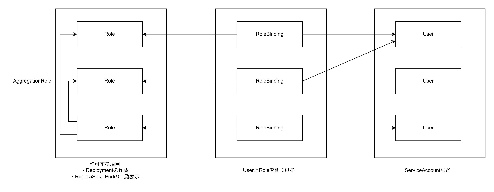

# RBAC（Role Based Access Control）

RBAC（Role Based Access Control）は、どういった操作を許可するのかを定めた Role を作成し、ServiceAccount などの User に対して Role を紐づける（RoleBinding）ことで権限を付与する。

- Rol・RoleBinding（Namespace レベルのリソース）
- ClusterRole・ClusterRoleBinding（Cluster レベルのリソース）
  - 基本的には ClusterRole・ClusterRoleBinding を使用する



## Role と ClusterRole

- Role
  - Namespace スコープのリソース（Deployment,Pod など）を対象とした許可設定が可能
- ClusterRole
  - Namespace スコープのリソース・Cluster スコープのリソース（Node・Namespace・PersistentVolume）を対象とした許可設定が可能

### マニフェストファイル

Role と ClusterRole 作成時には`apiGroups`, `resources`, `verbs`の 3 つを指定する。以下 verbs の種類を占めす。

| 種別   | 内容       |
| :----- | :--------- |
| \*     | 全ての処理 |
| create | 作成       |
| delete | 削除       |
| get    | 取得       |
| list   | 一覧表示   |
| path   | 一部変更   |
| update | 更新       |
| watch  | 変更の追従 |

```Role.yaml
apiVersion: rbac.authorization.k8s.io/v1
kind: Role
metadata:
  name: sample-role
  namespace: default
rules:
  - apiGroups:
      - apps
    resources:
      - replicasets
      - deployments
      - deployments/scale
    verbs:
      - '*'
```

```AggregatedClusterRole.yaml
apiVersion: rbac.authorization.k8s.io/v1
kind: ClusterRole
metadata:
  name: sub-clusterrole1
  labels:
    app: sample-rbac
rules:
  - apiGroups: ['apps']
    resources: ['deployments']
    verbs: ['get']

---
apiVersion: rbac.authorization.k8s.io/v1
kind: ClusterRole
metadata:
  name: sub-clusterrole2
  labels:
    app: sample-rbac
rules:
  - apiGroups: ['']
    resources: ['services']
    verbs: ['get']

---
apiVersion: rbac.authorization.k8s.io/v1
kind: ClusterRole
metadata:
  name: sample-aggregated-clusterrole
aggregationRule:
  clusterRoleSelectors:
    - matchLabels:
        app: sample-rbac
```

### Kubernetes が作成する ClusterRole

ClusterRole はいくつかのプリセットが用意されている。ざっくりした権限でよい場合はプリセットの Role や ClusterRole を使用する。

| ClusterRole 名 | 内容                                       |
| :------------- | :----------------------------------------- |
| cluster-admin  | 全てのリソースを管理可能                   |
| admin          | ClusterRole の編集+Namespace レベルの RBAC |
| edit           | ReadWrite                                  |
| read           | ReadOnly                                   |

以下にシステムコンポーネントが利用している ClusterRole の一例を示す。

| ClusterRole 名                                       |
| :--------------------------------------------------- |
| system:controller:attachdetach-controller            |
| system:controller:certificate-controller             |
| system:controller:clusterrole-aggregation-controller |
| system:controller:cronjob-controller                 |

## RoleBinding と ClusterRoleBinding

- RoleBinding
  - Role または ClusterRole と、User を紐づける
  - User は複数指定可能
  - Namespace を指定する必要がある（ClusterRole を使用しても指定した Namespace 内での権限のみ付与できる）
- ClusterRoleBinding
  - ClusterRole と、User を紐づける
  - User は複数指定可能
  - クラスタ全体の権限を付与できる

### マニフェストファイル記述

`roleRef`で紐づける Role を、`subjects`で紐づける User や ServiceAccount を指定する。

```RoleBinding.yaml
apiVersion: rbac.authorization.k8s.io/v1
kind: RoleBinding
metadata:
  name: sample-rolebinding
  namespace: default
roleRef:
  apiGroup: rbac.authorization.k8s.io
  kind: Role
  name: sample-role
subjects:
  - kind: ServiceAccount
    name: sample-serviceaccount
    namespace: default
```

```ClusterRoleBinding.yaml
apiVersion: rbac.authorization.k8s.io/v1
kind: ClusterRoleBinding
metadata:
  name: sample-clusterrolebinding
roleRef:
  apiGroup: rbac.authorization.k8s.io
  kind: ClusterRole
  name: sample-clusterrole
subjects:
  - kind: ServiceAccount
    name: sample-serviceaccount
    namespace: default
  - kind: ServiceAccount
    name: sample-serviceaccount2
    namespace: default
```
