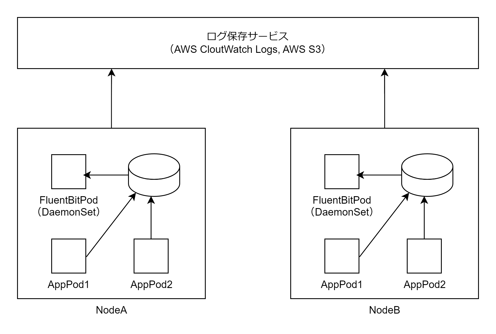

# ログ管理

## アプリケーションログ

- Pod のコンテナランタイムが Docker の場合、ログドライバーとして json-file が使用される
- Pod 上のコンテナが標準出力・標準エラー出力にログを出力した場合 json-file ログドライバーが Node 上の/var/log/containers 以下のファイルに JSON 形式のログを出力する
- DaemonSet を利用して各ノード上に FluentBit の Pod を 1 つずつ起動し、/var/log/containers 以下に記録されるログを tail プラグインを使用して AWS CloudWatch Logs、AWS S3 に転送できる



1. Pod 上のコンテナ上で動くアプリケーションが標準出力と標準エラー出力にログを出力する
2. Pod のコンテナランタイム Docker がログドライバー json-file を使用してノード上の/var/log/containers 以下にログを JSON 形式で出力する
3. DaemonSet として起動している FluentBit が/var/log/containers 以下のログファイルを tail ブラグインで監視し、各種ログ保存サービスに転送する

## AWS CloudWatch Logs への FluentBit によるログの転送設定

1. CloudWatch Logs への書き込みなどを許可した IAM ロールを作成し EKS クラスタにアタッチする

2. `amazon-cloudwatch`という名前の名前空間を作成する

```bash
kubectl apply -f https://raw.githubusercontent.com/aws-samples/amazon-cloudwatch-container-insights/latest/k8s-deployment-manifest-templates/deployment-mode/daemonset/container-insights-monitoring/cloudwatch-namespace.yaml
```

3. クラスター名とログを送信するリージョンを持つ cluster-info という名前の ConfigMap を作成します。`cluster-name` と `cluster-region` をクラスターの名前とリージョンに置き換えます。

```bash
ClusterName=cluster-name
RegionName=cluster-region
FluentBitHttpPort='2020'
FluentBitReadFromHead='Off'
[[ ${FluentBitReadFromHead} = 'On' ]] && FluentBitReadFromTail='Off'|| FluentBitReadFromTail='On'
[[ -z ${FluentBitHttpPort} ]] && FluentBitHttpServer='Off' || FluentBitHttpServer='On'
kubectl create configmap fluent-bit-cluster-info \
--from-literal=cluster.name=${ClusterName} \
--from-literal=http.server=${FluentBitHttpServer} \
--from-literal=http.port=${FluentBitHttpPort} \
--from-literal=read.head=${FluentBitReadFromHead} \
--from-literal=read.tail=${FluentBitReadFromTail} \
--from-literal=logs.region=${RegionName} -n amazon-cloudwatch
```

4. FluentBit の DaemonSet リソースを作成する

```bash
kubectl apply -f https://raw.githubusercontent.com/aws-samples/amazon-cloudwatch-container-insights/latest/k8s-deployment-manifest-templates/deployment-mode/daemonset/container-insights-monitoring/fluent-bit/fluent-bit.yaml
```

5. FluentBit により CloutWatchLog グループが作成される

<https://docs.aws.amazon.com/ja_jp/AmazonCloudWatch/latest/monitoring/Container-Insights-setup-logs-FluentBit.html>
