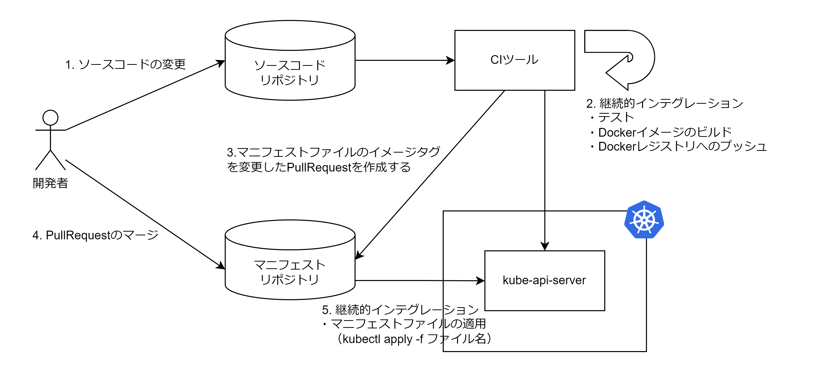

# CI/CD

Kubernetes の CI/CD には 2 つの方法論がある。

- GitOps
- CIOps

## GitOps

1. 開発者がソースコードリポジトリに変更を main ブランチにマージする
2. GitHubActions がテスト・Docker イメージのビルド・Docker レジストリへのイメージの Push を行う
3. GithubActions がマニフェストファイルのイメージタグを変更した PullRequest をマニフェストリポジトリに対して作成する
4. 開発者がマニフェストリポジトリへの PullRequest をマージする
5. ArgoCD がマニフェストリポジトリを定期的にポーリングし、マニフェストファイルの変更を検知すると Kubernetes にマニフェストファイルの変更を適用する


## CIOps

1. 開発者がリポジトリに変更を main ブランチにマージする
2. ソースリポジトリの GitHubActions がテスト・Docker イメージのビルド・Docker レジストリへのイメージの Push を行う
3. ソースリポジトリの GithubActions がマニフェストファイルのイメージタグを変更した PullRequest をマニフェストリポジトリに対して作成する
4. 開発者がマニフェストリポジトリへの PullRequest をマージする
5. マニフェストリポジトリの GithubActions がマニフェストファイルを Kubernetes に適用する



## ArgoCD

- ArgoCD は GitOps を実現するための CD ツール
- 指定したリポジトリを監視し、Kubernetes クラスタに対してマニフェストを適用する

1. ArgoCD を Kubernetes にインストールする（名前空間・サービスアカウント・カスタム定義など）
2. Application リソースを作成する

```Application.yaml
apiVersion: argoproj.io/v1alpha1
kind: Application
metadata:
  name: sample-cd
  namespace: argocd
spec:
  project: default
  # 監視するマニフェストリポジトリ
  source:
    repoURL: https://github.com/kuritaeiji/argocd.git
    targetRevision: HEAD
    path: manifests
  # マニフェストファイルを適用するクラスター名とデフォルトの名前空間
  destination:
    server: https://kubernetes.default.svc
    namespace: default
```
