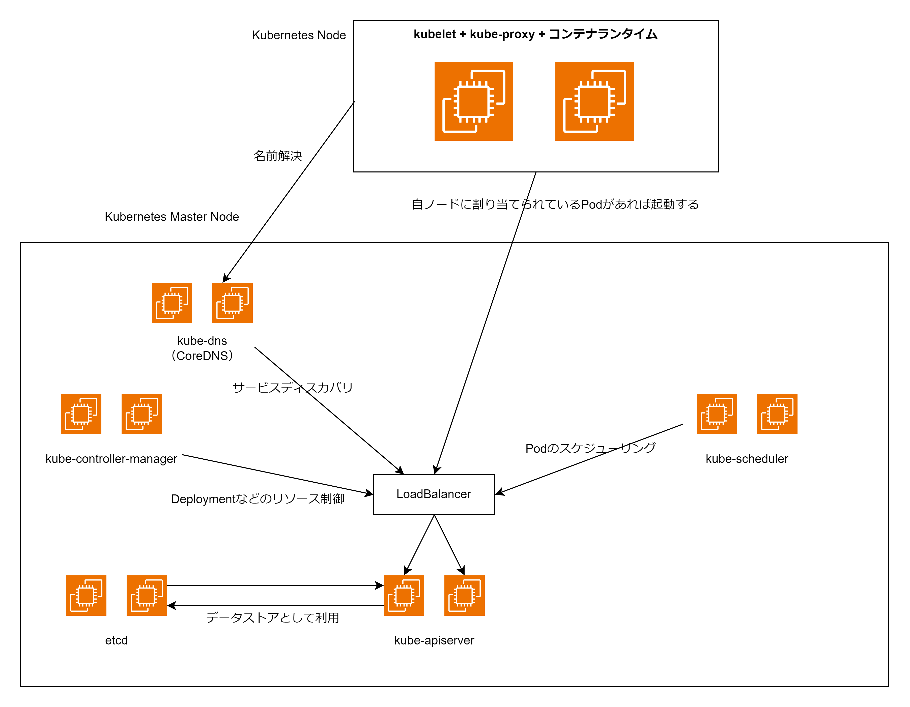

# Kubernetes のアーキテクチャー

Kubernetes クラスターは下記 10 個のコンポーネントから構成される kube-apiserver を中心とした分散システムになっている。

- etcd
- kube-apiserver
- kube-scheduler
- kube-controller-manager
- kubelet
- コンテナランタイム
- kube-proxy
- CNI Plugin
- kube-dns（CoreDNS）
- cloud-controller-manager

## etcd

- 分散 Key-Value Store(KVS)
- Node や Pod などのリソース情報が保存される（現実状態の status や理想状態の spec）

## kube-apiserver

- kube-apiserver は Kubernetes API を提供するコンポーネント
- kubectl は kube-apiserver に対してリクエストを送ることで Deployment や Service などのリソースの作成・削除を行う

Deployment の Pod の起動の流れ

1. 開発者が kubectl を利用して kube-apiserver と通信して Deployment リソースを etcd に登録する
2. kube-controller-manager の Deployment コントローラーが ReplicaSet リソースを作成する
3. kube-controller-manager の ReplicaSet コントローラーがレプリカ数分の Pod リソースを PodTemplate を基に作成する
4. kube-scheduler が Pod リソースの起動するノード情報(spec.NodeName)の部分を、kube-apiserver にリクエストを送って書き換えることでスケジューリングする
5. kubelet はノード情報(spec.nodeName)が地震に割り当てられている Pod の中でまだ起動していない Pod があれば起動する

## kube-scheduler

- 起動するノード情報(spec.nodeName)が未割当の Pod を検知し、kube-apiserver にリクエストを送って更新することでスケジューリングする
- 各ノードのリソース、NodeAffinity などの条件を考慮して起動すノードを決定する

## kube-controller-manager

kube-controller-manager は様々なコントローラーを実行するコンポーネント。以下のようなコントローラーが実行されている。

- Deployment Controller（Deployment リソースを監視し ReplicaSet リソースの作成・削除を行う）
- ReplicaSetController（レプリカ数分の Pod リソース維持する）
- NodeController（ノードの状態を監視する）
- Service Account & Token Controller（サービスアカウントのトークンを作成する）

## kubelet

- kubelet は各ワーカノード上で動作するコンポーネント
- Pod が kube-apiserver 経由で登録され、kube-scheduler によって Pod が起動する Node が決定されると kubelet はそれを検知して自陣のノードで起動すべきコンテナを起動する
- コンテナランタイムとして Docker や containerd などが使用できる

## kube-proxy

- kube-proxy は各ワーカノード上で動作するコンポーネント
- Service リソースが作られた際に ClusterIP や NodePort 宛てのトラフィックが各 Pod に転送されるようにする
- 転送にはデフォルトでは iptables を使用する（宛先 IP アドレスが仮想 IP アドレスの場合に宛先 IP アドレスを DNAT して書き換える）

## CNI(Container Network Interface)Plugin

Kubernetes はオーバーレイネットワークを構築するソフトウェアである CNI Plugin を利用する必要がある。以下のようなプラグインがある。

- Flannel
- Open vSwitch

## kube-dns（Core DNS）

- kube-dns はクラスタ内部の名前解決やサービスディスカバリに利用される
- sample-service という Service リソースを作成した場合に sample-service.default.svc.cluster.local の仮想 IP アドレスの A レコードを作成する
- Service リソースが etcd に保存された場合や Service に紐づく Pod に変更があった場合は DNS レコードを書き換える
- kube-dns は内部で Core DNS を使用している

## cloud-controller-manager

- cloud-controller-manager は Kubernetes クラスタが各種クラウドプロバイダサービスと連携するためのコンポーネント
- LoadBalancer Service を作成した際に AWL NLB と連携したい、Node が作成された際にリージョンやゾーン情報のラベルを付与したりする

## その他のコンポーネント

- Ingress Controller(ALB Ingress Controller・Nginx Ingress Controller)
