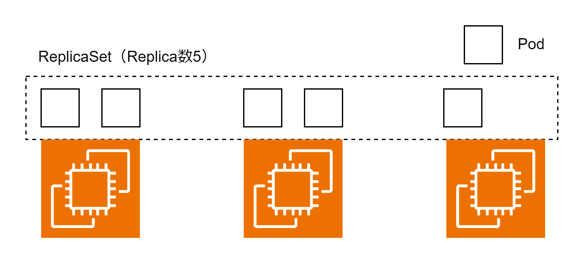

# ReplicaSet

ReplicaSet は Pod のレプリカを作成し、指定した数の Pod を維持し続けるリソース。



## セルフヒーリング

ReplicaSet は Pod や Node に障害が発生した場合に Pod 数が指定数を満たすように別のノードで Pod を起動してくれる。

## マニフェストファイル

spec にはレプリカ数・監視対象の Pod のラベル名・Pod テンプレートの 3 つを記述する。

```ReplicaSet.yaml
apiVersion: apps/v1
kind: ReplicaSet
metadata:
  name: sample-replica-set
spec:
  replicas: 3
  selector:
    matchLabels:
      app: sample-app
  template:
    metadata:
      labels:
        app: sample-app
    spec:
      containers:
        - name: nginx
          image: nginx:1.16
```
