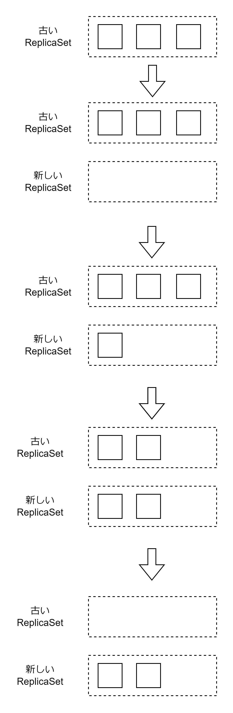
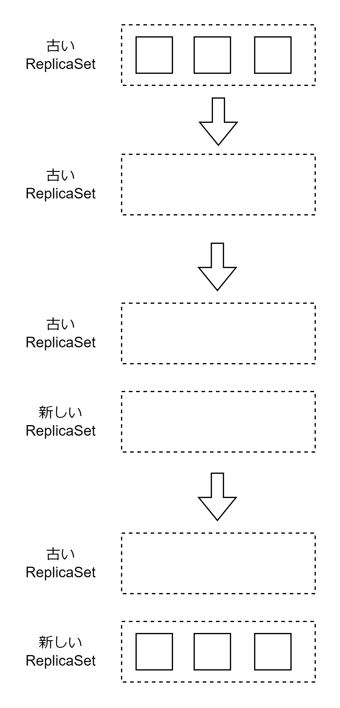

# Deployment

Deployment リソースは ReplicaSet を管理することでローリングアップデートやロールバックを実現する。Pod のコンテナイメージを変更するとローリングアップデートが行われる。以下のようなフローでローリングアップデートする。

1. 新しい ReplicaSet を作成する
2. 新しい ReplicaSet 上のレプリカ数を徐々に増やす
3. 古い ReplicaSet 上のレプリカ数を徐々に減らす
4. 2,3 を繰り返す
5. 古い ReplicaSet はレプリカ数 0 で保持する



## ロールバック

ロールバックは古い ReplicaSet に切り戻すこと。

```bash
# ReplicaSetの履歴を表示する
kubectl rollout history deployment sample-deployment
# 1つ前のReplicaSetにロールバックする
kubectl rollout undo deployment sample-deployment
# 特定のリビジョンにロールバックする
kubectl rollout undo deployment sample-deployment --to-revision 1
# 再起動する
kubectl rollout restart deployment sample-deployment
```

## Deployment のアップデート戦略

spec.strategy.type に指定する。

### Recreate

ReplicaSet 内のすべての Pod を削除してから、新しい ReplicaSet を作成し Pod を起動する。



### RollingUpdate

アップデート中に許容する不足最大 Pod 数（maxUnavailable）と最大超過 Pod 数（maxSurge）を指定できる。

```Deployment.yaml
spec:
  strategy:
    type: RollingUpdate
    rollingUpdate:
      # レプリカ数が10個の場合、1つも不足してはいけないのでPod数が10個を下回ってはいけない。
      maxUnavailable: 0
      # レプリカ数が10個の場合、1妻で超過してよいので、Pod数は1個超過の11個までしか起動してはいけない。
      maxSurge: 1
```

## その他のパラメータ

- minReadySeconds
  - Pod が Ready 状態になってから Deployment リソースが Pod の起動が完了したと判断するまでの最低秒数
- revisionHistoryLimit
  - Deployment が保持する最大 ReplicaSet 数
  - 履歴数
- progressDeadlineSeconds
  - Recreate/RollingUpdate のタイムアウト時間
  - タイムアウト時間が経過した場合自動的にロールバックする

## マニフェストファイル

ReplicaSet と同様にレプリカ数・監視対象の Pod のラベル名・Pod テンプレートの 3 つを記述する。アップデート戦略の種類も記述できる。

```Deployment.yaml
apiVersion: apps/v1
kind: Deployment
metadata:
  name: sample-replica-set
spec:
  # ローリングアップデートで更新する
  strategy:
    type: RollingUpdate
    rollingUpdate:
      # 最大超過Pod数は2個
      maxSurge: 2
      # 最大不足Pod数は0個
      maxUnavailable: 0
  # PodがReadyになってから起動したと判断するまでは10秒
  minReadySeconds: 10
  # 最大過去のReplicaSet数は5個
  revisionHistoryLimit: 5
  # RollingUpdate完了までの最大時間360秒。360秒以内に完了しない場合はロールバックする
  progressDeadlineSeconds: 360
  replicas: 3
  selector:
    matchLabels:
      app: sample-app
  template:
    metadata:
      labels:
        app: sample-app
    spec:
      containers:
        - name: nginx
          image: nginx:1.16
```
