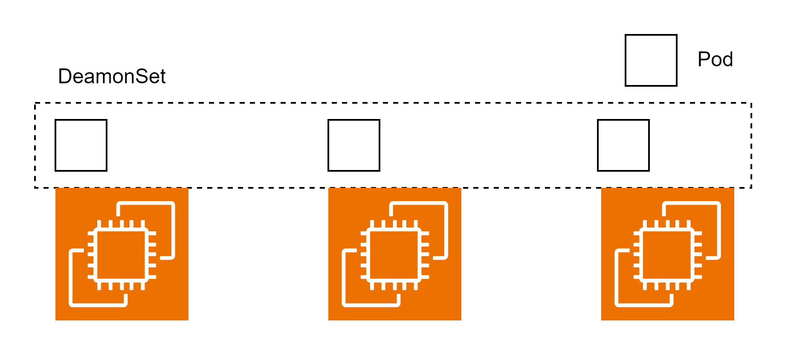

# DaemonSet

DaemonSet は全ノード上に Pod を 1 つずつ配置するリソース。nodeSelector や Affinity を使用することで Pod を配置する Node を選択することも可能。Node が増えた場合は自動的に Pod が起動する。  
DaemonSet のユースケースとしては、ログを収集する Fluentd や各 Pod・ノードのリソース使用状況をモニタリングする Datadog 等全ノードで起動したいプロセスのために使用できる。



## アップデート戦略

### OnDelete

予期せぬ Pod の停止など様々な要因で Pod が停止した場合のみ Pod がアップデートされる。アップデートは手動で行う。

### RollingUpdate

DaemonSet は各ノードに 1 つしか Pod を起動しないので maxSurge(最大超過 Pod 数)を指定できない。maxUnavailable（最大不足 Pod 数）は指定できる。1 度に停止可能な Pod 数のみを指定して RollingUpdate を行う。

## マニフェストファイル

監視対象の Pod のラベル名・Pod テンプレートの 2 つを記述する。アップデート戦略の種類も記述できる。

```DaemonSet.yaml
apiVersion: apps/v1
kind: DaemonSet
metadata:
  name: sample-ds
spec:
  strategy:
    type: RollingUpdate
    rollingUpdate:
      maxUnavailable: 2
  selector:
    matchLabels:
      app: sample-app
  template:
    metadata:
      labels:
        app: sample-app
    spec:
      containers:
        - name: nginx
          image: nginx:1.16
```
