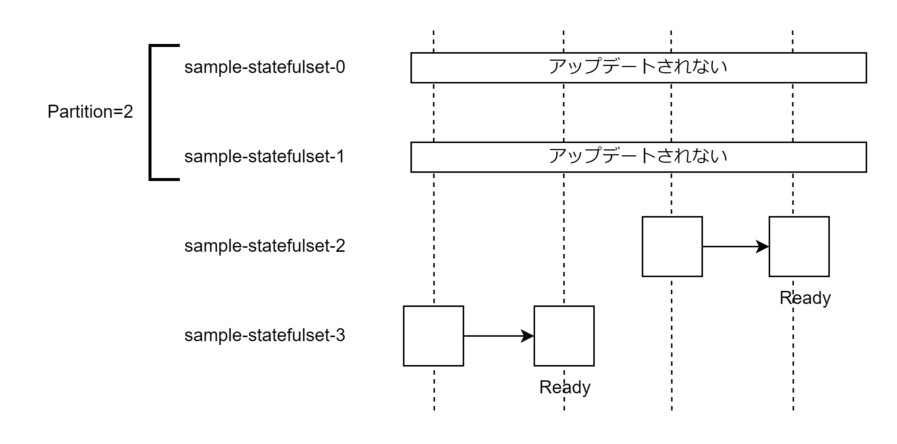

# StatefulSet

StatefulSet も DaemonSet 同様 ReplicaSet の特殊な形のリソース。データベースなどに使用する。ReplicaSet との違いは以下の通り。

- 作成される Pod 名のサフィックスは数字のインデックスが付与されたもの
  - sample-stateful-set-1・sample-stateful-set-2
  - Pod 名が変わらない
  - Headless サービスと組み合わせてどの Pod にアクセスするか選択できる
- データを永続化する仕組みを有する
  - PersistentVolume を使用している場合は Pod の再起動時に同じディスクを使用する

## StatefulSet のライフサイクル

podManagementPolicy に記述する。

- OrderedReady
  - 1 つの Pod が起動してから次の Pod を起動する
- Parallel
  - 同時に複数の Pod を起動する

スケールイン時には新しいインデックス番号の Pod から削除する。

## StatefulSet のアップデート戦略

### OnDelete

基本的には手動で Pod を削除することで Pod をアップデートする。予期せぬ Pod の停止時にはアップデートが行われる。

### RollingUpdate

1 つずつ Pod のアップデートを行う。1 つの Pod のアップデートが完了すると次の Pod をアップデートする。spec.podManagementPolicy が parallel の場合も 1 つずつアップデートする。partition を設定することでいくつの Pod を更新しないか設定できる。partition に設定した数値以降のインデックス番号を持つ Pod を更新する。



## マニフェストファイル

- ReplicaSet と同様にレプリカ数・監視対象の Pod のラベル名・Pod テンプレートの 3 つを記述する。
- Headless サービスと同じサービス名を記述する。
- PersistentVolumeClaimTemplate を記述する
- コンテナに PVC をマウントする

```StatefulSet.yaml
apiVersion: apps/v1
kind: StatefulSet
metadata:
  name: sample-statefulset
spec:
  # Headless Serviceのサービス名を指定するとPod番号で特定のPodの名前解決ができる
  serviceName: sample-headless
  strategy:
    type: RollingUpdate
    rollingUpdate:
      partition: 2
  PodManagementPolicy: OrderedReady
  replicas: 3
  selector:
    matchLabels:
      app: sample-app
  template:
    metadata:
      labels:
        app: sample-app
    spec:
      containers:
        - name: nginx
          image: nginx:1.16
          # PVCをコンテナにマウントする
          volumeMounts:
            - name: www
              mountPath: /usr/share/nginx/html
  # PVCを定義する
  volumeClaimTemplates:
    - metadata:
        name: www
      spec:
        accessModes:
          - ReadWriteOnce
        resources:
          requests:
            storage: 1G
        storageClassName: standard
```
