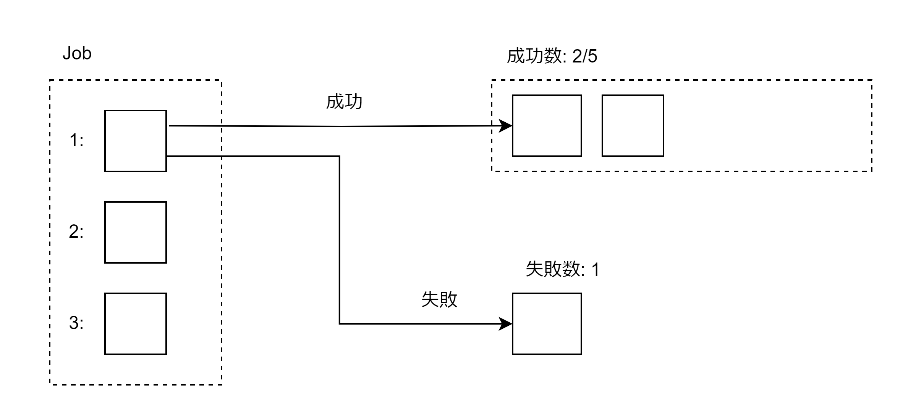
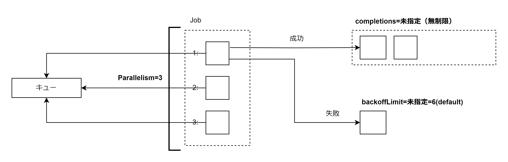
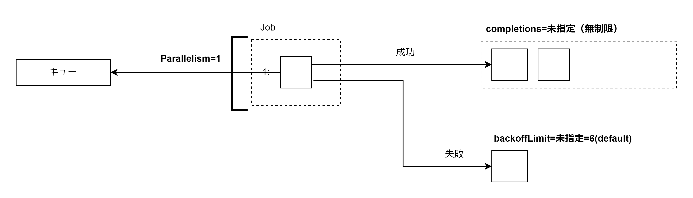

# Job

Job は N 並列で Pod を実行しながら指定した回数のコンテナの実行（正常終了）を保証するリソース。



ReplicaSet との違いは Job は「Pod が停止することを前提に作られている」ということ。ReplicaSet 等では Pod の停止は予期せぬエラーである。Job の場合は Pod の停止が正常終了とみなされる用途に向いている。バッチを作成する場合は Job を使用する。

## Pod の restartPolicy による挙動の違い

- restartPolicy: Never の場合
  - Pod 障害時には新しい Pod を作成する
- restartPolicy: OnFailure の場合
  - Pod 障害時には Pod を再起動する
  - PV を使用していない場合はデータは消える

## タスク型とワークキュー型の並列実行

成功数（completions）・並列数（parallelism）・失敗数（backoffLimit）の 3 つのパラメータを適切に設定する必要がある。以下に典型的な 4 種類のタスク型とタスクキュー型のワークロードのための Job 作成例を占める。

| ワークロード                 | completions | parallelism | backoffLimit |
| :--------------------------- | :---------- | :---------- | :----------- |
| 1 回だけ実行するタスク       | 1           | 1           | 0            |
| N 並列で実行させるタスク     | M           | N           | P            |
| 1 個ずつ実行するワークキュー | 未指定      | 1           | P            |
| N 並列で実行するワークキュー | 未指定      | N           | P            |

### One Shot Task: 1 回だけ実行するタスク

completions=1/parallelism=1/backoffLimit=0 を指定する。必ず 1 回だけ実行される。

### Multi Task: N 並列で実行させるタスク

成功数と並列数を返すことで並列タスクを作成できる。例えば completions=5/parallelism=3 を指定した場合、Pod が 5 回正常終了（終了コードが 0）するまで 3 並列で実行する。

### Multi WorkQueue: N 並列で実行するワークキュー

キューからタスクを取得してタスクを実行し、キューにタスクがなくなるまで Job を実行したい場合に使用する。ワークキュー型は成功数を指定せず、並列数と失敗数のみ指定する。この場合並列数で指定された数だけ Pod を実行し、そのうち **1 つでも正常終了したらそれ以降は Pod を作成しない**。つまり 1 つの Pod がキューにタスクがなくなったことを検知したら正常終了するのでそれ以降 Pod が作成されないということ。



### Single Worker Queue: 1 個ずつ実行するワークキュー

成功数を指定せず、並列数に 1 を指定した場合は 1 度正常終了するまで 1 個ずつ実行するワークキューになる。シングルワークキューは後々並列数を増やすことでマルチワークキューに変更できる。



## 一定期間後の Job の削除

Job は終了しても削除されないので spec.ttlSecondsAfterFinished に秒数を指定することで、Job 終了後に一定秒数経過で削除されるようにできる。

## マニフェストファイル

- 成功数（completions）・並列数（parallelism）・失敗数（backoffLimit）を記述する
- Pod テンプレートを記述する
  - restartPolicy を記述する

```Job.yaml
apiVersion: batch/v1
kind: Job
metadata:
  name: sample-job
spec:
  completions: 1
  parallelism: 1
  backoffLimit: 10
  ttlSecondsAfterFinished: 120
  template:
    spec:
      containers:
        - name: tools-container
          image: amsy810/tools:2.10
          command: ['sleep']
          args: ['60']
      restartPolicy: Never
```
