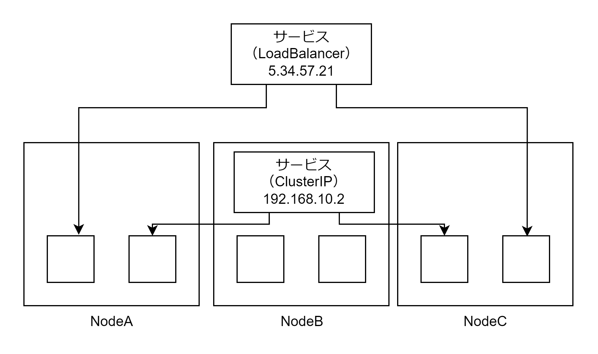

# Kubernetes クラスターのネットワークと Service

## Kubernetes クラスターのネットワーク

- Pod 内の各コンテナは同一ネットワーク空間に属するため localnet で通信できる
- ノード内の各 Pod はブリッジネットワークで構成されて同一 LAN 上に存在する
- Kubernetes クラスタ内の各ノードは同一 LAN 上に存在する


イメージとしては以下の図。各 Pod と docker0 で LAN を形成し、各 Node とルーターで LAN を形成するイメージ。


## Service

サービスを利用せずとも上記のように内部ネットワークが自動構成されるため Pod は Service を利用せずとも各 Pod の IP アドレスを使用することで Pod 館通信を行うことができる。しかしサービスを使用することによるメリットが 3 つある。

- Pod 宛てトラフィックのロードバランシング（複数の Web サーバー Pod の IP アドレスを 1 つの IP アドレスに集約できる）
- サービスディスカバリとクラスタ内 DNS

### Pod 宛てトラフィックのロードバランシング

Service は受信したトラフィックを複数の Pod にロードバランシング（負荷分散）できる。サービスにはクラスタ内でのみ利用可能な仮想 IP アドレス（ClusterIP）や外部のロードバランサーが払いだす仮想 IP アドレス（VirtualIP アドレス）が提供されている。



ClusterIP の場合は iptables を利用してエンドポイントから各 Pod にロードバランシングする。パケットの宛先 IP アドレスがエンドポイントとして払い出された仮想 IP アドレスかつ宛先ポート番号がサービスのポート番号の場合、パケットの宛先 IP アドレスと宛先ポート番号を書き換えることで実現する。

```bash
# パケットの宛先IP+宛先ポート番号が192.168.10.2:8080の場合、宛先IPと宛先ポート番号を10.0.1.2:80または10.0.1.3:80または10.0.2.2:80に変更する
iptables -t nat -A output -d 192.168.10.2 --dport 8080 -j DNAT --to 10.0.1.2:80,10.0.1.3:80,10.0.2.2:80
```

LoadBalancer の場合は AWL NLB を利用して実現する。NLB にはグローバル IP アドレスが払いだされる。サービスに払い出され仮想 IP アドレスはグローバル IP アドレスになるので外部からアクセス可能になる。


### クラスタ内 DNS とサービスディスカバリ

サービスディスカバリの機能は Service によって実現される。サービスディスカバリとは名前からエンドポイントを判別する機能のこと。コントロールプレーンで coredns という Pod が権威 DNS サーバーとして起動しており A レコードを提供することで DNS 名からエンドポイント（仮想 IP アドレス）を取得する。


/etc/resolv.conf に search default.svc.cluster.local と記述されているため sample-svc だけでも名前解決できる。Namespace が異なる場合は sample-svc.default で名前解決できる。

```/etc/resolv.conf
search default.svc.cluster.local svc.cluster.local cluster.local
```

### ロードバランシングの一連の流れ

1. coredns に対して sample-svc.default.svc.cluster.local を名前解決して仮想 IP アドレスを取得する
2. 宛先 IP アドレスと宛先ポート番号を Pod の IP アドレスとポート番号に書き換える
3. 宛先 Pod にパケットが到達する
