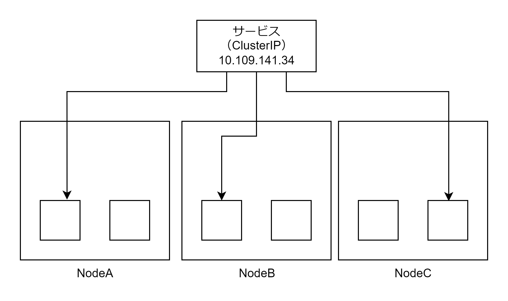

# ClusterIP

ClusterIP は Kubernetes クラスタ内からのみ通信できる仮想 IP アドレスを割り当て、各 Pod に通信をロードバランシングする Service。仮想 IP アドレスを宛先 IP アドレスにすると、宛先 IP アドレスを Service の対象 Pod のいずれかの IP アドレスに iptables が書き換えることによって実現する。仮想 IP アドレス（ClusterIP）のドメイン名は<サービス名>.<ネームスペース>.svc.cluster.local で解決できる。



## マニフェストファイル

- Service タイプ・対象 Pod・ポート番号を指定する
- 静的 IP アドレスも指定可能

```ClusterIP.yaml
apiVersion: v1
kind: Service
metadata:
  name: sample-clusterip
spec:
  type: ClusterIP
  clusterIP: 10.109.141.34
  ports:
    - name: 'http-port'
      protocol: 'TCP'
      port: 8080
      targetPort: 80
  selector:
    app: sample-app
```
