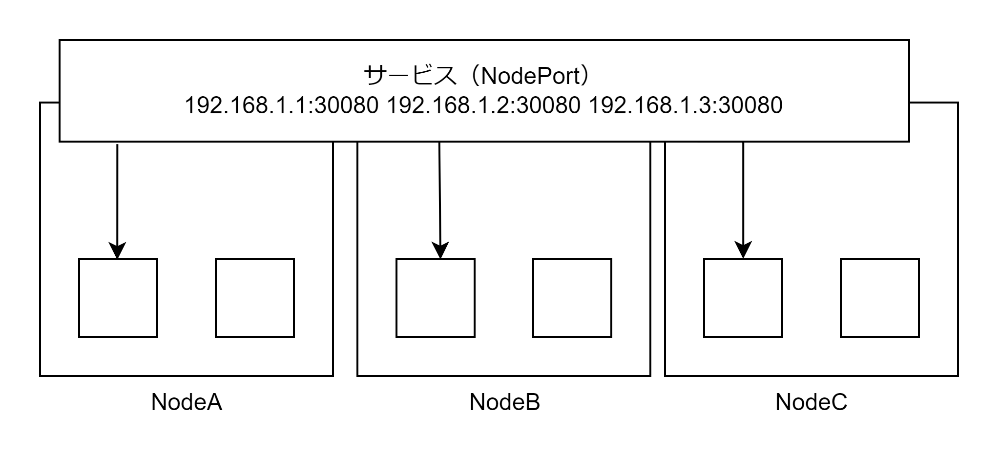

# NodePort Service

<Kubernetes ノードの IP アドレス>:<指定したポート番号>宛てのトラフィックを Service の対象 Pod にロードバランシングすることで外部との通信を確立する。宛先 IP アドレスと宛先ポート番号が<Kubernetes ノードの IP アドレス>:<指定したポート番号>だった場合に、Service の対象 Pod のいずれかの IP アドレスとポート番号に iptables によって書き換えることによって実現する。  
NodePort リソースを作成すると ClusterIP リソースも作成される。



## マニフェストファイル

NodePort を作成すると NodePort と ClusterIP の 2 つが作成される。

- Service タイプ・対象 Pod・ポート番号を指定する
  - ポート番号はノードのポート番号・ClusterIP のポート番号・Pod のポート番号の 3 つを指定する

```NodePort.yaml
apiVersion: v1
kind: Service
metadata:
  name: sample-nodeport
spec:
  type: NodePort
  selector:
    app: sample-app
  ports:
    - name: 'http-port'
      protocol: 'TCP'
      port: 8080
      targetPort: 80
      nodePort: 30080
```
