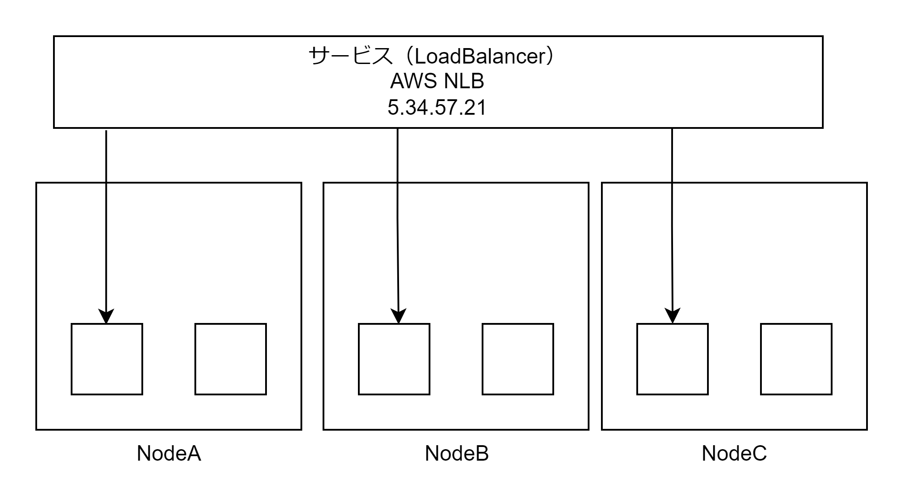

# LoadBalancer

LoadBalancer Service は Kubernetes クラスタ外のロードバランサーに外部疎通性のある仮想 IP アドレス（グローバル IP アドレス）を払い出すことができる。AWS EKS の場合は LoadBalancer Service リソースを作成すると自動的に AWS NLB が作成され、NLB の IP アドレスが Kubernetes から払い出される仮想 IP アドレスになる。  
LoadBalancer Service リソースを作成すると、NodePort・ClusterIP も作成される。



## マニフェストファイル

LoadBalancer を作成すると LoadBalancer と NodePort と ClusterIP の 3 つが作成される。LoadBalancer と ClusterIP のポート番号は同じ番号になる。

- Service タイプ・対象 Pod・ポート番号を指定する
  - ポート番号はノードのポート番号・ClusterIP と LoadBalancer のポート番号・Pod のポート番号の 3 つを指定する

```LoadBalancer.yaml
apiVersion: v1
kind: Service
metadata:
  name: sample-loadbalancer
spec:
  type: LoadBalancer
  selector:
    app: sample-app
  ports:
    - name: 'http-port'
      protocol: 'TCP'
      nodePort: 30081
      port: 8080
      targetPort: 80
```

## Service のその他の機能

- セッションアフィニティー（パーシステンス）(spec.sessionAffinity)
  - 送信元 IP アドレスをもとに同じ Pod にトラフィックを転送し続ける機能
- NodePort でのノードをまたいだロードバランシングの排除と送信元 IP アドレスの保持(spec.externalTrafficPolicy)
  - LoadBalancer Service でロードバランシング後に NodePort に到達し NodePort でも Node をまたいでロードバランシングしてしまうため、NodePort でのノードをまたいだロードバランシングはしないよう設定する。
  - NodePort で別のノードの Pod へ転送する場合、送信元 IP をノード IP に NAT しないように設定する。
- トポロジを意識した Service 転送(spec.topologyKeys)
  - 第一優先度「同一ノード」、第二優先度「同一ゾーン」、第三優先度「いずれかの Pod」のように設定する。
  - spec.externalTrafficPolicy よりこちらを使用する

```LoadBalancer.yaml
apiVersion: v1
kind: Service
metadata:
  name: sample-loadbalancer
spec:
  type: LoadBalancer
  selector:
    app: sample-app
  ports:
    - name: 'http-port'
      protocol: 'TCP'
      nodePort: 30081
      port: 8080
      targetPort: 80
  sessionAffinity: ClientIP
  sessionAffinityConfig:
    clientIP:
      timeoutSeconds: 10
  topologyKeys:
    - kubernetes.io/hostname
    - '*'
```
