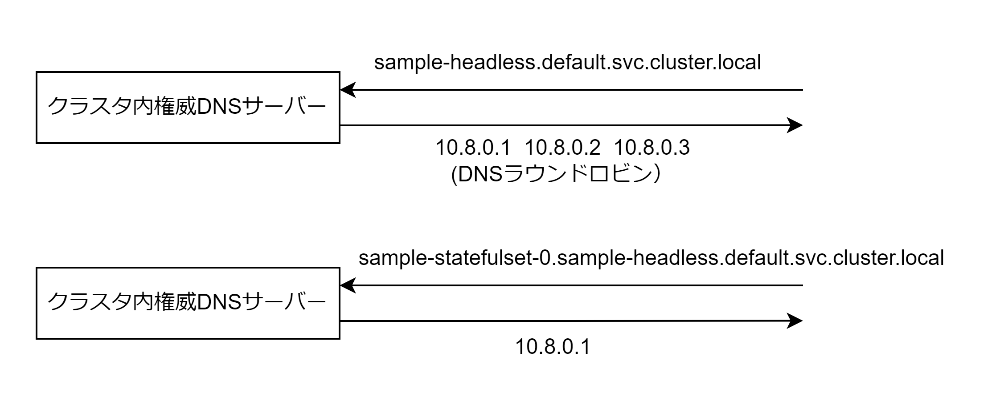

# Headless Service

HeadlessService はロードバランシングするための仮想 IP アドレスは作成されず、DNS ラウンドロビンを使用したエンドポイントをしよする。ドメイン名に対して直接対象 Pod の IP アドレスを返却するため仮想 IP アドレスを使用しない。  
StatefulSet が HeadlessService を使用している場合のみ Pod 名から IP アドレスのディスカバリが可能。sample-statefulset-0 などのドメイン名から 0 番目の Pod の IP アドレスを取得可能。



## マニフェストファイル

- Service タイプ・対象 Pod・ポート番号を指定する
- clusterIP: None を指定する

```Headless.yaml
apiVersion: v1
kind: Service
metadata:
  name: sample-headless
spec:
  type: ClusterIP
  clusterIP: None
  selector:
    app: sample-statefulset
  ports:
    - name: 'http-port'
      protocol: 'TCP'
      port: 80
      targetPort: 80

---
apiVersion: apps/v1
kind: StatefulSet
metadata:
  name: sample-statefulset
spec:
  serviceName: sample-headless
  replicas: 3
  selector:
    matchLabels:
      app: sample-statefulset
  template:
    containers:
      - name: nginx
        image: amsy810/echo-nginx:v2.0
```
