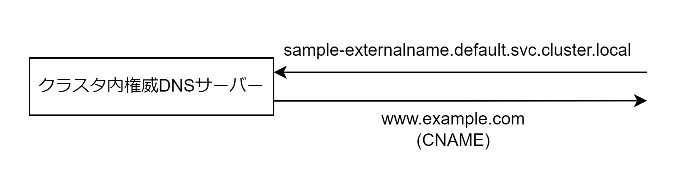

# ExternalName Service

ExternalName Service は Service 名の名前解決に対して外部ドメインあての CNAME レコードを返却する。SasS や IaaS などの外部にあるサービスを利用する際にアプリケーションに外部ドメイン名を記述することなく疎結合にする。



## マニフェストファイル

- Type: ExternalName・externalName: <ドメイン名>を記述する

```ExternalName.yaml
apiVersion: v1
kind: Service
metadata:
  name: sample-external
spec:
  type: ExternalName
  externalName: www.example.com
```
