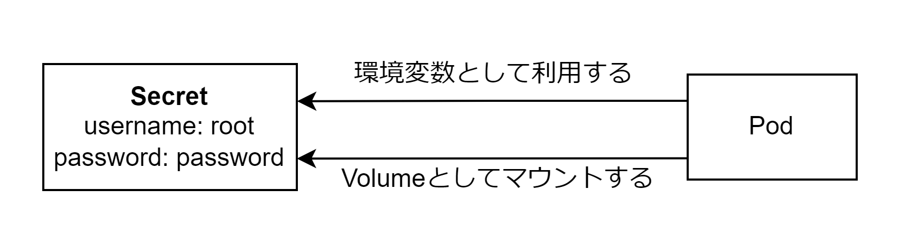

# Secret

Secret は機密情報をコンテナに渡すことができる。Secret のマニフェストファイルは kubesec を使用して暗号化する。



## Secret の分類

| type                                | 概要                                               |
| :---------------------------------- | :------------------------------------------------- |
| Opaque                              | 一般的な汎用用途                                   |
| kubernetes.io/tls                   | TLS 証明書用                                       |
| kubernetes.io/dockerconfigjson      | Docker レジストリ認証情報用                        |
| kubernetes.io/service-account-token | Service Account 用のトークンとクライアント証明書用 |
| kubernetes.io/ssh-auth              | SSH の認証情報用                                   |

## kubectl create secret コマンド

- --from-file
  - ファイルから値を参照して作成する
- --from-env-file
  - envfile から値を参照して作成する
- --from-literal
  - 直接値を渡して作成する
- -f
  - マニフェストファイルから作成する
- kubectl create secret TYPE
  - Opaque 以外の Secret を TYPE を指定して作成する

## Opaque の Secret の作成

```Secret.yaml
apiVersion: v1
kind: Secret
metadata:
  name: sample-db-auth
type: Opaque
stringData:
  username: root
  password: rootpassword
```

## Opaque 以外の Secret の作成

```bash
# 自己署名証明書の作成とTLSのsecretの作成
openssl req -x509 -nodes -days 36500 -newkey rsa:2048 -keyout tls.key -out tls.crt -subj="/CN=sample.example.com"
kubectl create secret tls tls-sample --key tls.key --cert tls.crt

# Dockerレジストリのsecretの作成
kubectl create secret docker-registry sample-registry-auth --docker-server=ghcr.io --docker-username=kuritaeiji --docker-password=<GitHub Access Token> --dry-run -o yaml
```

## Secret をコンテナに渡す

Secret をコンテナに渡す場合以下の 4 つのパターンがある。

- 環境変数として渡す
  - Secret の特定の Key のみ
  - Secret のすべての Key
- Volume としてマウントする
  - Secret の特定の Key のみ
  - Secret のすべての Key

### 環境変数として渡す

```Pod.yaml
apiVersion: v1
kind: Pod
metadata:
  name: pod
spec:
  containers:
    - name: nginx
      image: nginx:1.16
      # 特定のKeyのみ環境変数として渡す
      env:
        - name: DB_USER
          valueFrom:
            secretKeyRef:
              name: sample-db-auth
              key: username
      # 全てのKeyを環境変数として渡す
      envFrom:
        - secretRef:
            name: sample-db-auth
          prefix: DB1_
```

## Volume としてマウントする

```Pod.yaml
apiVersion: v1
kind: Pod
metadata:
  name: pod
spec:
  containers:
    - name: nginx
      image: nginx:1.16
      # cat /config/username.txt rootと表示される
      volumeMounts:
        - name: config-volume
          mountPath: /config
  volumes:
    - name: config-volume
      secret:
        secretName: sample-db-auth
        items:
          key: username
          path: username.txt
```

```Pod.yaml
apiVersion: v1
kind: Pod
metadata:
  name: pod
spec:
  containers:
    - name: nginx
      image: nginx:1.16
      # /config以下にusernameファイルとpasswordファイルが作成される
      volumeMounts:
        - name: config-volume
          mountPath: /config
  volumes:
    - name: config-volume
      secret:
        secretName: sample-db-auth
```

## Secret の値を更新した場合、コンテナが利用している Secret の値の更新パターン

- 環境変数として渡した場合
  - Pod を再起動しない限り環境変数は更新されない
- Volume としてマウントした場合
  - kubelet が kube-apiserver に変更を定期的に確認してファイルを更新する

## Secret マニフェストファイルの暗号化

Secret ファイルは Base64 でエンコードされているだけなので Git リポジトリなどにアップロードできないため暗号化を行う必要がある。「kubesec」を用いるとマニフェストファイルを暗号化できる。AWS KMS/GnuPG を利用して暗号化できる。

```bash
# 1.kubesecのインストール
# 2.GunPGで公開鍵と秘密鍵を作成
gpg --full-generate-key
# 3.kubesecとGnuPGの鍵をりようしてマニフェストファイルを暗号化する
kubesec encrypt -i --key=pgp:3BB2AE4142D6B837812C56CD59BCBFE7BBF3C345 secret.yaml
# 4.kubesecを利用して複合する
kubesec decrypt -i secret.yaml
```
