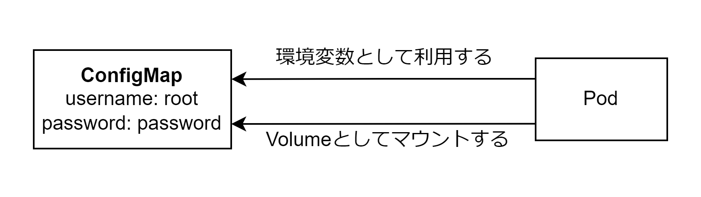

# ConfigMap

設定情報など Key-Value で保持できるデータを保存しておくリソース。nginx.conf などの設定ファイルの保存も可能。



## マニフェストファイル

ConfigMap をコンテナに渡す場合以下の 4 つのパターンがある。

- 環境変数として渡す
  - Secret の特定の Key のみ
  - Secret のすべての Key
- Volume としてマウントする
  - Secret の特定の Key のみ
  - Secret のすべての Key

```ConfigMap.yaml
apiVersion: v1
kind: ConfigMap
metadata:
  name: sample-configmap
data:
  thread: '16'
  nginx.conf: |
    user nginx;
    worker_processes auto;
    error_log /var/log/nginx/error.log;
    pid /run/nginx.pid

---
apiVersion: v1
kind: Pod
metadata:
  name: sample-app
spec:
  containers:
    - name: nginx
      image: nginx:1.16
      envFrom:
        - configMapRef:
            name: sample-configmap
      volumeMounts:
        - name: config-volume
          mountPath: /config
  volumes:
    - name: config-volume
      configMap:
        name: sample-configmap
```
