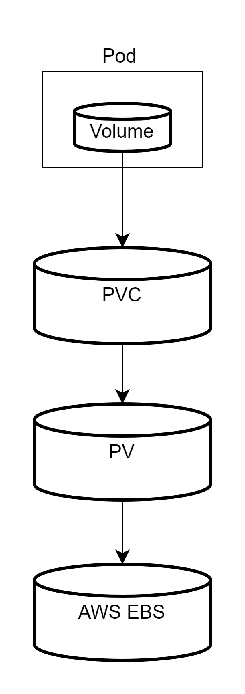

# Volume,PersistentVolume(PV),PersistentVolumeClaim(PVC)の違い

- Volume
  - Pod 内に作成されるストレージ領域
- PersistentVolume(PV)
  - 永続化領域として使用するストレージの実体（AWS EBS 等）
- PersistentVolumeClaim(PVC)
  - 永続化領域の要求を行うリソース。PVC で指定された条件をもとに PV から Volume を割り当てる

