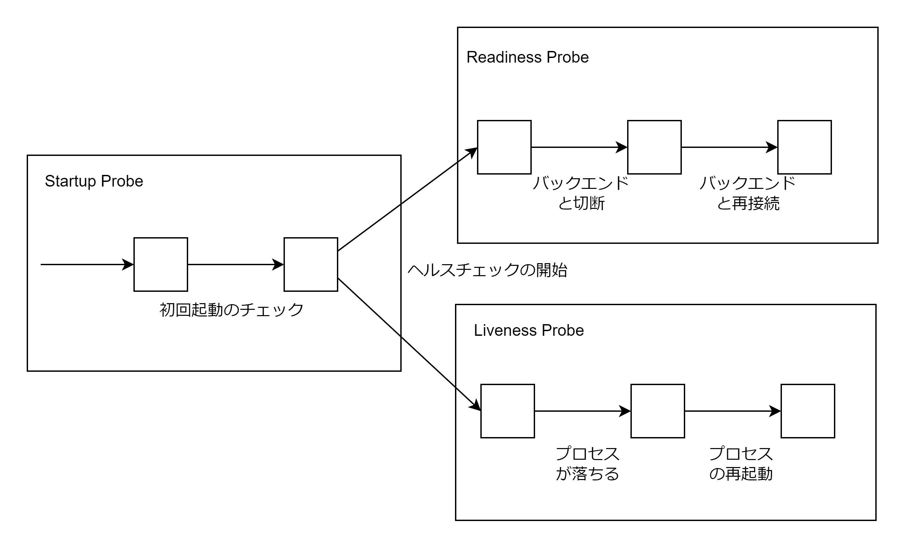

# ヘルスチェック

## Liveness/Readiness/Startup Probe3 種類のヘルスチェック機構

| Probe の種類    | 役割                                             | 失敗時の挙動                                 |
| :-------------- | :----------------------------------------------- | :------------------------------------------- |
| Liveness Probe  | Pod 内のコンテナが正常に動作しているかの確認     | コンテナを再起動する                         |
| Readiness Probe | Pod がリクエストを受け付けることができるかの確認 | トラフィックを流さない（Pod を再起動しない） |
| Startup Probe   | Pod の初回起動が完了したかの確認                 | 他の Probe を実行し始めない                  |

通常 LoadBalancer の Service でロードバランサーを作成した場合はロードバランサーから Kubernetes Node へのヘルスチェックは ICMP による簡易的なチェックしか行われない。よって Pod の状態をチェックしてトラフィックを制御するために Readiness Probe または Liveness Probe を設定する必要がある。  
通常は Startup Probe と Readiness Probe または Liveness Probe を組み合わせて使用する。



## 3 種類のヘルスチェック方式

| ヘルスチェック方式 | 内容                                                               |
| :----------------- | :----------------------------------------------------------------- |
| exec               | コマンドを実行し、終了コードが 0 でなければ終了                    |
| httpGet            | HTTP GET リクエストを実行し、Status Code が 200~399 でなければ失敗 |
| tcpSocket          | TCP セッションが確立できなければ失敗                               |

```yaml
livenessProbe:
  exec:
    command: ['test', '-e', '/ok.txt']
```

```yaml
livenessProbe:
  httpGet:
    path: /health
    port: 80
    scheme: HTTP
    host: example.com
    httpHeaders:
      - name: Authorization
        value: Bearer TOKEN
```

```yaml
livenessProbe:
  tcpSocket:
    port: 80
```

## ヘルスチェックの感覚

| 設定項目            | 内容                         |
| :------------------ | :--------------------------- |
| initialDelaySeconds | 初回ヘルスチェックまでの遅延 |
| periodSeconds       | ヘルスチェック間隔の秒数     |
| timeoutSeconds      | タイムアウトまでの秒数       |
| successThreshold    | 成功と判定するまでの回数     |
| failureThreshold    | 失敗と判定するまでの回数     |

```Pod.yaml
apiVersion: v1
kind: Pod
metadata:
  name: sample-healthcheck
spec:
  containers:
    - name: nginx-container
      image: nginx:1.16
      livenessProbe:
        httpGet:
          path: /index.html
          port: 80
          scheme: HTTP
        timeoutSeconds: 1
        successThreshold: 1
        failureThreshold: 2
        initialDelaySeconds: 3
        periodSeconds: 3
      readinessProbe:
        exec:
          command: ['ls', '/usr/share/nginx/html/50x.html']
        timeoutSeconds: 1
        successThreshold: 2
        failureThreshold: 1
        initialDelaySeconds: 5
        periodSeconds: 3
```
