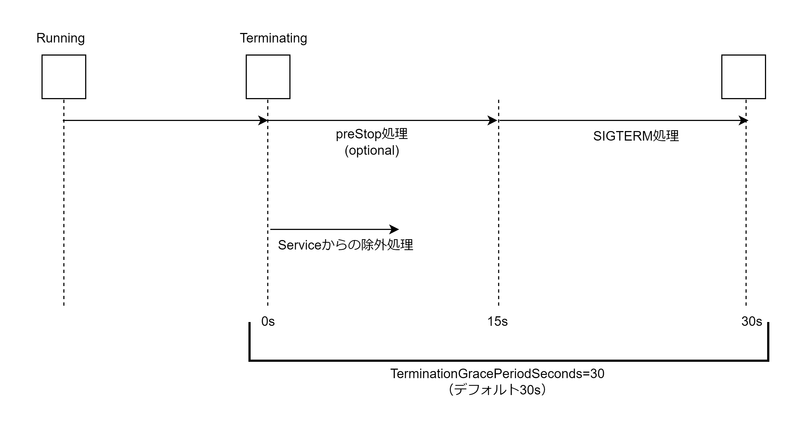

# Pod の安全な停止

起動中の Pod の削除要求が Kubernetes API サーバーに届くと非同期に「preStop 処理+SIGTERM 処理」と「Service からの除外設定」が行われる。「Service からの除外設定」が終わる前に「preStop 処理+SIGTERM 処理」でプロセスを停止してしまうとリクエストエラーが発生する可能性がある。よってリクエスト断をなくすために、Service の除外処理が終わる数秒間を「preStop 処理+SIGTERM 処理」で待機する必要がある。アプリケーションは SIGTERM を受け取ると安全に停止するようにコーディングする必要がある。



```Pod.yaml
apiVersion: v1
kind: Pod
metadata:
  name: sample-healthcheck
spec:
  lifecycle:
    preStop:
      exec:
        command: ['/bin/sh', '-c', 'sleep 15']
  containers:
    - name: nginx-container
      image: nginx:1.16
```
