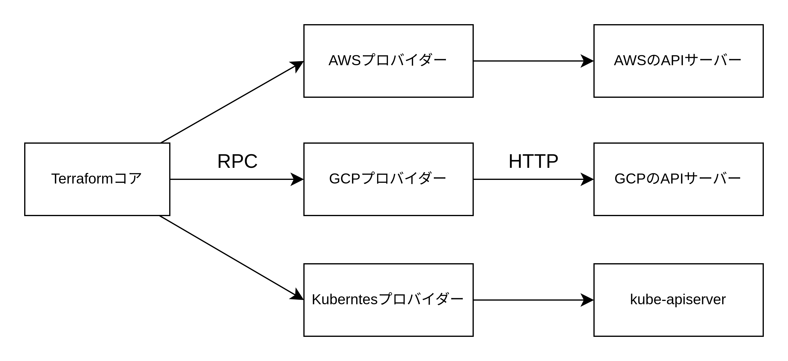

# Terraform とは

- サーバー・DB・ロードバランサー・キューなどのインフラを作成するプロビジョニングツール
- イミュータブルなインフラ（EC2 の設定を変更すると変更前の EC2 を削除し、新しい EC2 を作成する）
- 宣言型言語（実現したいインフラの状態を宣言し、実現方法は Terraform に任せる）
- ドメイン特化言語
- マスタレス（Kubernetes はコントロールプレーンというマスターノードを持つ）
- エージェントレス（Kubernetes はワーカーノード上で kubelet というエージェントが動いている）

## Terraform の仕組み



- Terraform コア: CLI・テラフォームファイルのパース・各種プロバイダー呼び出しなどを行う Go で記述されたバイナリー
- プロバイダー: 実際にサーバーをデプロイするよう AWS などの API サーバーと通信するバイナリーファイル。Terraform レジストリ（registry.terraform.io）上にアップロードされている。terraform init を実行することでバイナリーファイルを terraform ディレクトリにダウンロードする。

Terraform コアとプロバイダーのバージョンはモジュール内で固定する。

```main.tf
terraform {
  # Terraformコアのバージョンは1系で固定する
  required_version = "~> 1.0"
  required_providers = {
    aws = {
      # AWSプロバイダーのダウンロード先を指定する
      source = "registry.terraform.io/hashicorp/aws"
      # AWSプロバイダーのバージョンは5系で固定する
      version = "~> 5.0"
    }
  }
}
```
